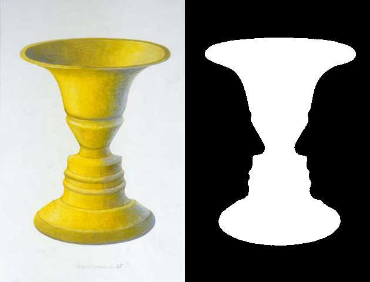

<Blockquote link='https://languages.oup.com/google-dictionary-en/' author="Oxford Languages">
  ge·stalt (noun)

  /ɡəˈSHtält/

  An organized whole that is perceived as more than the sum of its parts
</Blockquote>

For some of you, the concepts may be a review from Digital 2D Design, but they are important when we talk about UI design; these are the principles that make a design work. Gestalt theory is why we can navigate interfaces with multiple levels of content without becoming completely overwhelmed.

## Key Principles

There are 4 key properties with gestalt systems: emergence, reification, multistability, and invariance.

### Emergence

With _emergence_, we simplify elements to their general forms. We have an easier time interpreting simple objects than detailed ones and can "see" forms even when parts are missing.

<figure className="grid gap-6 gap-y-12 md:grid-cols-3">
  <Panel>
    <svg xmlns="http://www.w3.org/2000/svg" viewBox="0 0 179.19 156.72" className="fill-current">
      <circle cx="87.2" cy="146.06" r="1.34"/>
      <circle cx="71.78" cy="66.46" r="1.34"/>
      <circle cx="4.69" cy="63.84" r="1.34"/>
      <circle cx="57.08" cy="126.5" r="1.34"/>
      <circle cx="121.94" cy="98.4" r="1.54"/>
      <circle cx="68.77" cy="8.54" r="1.88"/>
      <circle cx="44.12" cy="16.98" r="1.34"/>
      <circle cx="10.39" cy="48.14" r="1.34"/>
      <circle cx="112.39" cy="65.61" r="1.66"/>
      <circle cx="118.23" cy="131.66" r="1.46"/>
      <circle cx="9.77" cy="64.58" r="1.55"/>
      <circle cx="74.02" cy="41.52" r="1.43"/>
      <circle cx="44.79" cy="11.57" r="1.34"/>
      <circle cx="29.47" cy="50.34" r="1.34"/>
      <circle cx="144.01" cy="75.21" r="1.99"/>
      <circle cx="71.65" cy="100.25" r="1.34"/>
      <circle cx="134.49" cy="33.35" r="1.85"/>
      <circle cx="82.02" cy="36.69" r="1.36"/>
      <circle cx="134.49" cy="86.97" r="1.34"/>
      <circle cx="128.07" cy="78.14" r="1.36"/>
      <circle cx="41.49" cy="81.32" r="1.34"/>
      <circle cx="61.89" cy="55.17" r="1.34"/>
      <circle cx="151.57" cy="92.03" r="1.34"/>
      <circle cx="132.94" cy="1.34" r="1.34"/>
      <circle cx="114.37" cy="42.44" r="1.34"/>
      <circle cx="161.06" cy="45.85" r="1.34"/>
      <circle cx="138.6" cy="92.42" r="1.82"/>
      <circle cx="136.09" cy="16.46" r="1.34"/>
      <circle cx="49.72" cy="53.7" r="1.83"/>
      <circle cx="147.76" cy="40.62" r="2.07"/>
      <circle cx="23.25" cy="52.45" r="1.34"/>
      <circle cx="138.73" cy="41.52" r="2.03"/>
      <circle cx="152.29" cy="20.08" r="1.34"/>
      <circle cx="176.07" cy="53.73" r="1.78"/>
      <circle cx="73.94" cy="82.5" r="1.67"/>
      <circle cx="103.24" cy="63.21" r="1.34"/>
      <circle cx="59.13" cy="81.47" r="1.34"/>
      <circle cx="26.6" cy="83.63" r="1.74"/>
      <circle cx="145.21" cy="3.43" r="1.43"/>
      <circle cx="110.22" cy="18.75" r="1.34"/>
      <circle cx="45.62" cy="67.1" r="1.54"/>
      <circle cx="111.29" cy="99.89" r="1.34"/>
      <circle cx="48.74" cy="93.92" r="1.34"/>
      <circle cx="127.56" cy="31.85" r="1.34"/>
      <circle cx="102.91" cy="86.01" r="1.38"/>
      <circle cx="177.86" cy="44.51" r="1.34"/>
      <circle cx="27.79" cy="69.94" r="1.34"/>
      <circle cx="141.66" cy="35.9" r="1.34"/>
      <circle cx="40.27" cy="112.03" r="1.38"/>
      <circle cx="74.91" cy="137.88" r="1.34"/>
      <circle cx="172.54" cy="71.02" r="1.54"/>
      <circle cx="38.44" cy="42.13" r="1.34"/>
      <circle cx="10.75" cy="78.09" r="1.34"/>
      <circle cx="131.05" cy="115.27" r="1.53"/>
      <circle cx="136.76" cy="108.12" r="1.53"/>
      <circle cx="146.9" cy="56.93" r="1.34"/>
      <circle cx="106.39" cy="40.14" r="1.45"/>
      <circle cx="75.21" cy="95.85" r="1.34"/>
      <circle cx="94.15" cy="138.17" r="1.34"/>
      <circle cx="84.54" cy="96.17" r="2.19"/>
      <circle cx="123.2" cy="123.93" r="2.42"/>
      <circle cx="156.23" cy="60.57" r="2.01"/>
      <circle cx="121.88" cy="3.62" r="2.26"/>
      <circle cx="93.24" cy="22.6" r="2.01"/>
      <circle cx="73.65" cy="13.51" r="2.12"/>
      <circle cx="94.29" cy="94.43" r="2.01"/>
      <circle cx="96.65" cy="57.11" r="2.01"/>
      <circle cx="163.06" cy="61.04" r="2.09"/>
      <circle cx="170.06" cy="23.99" r="2.2"/>
      <circle cx="65.98" cy="40.71" r="2.4"/>
      <circle cx="99.93" cy="128.54" r="2.01"/>
      <circle cx="133.63" cy="70.65" r="2.68"/>
      <circle cx="60.18" cy="23.85" r="2.01"/>
      <circle cx="8.15" cy="71.48" r="2.01"/>
      <circle cx="62.78" cy="33" r="2.01"/>
      <circle cx="154.6" cy="9.53" r="2.55"/>
      <circle cx="46.13" cy="25.87" r="2.52"/>
      <circle cx="124.77" cy="54.47" r="2.01"/>
      <circle cx="112.16" cy="135.67" r="2.01"/>
      <circle cx="99.16" cy="79.65" r="2.01"/>
      <circle cx="155.97" cy="67.45" r="2.11"/>
      <circle cx="26.88" cy="34.17" r="2.01"/>
      <circle cx="144.94" cy="95.47" r="2.01"/>
      <circle cx="45.63" cy="106.03" r="2.01"/>
      <circle cx="123.07" cy="85.89" r="2.01"/>
      <circle cx="90.89" cy="43" r="2.81"/>
      <circle cx="42.54" cy="75.53" r="2.08"/>
      <circle cx="62.91" cy="121.12" r="2.01"/>
      <circle cx="174.04" cy="33.87" r="2.28"/>
      <circle cx="116.02" cy="96.09" r="2.21"/>
      <circle cx="46.02" cy="33.33" r="2.01"/>
      <circle cx="163.47" cy="51.62" r="2.01"/>
      <circle cx="143.41" cy="23.08" r="2.01"/>
      <circle cx="92.96" cy="127.69" r="2.01"/>
      <circle cx="123.95" cy="11.09" r="2.01"/>
      <circle cx="61.53" cy="11.97" r="3.03"/>
      <circle cx="110.9" cy="34.36" r="2.01"/>
      <circle cx="29.44" cy="99.35" r="2.01"/>
      <circle cx="16.06" cy="56.94" r="3.58"/>
      <circle cx="41.61" cy="92.43" r="3.06"/>
      <circle cx="66.56" cy="108.61" r="3.13"/>
      <circle cx="132.8" cy="50.25" r="3.01"/>
      <circle cx="68.39" cy="91.67" r="3.1"/>
      <circle cx="121.37" cy="114.22" r="3.26"/>
      <circle cx="3.21" cy="46.04" r="3.21"/>
      <circle cx="156.04" cy="40.67" r="3.01"/>
      <circle cx="129" cy="105.66" r="3.62"/>
      <circle cx="173.26" cy="61.53" r="3.32"/>
      <circle cx="11.72" cy="26.47" r="3.01"/>
      <circle cx="136.68" cy="79.68" r="3.29"/>
      <circle cx="46.87" cy="43.58" r="3.34"/>
      <circle cx="62.42" cy="99.56" r="3.13"/>
      <circle cx="113.91" cy="26.26" r="3.34"/>
      <circle cx="78.74" cy="146" r="3.54"/>
      <circle cx="79.48" cy="46.81" r="3.01"/>
      <circle cx="87.87" cy="53.19" r="3.93"/>
      <circle cx="99.96" cy="34.9" r="3.05"/>
      <circle cx="144.32" cy="49.42" r="3.52"/>
      <circle cx="52.94" cy="102.23" r="3.06"/>
      <circle cx="87.13" cy="76.8" r="3.46"/>
      <circle cx="162.62" cy="80.96" r="3.01"/>
      <circle cx="109.32" cy="113.09" r="3.92"/>
      <circle cx="38.6" cy="49.37" r="3.03"/>
      <circle cx="63.92" cy="130.54" r="3.52"/>
      <circle cx="90.76" cy="102.88" r="3.11"/>
      <circle cx="61.73" cy="67.16" r="3.01"/>
      <circle cx="164.53" cy="34.7" r="3.01"/>
      <circle cx="29.82" cy="42.36" r="3.38"/>
      <circle cx="103.01" cy="14.97" r="3.18"/>
      <circle cx="52.48" cy="4.49" r="3.06"/>
      <circle cx="17.3" cy="81.48" r="3.12"/>
      <circle cx="29.08" cy="10.89" r="3.56"/>
      <circle cx="113.15" cy="86.74" r="3.92"/>
      <circle cx="80.62" cy="23.11" r="3.33"/>
      <circle cx="57.88" cy="113.07" r="3.01"/>
      <circle cx="133.93" cy="9.42" r="3.12"/>
      <circle cx="86.99" cy="135.57" r="3.29"/>
      <circle cx="72.49" cy="32.76" r="4.09"/>
      <circle cx="134.06" cy="23.98" r="3.41"/>
      <circle cx="4.83" cy="33.35" r="3.11"/>
      <circle cx="113.89" cy="11.4" r="3.71"/>
      <circle cx="110.84" cy="127.57" r="3.06"/>
      <circle cx="120.82" cy="46.18" r="3.18"/>
      <circle cx="16.86" cy="34.82" r="3.15"/>
      <circle cx="66.18" cy="77.73" r="3.43"/>
      <circle cx="28.58" cy="57.81" r="3.23"/>
      <circle cx="82.88" cy="113.75" r="3.01"/>
      <circle cx="95.94" cy="67.14" r="3.01"/>
      <circle cx="117.01" cy="104.85" r="3.27"/>
      <circle cx="48.67" cy="116.67" r="3.22"/>
      <circle cx="86.58" cy="64.34" r="3.13"/>
      <circle cx="79.02" cy="89.04" r="3.42"/>
      <circle cx="123.56" cy="19.32" r="3.06"/>
      <circle cx="146.16" cy="85.93" r="3.14"/>
      <circle cx="57.47" cy="48.64" r="3.48"/>
      <circle cx="49.36" cy="82.55" r="3.01"/>
      <circle cx="130.18" cy="40.96" r="3.05"/>
      <circle cx="120.77" cy="78" r="3.05"/>
      <circle cx="17.5" cy="70.39" r="3.88"/>
      <circle cx="24.48" cy="24.76" r="3.23"/>
      <circle cx="37.49" cy="102.12" r="3.26"/>
      <circle cx="101.07" cy="120.37" r="3.07"/>
      <circle cx="155.14" cy="52.33" r="3.11"/>
      <circle cx="5.57" cy="56.6" r="3.07"/>
      <circle cx="36.57" cy="18.92" r="3.42"/>
      <circle cx="31.6" cy="77.26" r="3.22"/>
      <circle cx="75.36" cy="59.32" r="3.33"/>
      <circle cx="109.13" cy="56.69" r="4.11"/>
      <circle cx="170.05" cy="44.61" r="4.02"/>
      <circle cx="102.44" cy="136.4" r="3.07"/>
      <circle cx="101.13" cy="25.17" r="3.11"/>
      <circle cx="30.66" cy="91.26" r="3.02"/>
      <circle cx="135.72" cy="60.93" r="3.01"/>
      <circle cx="161.52" cy="16.15" r="3.27"/>
      <circle cx="53.78" cy="74.01" r="3.02"/>
      <circle cx="67.68" cy="19.83" r="3.25"/>
      <circle cx="101.24" cy="46.86" r="3.78"/>
      <circle cx="156.06" cy="28.19" r="3.77"/>
      <circle cx="120.84" cy="35.03" r="3.17"/>
      <circle cx="88.91" cy="31.55" r="4.25"/>
      <circle cx="91.18" cy="86.67" r="3.15"/>
      <circle cx="97.16" cy="146" r="3.63"/>
      <circle cx="103.9" cy="93.21" r="3.01"/>
      <circle cx="153.02" cy="76.58" r="3.68"/>
      <circle cx="86.29" cy="153.51" r="3.22"/>
      <circle cx="146.64" cy="14.45" r="3.16"/>
      <circle cx="144.5" cy="65.85" r="3.34"/>
      <circle cx="68.64" cy="50.61" r="3.67"/>
      <circle cx="35.41" cy="67.14" r="3.65"/>
      <circle cx="53.73" cy="61.87" r="3.01"/>
      <circle cx="107.98" cy="75.28" r="4.18"/>
      <circle cx="44.3" cy="59.61" r="3.08"/>
      <circle cx="77.58" cy="104.76" r="3.18"/>
      <circle cx="138.29" cy="100.48" r="3.12"/>
      <circle cx="51.23" cy="15.81" r="3.01"/>
      <circle cx="19.64" cy="45.79" r="3.26"/>
      <circle cx="164.94" cy="71.52" r="3.1"/>
      <circle cx="39.32" cy="5.93" r="3.46"/>
      <circle cx="85.34" cy="123.73" r="3.31"/>
      <circle cx="71.66" cy="119.8" r="3.49"/>
      <circle cx="103.76" cy="103.21" r="3.3"/>
      <circle cx="93.15" cy="113.04" r="3.5"/>
      <circle cx="57.33" cy="89.02" r="3.39"/>
      <circle cx="36.36" cy="31.41" r="4.19"/>
      <circle cx="16.84" cy="18.1" r="3.16"/>
      <circle cx="76.45" cy="73.23" r="3.72"/>
      <circle cx="128.84" cy="92.47" r="3.42"/>
      <circle cx="146.01" cy="30.99" r="3.08"/>
      <circle cx="76.44" cy="130.79" r="3.04"/>
      <circle cx="54.71" cy="30.18" r="3.15"/>
      <circle cx="121.72" cy="63.95" r="4.27"/>
      <circle cx="154.7" cy="85.22" r="1.34"/>
      <circle cx="21.91" cy="89.36" r="1.34"/>
      <circle cx="55.55" cy="38.69" r="2.01"/>
      <circle cx="110.41" cy="47.91" r="2.01"/>
    </svg>
  </Panel>

  <figcaption className="md:col-span-2">
    

      Even without a border, we simplify the group of many small dots into one shape: a heart.
    

    

      Other principles and concepts discuss our ways of grouping elements, but emergence is specifically looking at that "bigger picture" and eschewing too much detail for the simpler explanation.
    

  </figcaption>
</figure>

<Blockquote
  link="https://medium.com/@sara.dholakia/the-intersection-of-psychology-design-7cc0fa2cf4fc"
  author="Sara Dholakia"
  title="The Intersection of Psychology & Design"
>
  

    When we see an image, we first attempt to identify it by its outline or general shape. We then compare that to the objects in our mental inventory. This is why our brains recognize simple, well-defined objects more quickly than complex ones.
  

  

    From an evolutionary perspective, this makes a lot of sense. If you’re out wandering in a jungle, it’s in your best interest to be able to quickly identify a leopard so you don’t get attacked. It would be much less useful for you to first identify the individual shapes of its spots.
  

</Blockquote>

### Reification

With _reification_, we recognize more information that what is present; our brains fill in the gaps. Along with _closure_, this can come in handy for logos, icons, or illustrations.

<figure>

  

    <Panel caption="There is no triangle overlapping the circles">
      <svg
        xmlns="http://www.w3.org/2000/svg"
        viewBox="0 0 200.67 182.45"
        className="fill-current w-full h-32"
      >
        <path d="M64.63 150.12H32.32l16.15-28a32.31 32.31 0 00-48.47 28 32.32 32.32 0 0032.32 32.32 32.32 32.32 0 0032.31-32.32z" />
        <path d="M152.19 122.14l16.16 28H136a32.32 32.32 0 0032.32 32.32 32.32 32.32 0 0032.32-32.32 32.32 32.32 0 00-32.32-32.32 32.39 32.39 0 00-16.16 4.33z" />
        <path d="M100.32 0a32.32 32.32 0 00-16.16 60.3l16.16-28 16.16 28A32.31 32.31 0 00100.32 0z" />
      </svg>
    </Panel>
    <Panel caption="2 apostrophe-like shapes, not 1 split squiggle">
      <svg
        xmlns="http://www.w3.org/2000/svg"
        viewBox="0 0 109.69 159.31"
        className="fill-current w-full h-32"
      >
        <path d="M72.91 76l-1.65.45L70 109.68a10.93 10.93 0 01-11.24 10.66l-2.6-.11c-2.27.32-4.63.6-6.94 1-6.42 1.16-12.34 3.4-16 6.5a14.94 14.94 0 00-5.32 11.18 15.28 15.28 0 005 12.37c4.11 3.95 11.28 7.57 22.2 8s25.57-2.39 36.4-8.94 17.83-16.86 18.27-27.54-5.77-21.73-13.24-29.75c-7-7.55-15.3-12.41-23.62-17.1z"/>
        <path d="M52.61 0C42 0 28.44 2.84 18.29 9 7.46 15.53.47 25.83 0 36.51s5.69 21.74 13.16 29.75c7.05 7.56 15.3 12.41 23.63 17.11l1.64-.46 1.31-33.27A10.93 10.93 0 0151 39l2.61.1c2.26-.32 4.62-.6 6.93-1 6.42-1.16 12.34-3.41 16-6.51a14.93 14.93 0 005.32-11.18A15.3 15.3 0 0076.89 8C72.78 4.06 65.61.45 54.7 0h-2.09z"/>
      </svg>
    </Panel>
    <Panel caption="A group of flat objects, not a 3D spiked sphere">
      <svg
        xmlns="http://www.w3.org/2000/svg"
        viewBox="0 0 200.14 214.71"
        className="fill-current w-full h-32"
      >
        <path d="M100.31 1s-13 57.67-13 58.5a11.16 11.16 0 00.62 3.69c.53 1.42 1.57 2.81 4.41 3.81a34.67 34.67 0 0011.17 1.31 20.64 20.64 0 008.34-2 6.66 6.66 0 003.43-3.13 6.83 6.83 0 00.4-3.08c0-.7-13.94-60.08-13.94-60.08z"/>
        <path d="M162.45 189.19l.69-1.73s-24.23-45.31-24.46-45.73a5.1 5.1 0 00-1.85-1.93 8.49 8.49 0 00-6.08-1.4 17.73 17.73 0 00-8.59 4.49 14.79 14.79 0 00-4.34 7.21 8.38 8.38 0 00.4 5.37 10.54 10.54 0 001.82 2.86c.44.52 42.41 30.86 42.41 30.86z"/>
        <path d="M.56 63.85s60 16.91 60.71 17.2a9.5 9.5 0 012.89 1.82 7 7 0 011.94 4.63 15.66 15.66 0 01-1.48 8 15.88 15.88 0 01-5.62 6.16 7.28 7.28 0 01-4.67 1.1 5.78 5.78 0 01-2-.56C52 102 0 65.26 0 65.26z"/>
        <path d="M4.79 173.51l.61 1.29s58.67-21 59.33-21.37a11.78 11.78 0 002.66-2.13 6.78 6.78 0 001.55-4.39 16.52 16.52 0 00-1.42-8.24 15.36 15.36 0 00-5.91-6 6.49 6.49 0 00-4.78-1 7 7 0 00-2.74 1.45c-.52.41-49.3 40.41-49.3 40.41z"/>
        <path d="M41.81 33.53l-1.21 1.31 18.16 30.75a60.52 60.52 0 0112.8-8.09z"/>
        <path d="M19.64 101.89l-.07 1.35 17 7.73a61 61 0 011.25-10.69z"/>
        <path d="M9 134.16l.43 2 30.81-2.31a61.48 61.48 0 01-3.08-12z"/>
        <path d="M61.15 161.67l-12.31 53 1.45.09 33.93-42.48a61.13 61.13 0 01-23.07-10.56z"/>
        <path d="M98.53 173.67l13.1 27.71 1.53-.68-.46-28.95a60.53 60.53 0 01-14.17 1.92z"/>
        <path d="M157.79 121.85l42.35 24.37-.42 1.36-49.53-4.18a60.88 60.88 0 007.6-21.55z"/>
        <path d="M193.91 62.63l.66 1-39.12 30a60.85 60.85 0 00-9.09-17.49z"/>
        <path d="M154.54 42.53l-1.08-.53-23.53 19a60.82 60.82 0 019.72 7.57z"/>
      </svg>
    </Panel>
  

  <License
    type="cc"
    ccVersion="1.0"
    ccLicense="ZERO"
    link="https://en.wikipedia.org/wiki/File:Reification.svg"
    mediaType="Illustrations"
    authors={[
      {
        name: 'Mrmw via Wikipedia',
        link: 'https://commons.wikimedia.org/wiki/User:Mrmw',
      },
    ]}
  />

</figure>

### Multistability

We are able to alternate between multiple ambiguous interpretations; neither one is "right". This concept is common in optical illusions – and sometimes clever logos.

<figure className="grid gap-6 gap-y-12 md:grid-cols-2">

  

  

  

  <figcaption>
    <Link to="https://commons.wikimedia.org/wiki/Category:Rubin%27s_vase">Rubin's Vase</Link> is a popular example that can be interpreted as either a vase or pair of faces. Some more elaborate structures can even appear to show people standing and facing each other.
  </figcaption>

  <License
    title="Rubin vase depiction"
    type="public"
    link="https://commons.wikimedia.org/wiki/File:Rubin2.jpg"
    mediaType="Illustration"
    authors={[
      {
        name: 'John smithson 2007',
        link: 'https://en.wikipedia.org/wiki/User:John_smithson_2007',
      },
    ]}
  />

</figure>

<figure>
  <Panel fullHeight={false}>
    <svg xmlns="http://www.w3.org/2000/svg" viewBox="0 0 545.04 159.54" className="cube-illustration fill-current">
      <rect className="line stroke-current fill-none" x="2.5" y="42.6" width="114.44" height="114.44"/>
      <rect className="line stroke-current fill-none" x="42.6" y="2.5" width="114.44" height="114.44"/>
      <line className="line stroke-current fill-none" x1="2.5" y1="42.6" x2="42.6" y2="2.5"/>
      <line className="line stroke-current fill-none" x1="42.6" y1="116.94" x2="2.5" y2="157.04"/>
      <line className="line stroke-current fill-none" x1="116.94" y1="157.04" x2="157.04" y2="116.94"/>
      <line className="line stroke-current fill-none" x1="116.94" y1="42.6" x2="157.04" y2="2.5"/>
      <polyline className="line stroke-current fill-none dashed-line" points="349.79 116.94 235.35 116.94 235.35 2.5"/>
      <line className="line stroke-current fill-none dashed-line" x1="235.35" y1="116.94" x2="195.25" y2="157.04"/>
      <polyline className="line stroke-current fill-none" points="309.69 157.04 349.79 116.94 349.79 2.5 235.35 2.5 195.25 42.6"/>
      <line className="line stroke-current fill-none" x1="309.69" y1="42.6" x2="349.79" y2="2.5"/>
      <polyline className="line stroke-current fill-none dashed-line" points="388 42.6 502.44 42.6 502.44 157.04"/>
      <line className="line stroke-current fill-none" x1="428.1" y1="116.94" x2="388" y2="157.04"/>
      <polyline className="line stroke-current fill-none" points="542.54 116.94 502.44 157.04 388 157.04 388 42.6 428.1 2.5"/>
      <line className="line stroke-current fill-none dashed-line" x1="502.44" y1="42.6" x2="542.54" y2="2.5"/>
      <rect className="text-opacity-50 fill-current text-grey-500" x="195.25" y="42.6" width="114.44" height="114.44"/>
      <rect className="line stroke-current fill-none" x="195.25" y="42.6" width="114.44" height="114.44"/>
      <rect className="text-opacity-50 fill-current text-grey-500" x="428.1" y="2.5" width="114.44" height="114.44"/>
      <rect className="line stroke-current fill-none" x="428.1" y="2.5" width="114.44" height="114.44"/>
    </svg>
  </Panel>
  <figcaption>
    The <Link to="https://en.wikipedia.org/wiki/Necker_cube">Necker Cube</Link> is a basic wireframe cube. With no context provided for its orientation; the lower-left or upper-right squares can both be interpreted as the 'front' side.
  </figcaption>
</figure>

### Invariance

We can recognize objects even when they are rotated, scaled, stretched, lightly distorted, or shown in different lighting.

<figure>
  <Panel fullHeight={false}>
    <svg xmlns="http://www.w3.org/2000/svg" viewBox="0 0 173.07 147.37" className="w-full">
      <g className="fill-current text-grey-300 dark:text-grey-700">
        <path d="M41.34,82.78l0,0-4.56-2.48a1.12,1.12,0,0,0-.73-.13L1.48,85.05A1.7,1.7,0,0,0,.11,86.72L0,143.59a1.45,1.45,0,0,0,.17.7,1.29,1.29,0,0,0,.47.46l4.56,2.48h0a1.25,1.25,0,0,0,.75.14l34.61-4.87a1.71,1.71,0,0,0,1.37-1.67L42,84A1.26,1.26,0,0,0,41.34,82.78Z"/>
        <path d="M109,131.34l-36.34-3.82a2.14,2.14,0,0,1-1.76-1.11L58.52,89.28,55.63,97,68,134.13a2.13,2.13,0,0,0,1.75,1.12l36.35,3.82c.58.06,1-.12,1.12-.43l2.88-7.73C110,131.22,109.55,131.4,109,131.34Z"/>
        <path d="M171.12,112.65c.06.25-.4.58-1.11.78l-36.87,10.41c-.81.23-1.63.21-1.85,0l-14.89-18,1.94,9.15,14.9,17.94c.21.26,1,.29,1.84.06L172,122.58c.71-.2,1.17-.53,1.12-.79Z"/>
      </g>
      <path class="fill-current text-grey-200 dark:text-grey-400" d="M40.45,65.15H1.56A1.54,1.54,0,0,1,0,63.61V4.41A1.53,1.53,0,0,1,1.56,2.88H40.45A1.53,1.53,0,0,1,42,4.41v59.2A1.54,1.54,0,0,1,40.45,65.15Zm58.17-1.54,10.44-59.2a1.25,1.25,0,0,0-1.27-1.53H68.9a1.9,1.9,0,0,0-1.8,1.53L56.66,63.61a1.26,1.26,0,0,0,1.26,1.54H96.81A1.92,1.92,0,0,0,98.62,63.61Zm67.07,0V4.41a3.32,3.32,0,0,0-1.54-2.51c-13-7.28-25.92,9.23-38.89,2-.84-.47-1.53-.29-1.53.56v59.2a3.35,3.35,0,0,0,1.53,2.52c13,7.28,25.93-9.24,38.89-2C165,64.65,165.69,64.46,165.69,63.61ZM6,87.53A1.71,1.71,0,0,0,4.66,89.2l-.1,56.87a1.22,1.22,0,0,0,1.37,1.29l34.61-4.87a1.71,1.71,0,0,0,1.37-1.67L42,84a1.21,1.21,0,0,0-1.37-1.28Zm104.05,43L97.73,93.4A2.18,2.18,0,0,0,96,92.29L59.63,88.47c-.79-.08-1.29.28-1.11.81l12.35,37.13a2.14,2.14,0,0,0,1.76,1.11L109,131.34C109.76,131.43,110.26,131.06,110.09,130.53Zm61-18-14.9-18c-.21-.26-1-.28-1.84,0L117.47,105c-.81.23-1.29.62-1.07.88l14.89,18c.22.26,1,.28,1.85,0L170,113.43C170.82,113.21,171.29,112.81,171.08,112.56Z"/>
      <g className="fill-current text-black dark:text-grey-900">
        <path d="M8,17.34a1.35,1.35,0,0,0-.34-.89c-.23-.25-1.71-1.67-2.22-2.16a.26.26,0,0,0-.35,0c-.52.49-2,1.91-2.22,2.17a1.23,1.23,0,0,0-.34.86,1.32,1.32,0,0,0,2.31.91c0,.39,0,.56-.56.81a.34.34,0,0,0-.2.39.33.33,0,0,0,.33.26h1.7a.35.35,0,0,0,.35-.28.34.34,0,0,0-.2-.37c-.55-.25-.56-.41-.57-.81A1.32,1.32,0,0,0,8,17.34Z"/>
        <path d="M35.37,58.06a2.37,2.37,0,0,0-.75,1.63,1.94,1.94,0,0,0,2.14,1.91A3.13,3.13,0,0,0,39,60.74c.21-.21.26-.42.07-.64l-.25-.31a.37.37,0,0,0-.6-.06,2,2,0,0,1-1.23.58.69.69,0,0,1-.77-.7c0-.42.43-.83,1-1.42s1.07-1,1.54-1.41a.67.67,0,0,0,.27-.6v-.4a.39.39,0,0,0-.43-.44H34.84a.39.39,0,0,0-.44.44v.45a.4.4,0,0,0,.44.44h2A12,12,0,0,0,35.37,58.06Z"/>
        <path d="M36.61,53.73a.24.24,0,0,0,.35,0c.51-.49,2-1.9,2.22-2.16a1.32,1.32,0,1,0-2-1.77c0-.4,0-.56.56-.81a.34.34,0,0,0,.2-.39.35.35,0,0,0-.33-.27H35.93a.35.35,0,0,0-.34.28.34.34,0,0,0,.2.38c.55.24.56.4.56.81a1.32,1.32,0,0,0-2,1.77C34.62,51.83,36.09,53.24,36.61,53.73Z"/>
        <path d="M21.4,58.29c1.13-1.07,4.36-4.18,4.87-4.74A2.83,2.83,0,0,0,27,51.66a2.92,2.92,0,0,0-2.9-3,2.88,2.88,0,0,0-2.17,1c0-.86,0-1.23,1.23-1.77a.77.77,0,0,0,.44-.86.76.76,0,0,0-.73-.58H19.14a.76.76,0,0,0-.75.61.75.75,0,0,0,.43.82c1.21.54,1.24.9,1.25,1.78a2.91,2.91,0,0,0-5.07,2,2.87,2.87,0,0,0,.75,1.95c.51.56,3.74,3.67,4.87,4.74A.56.56,0,0,0,21.4,58.29Z"/>
        <path d="M17.9,19.34a2.93,2.93,0,0,0,2.17-1c0,.86,0,1.23-1.23,1.77a.77.77,0,0,0-.44.86.75.75,0,0,0,.73.58h3.74a.75.75,0,0,0,.32-1.44C22,19.61,22,19.26,22,18.38a2.91,2.91,0,1,0,4.32-3.9c-.51-.56-3.75-3.67-4.88-4.75a.55.55,0,0,0-.77,0c-1.13,1.08-4.36,4.19-4.87,4.75A2.83,2.83,0,0,0,15,16.37,2.92,2.92,0,0,0,17.9,19.34Z"/>
        <path d="M3.23,8.23a.36.36,0,0,0,.59.07,2,2,0,0,1,1.23-.59.7.7,0,0,1,.78.7c0,.43-.44.84-1,1.42s-1.07,1-1.54,1.42a.69.69,0,0,0-.28.6v.39a.39.39,0,0,0,.44.45H7.18a.39.39,0,0,0,.43-.45V11.8a.4.4,0,0,0-.43-.45h-2A11.25,11.25,0,0,0,6.65,10,2.35,2.35,0,0,0,7.4,8.34,1.94,1.94,0,0,0,5.26,6.43a3.07,3.07,0,0,0-2.21.86c-.21.21-.27.42-.08.63Z"/>
        <path d="M96.69,55.34H92.93a.49.49,0,0,0-.52.44l-.07.45c0,.28.07.44.35.44h2A15,15,0,0,0,93,58.06a2.91,2.91,0,0,0-1,1.63c-.2,1.12.54,1.91,1.8,1.91a3.73,3.73,0,0,0,2.37-.86c.24-.21.33-.42.18-.64l-.2-.31c-.14-.22-.33-.25-.58-.06a2.49,2.49,0,0,1-1.33.58c-.44,0-.73-.24-.65-.7s.58-.83,1.28-1.42,1.24-1,1.79-1.41a.9.9,0,0,0,.38-.6l.07-.4C97.1,55.49,97,55.34,96.69,55.34Z"/>
        <path d="M79,58.29c1.31-1.07,5.1-4.18,5.7-4.74a3.46,3.46,0,0,0,1.09-1.89,2.39,2.39,0,0,0-2.38-3,3.46,3.46,0,0,0-2.34,1c.16-.86.24-1.23,1.54-1.77a.93.93,0,0,0,.59-.86.6.6,0,0,0-.63-.58H78.8a1,1,0,0,0-.86.61.64.64,0,0,0,.29.82c1.12.54,1.08.9.93,1.78a2.42,2.42,0,0,0-2.07-1,3.6,3.6,0,0,0-3.34,2.91,2.51,2.51,0,0,0,.4,1.95c.42.56,3.1,3.67,4,4.74A.56.56,0,0,0,79,58.29Z"/>
        <path d="M73,11.35H71A14.23,14.23,0,0,0,72.74,10a2.92,2.92,0,0,0,1-1.62c.2-1.13-.53-1.91-1.8-1.91a3.63,3.63,0,0,0-2.36.86c-.25.21-.34.42-.19.63l.2.31c.14.22.34.26.59.07a2.41,2.41,0,0,1,1.33-.59c.43,0,.73.25.65.7s-.58.84-1.28,1.42-1.25,1-1.79,1.42a.83.83,0,0,0-.38.6l-.07.39q-.08.45.36.45h3.76a.48.48,0,0,0,.51-.45l.08-.44C73.43,11.51,73.31,11.35,73,11.35Z"/>
        <path d="M82.33,19.34a3.51,3.51,0,0,0,2.34-1c-.15.86-.23,1.23-1.54,1.77a.93.93,0,0,0-.59.86.6.6,0,0,0,.63.58h3.74a.94.94,0,0,0,.86-.61.64.64,0,0,0-.28-.83c-1.12-.54-1.09-.89-.93-1.77a2.4,2.4,0,0,0,2.06,1A3.63,3.63,0,0,0,92,16.43a2.5,2.5,0,0,0-.41-1.95c-.41-.56-3.1-3.67-4-4.75a.55.55,0,0,0-.77,0c-1.32,1.08-5.1,4.19-5.71,4.75A3.45,3.45,0,0,0,80,16.37,2.39,2.39,0,0,0,82.33,19.34Z"/>
        <path d="M70.74,14.29a.27.27,0,0,0-.36,0c-.6.49-2.32,1.91-2.59,2.17a1.51,1.51,0,0,0-.5.86,1.09,1.09,0,0,0,1.08,1.35,1.59,1.59,0,0,0,1.07-.44c-.07.39-.11.56-.7.81a.4.4,0,0,0-.27.39.28.28,0,0,0,.29.26h1.7a.43.43,0,0,0,.39-.28.28.28,0,0,0-.13-.37c-.51-.25-.49-.41-.42-.81a1.08,1.08,0,0,0,.94.44,1.66,1.66,0,0,0,1.52-1.33,1.13,1.13,0,0,0-.19-.89C72.39,16.2,71.16,14.78,70.74,14.29Z"/>
        <path d="M97.34,49.36a1.58,1.58,0,0,0-1.06.44c.07-.4.1-.56.7-.81a.43.43,0,0,0,.27-.39.28.28,0,0,0-.29-.27h-1.7a.43.43,0,0,0-.39.28A.29.29,0,0,0,95,49c.5.24.49.4.42.81a1.1,1.1,0,0,0-.94-.44A1.63,1.63,0,0,0,93,50.68a1.11,1.11,0,0,0,.18.89c.19.26,1.41,1.67,1.84,2.16a.24.24,0,0,0,.35,0c.6-.49,2.32-1.9,2.6-2.16a1.56,1.56,0,0,0,.49-.86A1.08,1.08,0,0,0,97.34,49.36Z"/>
        <path d="M160.66,51.33c.51-.38,2-1.25,2.22-1.38a.8.8,0,0,0,.34-.7,2.19,2.19,0,0,0-1.32-1.9,1,1,0,0,0-1,.12c0-.39,0-.57.56-.64a.24.24,0,0,0,.2-.32.55.55,0,0,0-.33-.38,13.32,13.32,0,0,0-1.71-.42.28.28,0,0,0-.34.22.4.4,0,0,0,.2.41c.55.34.56.52.56.91a1.48,1.48,0,0,0-1-.61,1.14,1.14,0,0,0-1.28,1.19,1.4,1.4,0,0,0,.34.91c.23.25,1.7,1.87,2.22,2.51A.28.28,0,0,0,160.66,51.33Z"/>
        <path d="M162.67,59c.21-.12.26-.3.07-.6l-.25-.42c-.18-.29-.38-.41-.6-.3a1.76,1.76,0,0,1-1.23.21.94.94,0,0,1-.77-.88c0-.43.43-.75,1-1.17a9.49,9.49,0,0,1,1.54-.89.43.43,0,0,0,.27-.48v-.4a.63.63,0,0,0-.43-.62,14.37,14.37,0,0,0-3.76-.93c-.29,0-.44.11-.44.41v.44a.44.44,0,0,0,.44.49,14.54,14.54,0,0,1,2,.36,6.62,6.62,0,0,0-1.51,1.09,2.09,2.09,0,0,0-.75,1.54,2.45,2.45,0,0,0,2.14,2.27A3.13,3.13,0,0,0,162.67,59Z"/>
        <path d="M144.32,58.43a.65.65,0,0,0,.78-.27c1.13-1.5,4.36-5.69,4.87-6.37a3.71,3.71,0,0,0,.75-2.1,2.08,2.08,0,0,0-2.9-2.09,4.43,4.43,0,0,0-2.17,1.71c0-.86,0-1.24,1.23-2.2a1.07,1.07,0,0,0,.44-1,.52.52,0,0,0-.73-.33l-3.75,1.32a1.22,1.22,0,0,0-.75.87c-.06.37.11.65.43.68,1.21.12,1.24.46,1.25,1.34a2.38,2.38,0,0,0-2.24-.19,4.31,4.31,0,0,0-2.83,3.77,2.16,2.16,0,0,0,.75,1.74C140,55.75,143.19,57.78,144.32,58.43Z"/>
        <path d="M129.11,16.78a.27.27,0,0,0-.35-.09c-.52.39-2,1.26-2.22,1.38a.8.8,0,0,0-.34.71,2.21,2.21,0,0,0,1.32,1.9,1,1,0,0,0,1-.12c0,.39,0,.56-.56.64a.24.24,0,0,0-.2.32.48.48,0,0,0,.33.37,15.68,15.68,0,0,0,1.7.43.29.29,0,0,0,.35-.22.42.42,0,0,0-.2-.41c-.55-.35-.56-.52-.57-.92a1.56,1.56,0,0,0,1,.62,1.16,1.16,0,0,0,1.29-1.2,1.42,1.42,0,0,0-.34-.91C131.1,19,129.62,17.42,129.11,16.78Z"/>
        <path d="M141.6,20.42a4.42,4.42,0,0,0,2.17-1.71c0,.86,0,1.24-1.23,2.2a1.09,1.09,0,0,0-.44,1,.51.51,0,0,0,.73.33c1.25-.43,2.49-.88,3.74-1.32a1.18,1.18,0,0,0,.75-.87.52.52,0,0,0-.43-.68c-1.21-.12-1.24-.46-1.24-1.34a2.33,2.33,0,0,0,2.24.19,4.3,4.3,0,0,0,2.83-3.77,2.2,2.2,0,0,0-.75-1.74c-.51-.44-3.75-2.47-4.88-3.13a.65.65,0,0,0-.77.28c-1.13,1.5-4.36,5.69-4.87,6.37a3.68,3.68,0,0,0-.75,2.1A2.07,2.07,0,0,0,141.6,20.42Z"/>
        <path d="M126.93,10c.18.29.38.41.59.29a1.82,1.82,0,0,1,1.23-.2.93.93,0,0,1,.78.88c0,.42-.44.75-1,1.17a11.87,11.87,0,0,1-1.54.89.44.44,0,0,0-.28.48v.39a.64.64,0,0,0,.44.63,14.25,14.25,0,0,0,3.76.92c.28,0,.43-.11.43-.4v-.45a.44.44,0,0,0-.43-.48,13.26,13.26,0,0,1-2-.37,6.33,6.33,0,0,0,1.51-1.09,2,2,0,0,0,.75-1.53A2.44,2.44,0,0,0,129,8.88a3.07,3.07,0,0,0-2.21.12c-.21.12-.27.3-.08.6Z"/>
        <path d="M7.28,92.2l.23.27a.33.33,0,0,0,.28.14A.45.45,0,0,0,8,92.46a2,2,0,0,1,1.09-.72.55.55,0,0,1,.69.58c0,.4-.39.85-.92,1.48s-1,1.12-1.37,1.56a.78.78,0,0,0-.25.61v.38c0,.28.13.41.39.38L11,96.26a.44.44,0,0,0,.38-.49v-.42c0-.28-.13-.41-.38-.37l-1.82.25a12.75,12.75,0,0,0,1.35-1.53,2.67,2.67,0,0,0,.67-1.65,1.53,1.53,0,0,0-1.9-1.57,3.11,3.11,0,0,0-2,1.11C7.17,91.81,7.11,92,7.28,92.2Z"/>
        <path d="M26,128.72a3,3,0,0,0-1.93,1.19c0-.82,0-1.18,1.1-1.85a.86.86,0,0,0,.38-.88.56.56,0,0,0-.64-.47l-3.34.47a.82.82,0,0,0-.66.67.63.63,0,0,0,.38.75c1.07.36,1.1.71,1.1,1.54a2.17,2.17,0,0,0-1.91-.64h-.08a3.19,3.19,0,0,0-2.52,3.14,2.59,2.59,0,0,0,.66,1.79c.46.47,3.33,3.06,4.33,3.94a.41.41,0,0,0,.35.1.51.51,0,0,0,.34-.19c1-1.17,3.89-4.57,4.35-5.17a3.25,3.25,0,0,0,.66-1.92A2.29,2.29,0,0,0,26,128.72Z"/>
        <path d="M9.44,98a.24.24,0,0,0-.16,0,.29.29,0,0,0-.16.09c-.45.54-1.77,2.08-2,2.35a1.54,1.54,0,0,0-.31.88A1,1,0,0,0,8,102.42a1.33,1.33,0,0,0,.88-.54c0,.37,0,.54-.49.84a.39.39,0,0,0-.18.4.25.25,0,0,0,.29.21l1.52-.21a.36.36,0,0,0,.3-.31.28.28,0,0,0-.17-.34c-.49-.16-.5-.32-.51-.7a1,1,0,0,0,.89.29h0a1.45,1.45,0,0,0,1.14-1.43,1.13,1.13,0,0,0-.3-.82C11.2,99.6,9.89,98.43,9.44,98Z"/>
        <path d="M23.67,91.63a.46.46,0,0,0-.34-.1.6.6,0,0,0-.35.2c-1,1.18-3.89,4.57-4.34,5.17A3.25,3.25,0,0,0,18,98.81a2.3,2.3,0,0,0,2.58,2.49,2.94,2.94,0,0,0,1.93-1.19c0,.83,0,1.18-1.1,1.86a.84.84,0,0,0-.4.87.58.58,0,0,0,.66.47l3.32-.47a.82.82,0,0,0,.68-.68.65.65,0,0,0-.38-.74c-1.08-.37-1.1-.7-1.11-1.55a2.24,2.24,0,0,0,1.94.66h.06a3.23,3.23,0,0,0,2.52-3.16A2.54,2.54,0,0,0,28,95.59C27.55,95.11,24.68,92.53,23.67,91.63Z"/>
        <path d="M38.56,127.6a1.37,1.37,0,0,0-.88.55c0-.38,0-.54.5-.85a.38.38,0,0,0,.18-.4.27.27,0,0,0-.3-.22l-1.51.22a.38.38,0,0,0-.31.31.29.29,0,0,0,.17.34c.5.16.5.32.5.7A1,1,0,0,0,36,128h0a1.46,1.46,0,0,0-1.15,1.44,1.13,1.13,0,0,0,.3.8c.21.22,1.51,1.4,2,1.8a.17.17,0,0,0,.15.05.26.26,0,0,0,.16-.09c.46-.54,1.77-2.08,2-2.36a1.48,1.48,0,0,0,.3-.87A1.05,1.05,0,0,0,38.56,127.6Z"/>
        <path d="M39.07,137.55a.3.3,0,0,0-.29-.14.4.4,0,0,0-.24.15,2.07,2.07,0,0,1-1.1.72.55.55,0,0,1-.69-.58c0-.41.4-.85.93-1.49s.94-1.1,1.37-1.56a.77.77,0,0,0,.24-.6v-.38c0-.28-.13-.41-.38-.37l-3.35.47a.43.43,0,0,0-.39.48v.43c0,.27.14.4.39.37l1.81-.26A13.5,13.5,0,0,0,36,136.31a2.71,2.71,0,0,0-.67,1.66,1.52,1.52,0,0,0,1.89,1.57,3.11,3.11,0,0,0,2-1.1c.19-.23.24-.44.07-.62Z"/>
        <path d="M67.23,94.94l-.09-.28a.53.53,0,0,0-.5-.32l-1.9-.2a5.9,5.9,0,0,0,1.12-.72c.35-.32.48-.56.36-1a3.42,3.42,0,0,0-4.29-1.08c-.15.11-.15.23.07.38l.3.23a.75.75,0,0,0,.34.14.32.32,0,0,0,.23,0,1.68,1.68,0,0,1,1-.24,1,1,0,0,1,.87.51c.09.27-.23.48-.67.79a13.14,13.14,0,0,1-1.15.74.25.25,0,0,0-.12.35l.08.24a.52.52,0,0,0,.5.33l3.51.37C67.19,95.21,67.29,95.12,67.23,94.94Z"/>
        <path d="M84,102c0-.21-.24-.44-.58-.56-1.24-.46-1.34-.68-1.53-1.24a4.93,4.93,0,0,0,2.24.82h.06c1.47.13,2.36-.56,2-1.55a2.67,2.67,0,0,0-1.1-1.29c-.6-.41-4.27-2.67-5.55-3.46a.92.92,0,0,0-.4-.14.56.56,0,0,0-.33.06c-.82.57-3.2,2.2-3.56,2.5a1,1,0,0,0-.3,1.11,4.05,4.05,0,0,0,3.33,2.15,2.39,2.39,0,0,0,1.82-.39c.18.54.25.77-.78,1-.27.06-.37.27-.22.49a1.09,1.09,0,0,0,.8.44l3.5.37C83.79,102.34,84,102.21,84,102Z"/>
        <path d="M68.13,97.58c-.27-.18-1.94-1.21-2.52-1.57a.64.64,0,0,0-.18-.06.27.27,0,0,0-.16,0c-.37.26-1.45,1-1.62,1.14a.48.48,0,0,0-.14.51,1.87,1.87,0,0,0,1.52,1,1.14,1.14,0,0,0,.83-.18c.08.24.12.35-.35.45a.15.15,0,0,0-.11.23.52.52,0,0,0,.37.19l1.59.17c.16,0,.27,0,.26-.14s-.11-.2-.26-.26c-.57-.2-.61-.31-.69-.55a2.34,2.34,0,0,0,1,.36h0c.67.06,1.07-.26.92-.71A1.24,1.24,0,0,0,68.13,97.58Z"/>
        <path d="M103.17,123.87a.31.31,0,0,0,.15,0c.38-.26,1.46-1,1.62-1.14a.44.44,0,0,0,.14-.51,1.84,1.84,0,0,0-1.51-1,1.08,1.08,0,0,0-.83.18c-.09-.25-.11-.35.35-.46.13,0,.17-.12.1-.22a.49.49,0,0,0-.37-.2l-1.58-.17c-.16,0-.27,0-.27.14s.12.2.27.26c.56.2.6.31.7.56a2.41,2.41,0,0,0-1-.37h0c-.67-.06-1.08.25-.93.7a1.26,1.26,0,0,0,.5.59L103,123.8A.45.45,0,0,0,103.17,123.87Z"/>
        <path d="M106.6,128l-.31-.22a.68.68,0,0,0-.33-.15.34.34,0,0,0-.24,0,1.65,1.65,0,0,1-1,.24,1,1,0,0,1-.88-.51c-.08-.27.24-.48.68-.79s.79-.52,1.14-.74.17-.23.14-.34l-.09-.25a.53.53,0,0,0-.5-.32l-3.52-.37c-.26,0-.37,0-.31.23l.09.29a.53.53,0,0,0,.5.31l1.91.21a5.18,5.18,0,0,0-1.12.72c-.35.31-.49.56-.36.94a2.74,2.74,0,0,0,2.4,1.41,2.8,2.8,0,0,0,1.88-.32C106.81,128.32,106.82,128.19,106.6,128Z"/>
        <path d="M90.24,119.41a2.47,2.47,0,0,0-1.8.39c-.18-.54-.24-.76.78-1,.28-.07.38-.27.23-.5a1.18,1.18,0,0,0-.81-.44l-3.49-.36c-.34,0-.59.09-.58.3a.81.81,0,0,0,.58.56c1.24.46,1.35.69,1.53,1.24a4.92,4.92,0,0,0-2.2-.81H84.4c-1.48-.13-2.38.55-2.05,1.54a2.76,2.76,0,0,0,1.11,1.3c.6.4,4.26,2.67,5.55,3.45a.84.84,0,0,0,.39.14.56.56,0,0,0,.33-.06c.83-.56,3.21-2.19,3.56-2.5a1,1,0,0,0,.3-1.11A4,4,0,0,0,90.24,119.41Z"/>
        <path d="M142.94,104.55c0-.12-.28-.18-.62-.14-1.28.16-1.4.06-1.63-.2a7.61,7.61,0,0,0,2.31-.29l.06,0c1.49-.44,2.35-1.16,1.95-1.64a1.73,1.73,0,0,0-1.2-.39c-.63,0-4.48-.11-5.82-.14a1.51,1.51,0,0,0-.41.06,1.13,1.13,0,0,0-.33.15c-.79.63-3.08,2.44-3.42,2.75s-.42.55-.23.77c.41.5,2,.55,3.49.12a4.81,4.81,0,0,0,1.82-.87c.21.26.29.38-.72.87-.28.13-.37.29-.2.37a1.33,1.33,0,0,0,.84,0l3.55-1C142.72,104.84,143,104.67,142.94,104.55Z"/>
        <path d="M126.63,107.46c-.29,0-2,0-2.64-.06l-.19,0a.52.52,0,0,0-.15.07c-.36.29-1.4,1.11-1.56,1.25s-.19.25-.11.35.9.26,1.6.06a2.37,2.37,0,0,0,.83-.4c.09.12.13.17-.34.4-.12.06-.16.13-.09.17a.62.62,0,0,0,.38,0l1.63-.46c.15,0,.26-.12.25-.17s-.13-.08-.28-.07c-.58.08-.64,0-.74-.09a3.05,3.05,0,0,0,1-.13h0c.68-.2,1.07-.53.89-.74A.76.76,0,0,0,126.63,107.46Z"/>
        <path d="M163.67,111a.42.42,0,0,0,.15-.07c.36-.29,1.41-1.11,1.56-1.25s.19-.25.1-.35-.89-.25-1.58-.06a2,2,0,0,0-.83.4c-.1-.12-.13-.17.32-.4.13-.06.18-.13.1-.17a.65.65,0,0,0-.39,0l-1.61.45c-.15,0-.26.12-.26.18s.13.08.29.06c.58-.07.64,0,.74.1a3.11,3.11,0,0,0-1,.13h0c-.67.2-1.07.53-.89.76a.81.81,0,0,0,.55.17c.28,0,2,0,2.65.06Z"/>
        <path d="M167.4,112.28l-.31,0a1.05,1.05,0,0,0-.36,0,1,1,0,0,0-.23.11,3.26,3.26,0,0,1-1,.51c-.41.11-.79.13-.91,0s.21-.36.62-.7.76-.59,1.1-.84.16-.2.12-.26l-.1-.12c-.07-.08-.26-.09-.52,0l-3.57,1c-.27.08-.38.17-.31.25l.12.14c.07.08.25.09.53,0l1.92-.55a10,10,0,0,0-1.08.83c-.32.31-.45.5-.3.69.28.34,1.31.34,2.51,0a5.49,5.49,0,0,0,1.89-.85C167.64,112.37,167.64,112.29,167.4,112.28Z"/>
        <path d="M150.35,112.82a4.8,4.8,0,0,0-1.79.87c-.21-.26-.28-.38.72-.87.28-.13.37-.29.2-.38a1.39,1.39,0,0,0-.83,0l-3.55,1c-.35.09-.59.25-.57.38s.29.18.62.14c1.29-.17,1.41-.06,1.62.2a7.4,7.4,0,0,0-2.27.29l-.08,0c-1.49.43-2.36,1.16-2,1.64a1.75,1.75,0,0,0,1.2.39c.63,0,4.48.11,5.82.13a1.48,1.48,0,0,0,.41,0,1,1,0,0,0,.32-.15c.81-.63,3.09-2.44,3.43-2.74s.42-.56.24-.78C153.46,112.44,151.91,112.38,150.35,112.82Z"/>
        <path d="M125.56,106.18l-.11-.13c-.07-.09-.26-.09-.53,0l-1.94.55a8.54,8.54,0,0,0,1.09-.83c.33-.31.45-.5.3-.69-.29-.34-1.3-.35-2.51,0a5.52,5.52,0,0,0-1.88.86c-.14.11-.14.19.09.21l.32,0a1,1,0,0,0,.35,0A1,1,0,0,0,121,106a3,3,0,0,1,1-.51c.41-.12.79-.14.91,0s-.2.37-.62.71-.76.59-1.11.84c-.19.14-.15.2-.1.25l.1.12c.07.09.25.1.52,0l3.57-1C125.53,106.36,125.64,106.27,125.56,106.18Z"/>
      </g>
    </svg>
  </Panel>
  <figcaption>
    The 2 of clubs is warped, rotated in 3D, and skewed diagonally, but our minds interpret all of these cards to be versions of the top-left playing card.
  </figcaption>
</figure>

## Prägnanz, or the Principles of Grouping

### Proximity

### Similarity

### Closure

### Continuation

### Common Fate

### Good Form

This principle combines many of the other principles in this section: we group together elements that are similar in size, shape, pattern, form, color, and so on. For example, the Olymping Rings shown below are grouped together by their _similarity_ in shape and size. This particular illustration also displays _closure_ since we understand each circle to be a complete ring intertwined with the other circles. Though there are 3 unique shapes among the 5 rings (i.e. they are not identical copies), we understand them to be individual components of one group together.

<figure>
<Panel>
  <svg xmlns="http://www.w3.org/2000/svg" viewBox="0 0 960 435">
    <path class="text-blue-500 fill-current" d="M297.73,176l-.21,1.19a149,149,0,0,1-41.45,78.87L256,256a150.49,150.49,0,0,1-53.39,34.44c-.08-1.81-.13-3.63-.13-5.46A112.22,112.22,0,0,1,206.3,256,120.6,120.6,0,0,0,265,184.19l.06,0A120.57,120.57,0,0,0,270,150a123.19,123.19,0,0,0-1-15.66h0a120,120,0,0,0-238,0A120.8,120.8,0,0,0,30,150,120,120,0,0,0,141.76,269.71q4.08.29,8.24.29t8.24-.29c-.48,5-.74,10.13-.74,15.29q0,7.47.7,14.77-4.08.23-8.2.23t-8.2-.23a148.75,148.75,0,0,1-44.43-9.31A150,150,0,0,1,1.57,128.37C12.08,55.87,74.64,0,150,0A149.53,149.53,0,0,1,256,44l.05,0A149,149,0,0,1,297,120q.84,4.16,1.44,8.36a151.86,151.86,0,0,1-.32,45.4C298,174.51,297.86,175.26,297.73,176Z"/>
    <path class="text-black fill-current dark:text-white" d="M488.24,269.71c-.48,5-.74,10.13-.74,15.29q0,7.47.7,14.77-4.08.23-8.2.23t-8.2-.23a148.75,148.75,0,0,1-44.43-9.31A150.49,150.49,0,0,1,374,256,153.24,153.24,0,0,1,360,240a149.31,149.31,0,0,1-28.15-66.2A111.71,111.71,0,0,1,365,184.19a120.09,120.09,0,0,0,106.79,85.52q4.08.29,8.24.29T488.24,269.71Zm139.89-95.95a151.86,151.86,0,0,0,.32-45.4q-.6-4.2-1.44-8.36a149,149,0,0,0-40.94-76.07L586,44A149.57,149.57,0,0,0,480,0C413,0,356.06,44.21,336.9,105A147.24,147.24,0,0,0,333,120q-.86,4.14-1.45,8.37a156.74,156.74,0,0,1,29.45,6,120,120,0,0,1,238,0h0A123.19,123.19,0,0,1,600,150a120.57,120.57,0,0,1-4.91,34.16l-.06,0A120.6,120.6,0,0,1,536.3,256,112.22,112.22,0,0,0,532.5,285c0,1.83,0,3.65.13,5.46A150.49,150.49,0,0,0,586,256l.05.05a149,149,0,0,0,41.45-78.87l.21-1.19C627.86,175.26,628,174.51,628.13,173.76Z"/>
    <path class="text-red-500 fill-current" d="M960,150c0,1.28,0,2.56,0,3.83,0,.18,0,.36,0,.54,0,1.11-.07,2.22-.13,3.32v.13a153.14,153.14,0,0,1-1.67,15.94c-.12.75-.27,1.5-.4,2.25l-.21,1.19a149,149,0,0,1-41.45,78.87L916,256a149.58,149.58,0,0,1-97.82,43.75q-4.08.23-8.2.23t-8.2-.23A149.58,149.58,0,0,1,704,256,153.24,153.24,0,0,1,690,240a149.31,149.31,0,0,1-28.15-66.2A111.71,111.71,0,0,1,695,184.19a120.09,120.09,0,0,0,106.79,85.52q4.08.29,8.24.29t8.24-.29A119.19,119.19,0,0,0,866.3,256,120.6,120.6,0,0,0,925,184.19a119.36,119.36,0,0,0,4.81-27.93v-.1c0-.88.08-1.76.1-2.65,0-.15,0-.3,0-.45,0-1,0-2,0-3.06s0-2.05,0-3.06c0-.15,0-.3,0-.45,0-.89-.05-1.77-.1-2.65v-.1q-.26-4.76-.86-9.4c-.05-.37-.11-.74-.16-1.11-.11-.81-.24-1.62-.36-2.42-.25-1.55-.53-3.09-.84-4.61v0A120,120,0,0,0,691,134.34a156.74,156.74,0,0,0-29.45-6q.6-4.23,1.45-8.37a149.9,149.9,0,0,1,3.88-15C686.06,44.21,743,0,810,0A149.57,149.57,0,0,1,916,44l.05,0a148.9,148.9,0,0,1,42.38,84.43q1,6.84,1.35,13.82v.13c.06,1.1.1,2.21.13,3.32,0,.18,0,.36,0,.54C960,147.44,960,148.72,960,150Z"/>
    <path class="text-yellow-500 fill-current" d="M306.76,165.29c.48-5,.74-10.13.74-15.29q0-7.47-.7-14.77,4.08-.22,8.2-.23t8.2.23a148.75,148.75,0,0,1,44.43,9.31A150.49,150.49,0,0,1,421,179,153.24,153.24,0,0,1,435,195a149.31,149.31,0,0,1,28.15,66.2A111.71,111.71,0,0,1,430,250.81a120.09,120.09,0,0,0-106.79-85.52Q319.16,165,315,165T306.76,165.29ZM434,300.66a120,120,0,0,1-229.36,31.39q-.26-.57-.48-1.14c-.16-.37-.31-.74-.46-1.12a120.72,120.72,0,0,1-7.6-29.15A120.77,120.77,0,0,1,200,250.8c1.05-3.57,2.28-7.11,3.68-10.59.15-.38.3-.75.46-1.13l.47-1.13a120.82,120.82,0,0,1,54.09-58.9A112.22,112.22,0,0,0,262.5,150c0-1.83-.05-3.65-.13-5.46A150.49,150.49,0,0,0,209,179l0,0A149.42,149.42,0,0,0,177,226.17c-.2.49-.4,1-.61,1.46s-.38.91-.56,1.37a148.91,148.91,0,0,0-9,32.24H167a151.2,151.2,0,0,0-.33,45.4h-.06q.6,4.23,1.45,8.37a148.67,148.67,0,0,0,7.83,26l.56,1.38c.2.49.41,1,.61,1.46a149.42,149.42,0,0,0,31.91,47.24l0-.05a149.53,149.53,0,0,0,106,44c67,0,123.94-44.21,143.1-105A149.9,149.9,0,0,0,462,315q.86-4.14,1.45-8.37A156.74,156.74,0,0,1,434,300.66Z"/>
    <path class="text-green-500 fill-current" d="M793.43,306.63q-.6,4.23-1.45,8.37a149.9,149.9,0,0,1-3.88,15C768.94,390.79,712,435,645,435a149.57,149.57,0,0,1-106-44l-.05.05A149,149,0,0,1,498,315q-.84-4.15-1.44-8.36a151.86,151.86,0,0,1,.32-45.4c.12-.75.27-1.5.4-2.25l.21-1.19a149,149,0,0,1,41.45-78.87l.05,0a150.49,150.49,0,0,1,53.39-34.44c.08,1.81.13,3.63.13,5.46a112.22,112.22,0,0,1-3.8,29.05A120.6,120.6,0,0,0,530,250.81l-.06,0A120.57,120.57,0,0,0,525,285a123.19,123.19,0,0,0,1,15.66h0a120,120,0,0,0,238,0A156.74,156.74,0,0,0,793.43,306.63ZM645,165q4.15,0,8.24.29a119.19,119.19,0,0,1,48.06,13.76A120.55,120.55,0,0,1,760,250.81a111.71,111.71,0,0,0,33.08,10.43A149.31,149.31,0,0,0,765,195,153.24,153.24,0,0,0,751,179a150.49,150.49,0,0,0-53.39-34.44,148.75,148.75,0,0,0-44.43-9.31q-4.08-.22-8.2-.23t-8.2.23q.69,7.29.7,14.77c0,5.16-.26,10.26-.74,15.29Q640.84,165,645,165Z"/>
  </svg>
</Panel>

<License
  title="Olympic Rings"
  type="public"
  link="https://en.wikipedia.org/wiki/File:Olympic_Rings.svg"
  mediaType="Illustration"
  authors={[
    {
      name: 'Baron Pierre de Coubertin',
    },
  ]}
/>
</figure>

## Sample Interface: LOCUS

<figure>

  

  <figcaption>
    LOCUS is a smart city and IOT mobile application. The application provides a
    direct connection between the citizens and the information system of the city
    in a visualized form.
  </figcaption>

  <License
    type="unsplash"
    link="https://unsplash.com/photos/6ba_vdgx_go"
    mediaType="Photo"
    authors={[
      { name: 'Balázs Kétyi', link: 'https://unsplash.com/@balazsketyi' },
    ]}
    className="mt-4"
  />

</figure>

Let's talk about this design. There's a lot of information going on in this app screenshot, but already, our minds are breaking up the interface into smaller sections:

- Navigation bar

- Title

- Chart

- "You might feel..." panel

- Call-to-action button

- Forecast panel

...and those sections can even be broken down into smaller pieces. This screen could appear to be very busy with different formatting, but Gestalt principles make it less overwhelming.

We mostly separate those groupings by **common region**. The navigational bar is one wide row, followed by the title and chart section, and then individual panels and buttons grouped together with slightly different background colors.

The chart could just be a random group of lines, but because they share a **common fate**, they are perceived as related. Within the chart, the bars use **similarity** with their colors to show which sets are grouped together.

Within the Forecast panel, we see 3 distinct informational sections that are grouped by their **similarity**. Each section shows good **continuity** to guide us from left to right. We can enforce that continuity by centering or aligning items vertically. Here, the "Local Point" text aligns to the top of "14km" and "51 km from your location" aligns to the bottom, creating a tidy appearance and an implied horizontal line across the screen.

The whole design uses a greyish-blue except for the "warning" bars and "I've felt it" button, which both use the contrast of red to create a **focal point** that urges the viewer to use caution (top bars) or take action (by tapping the button).
