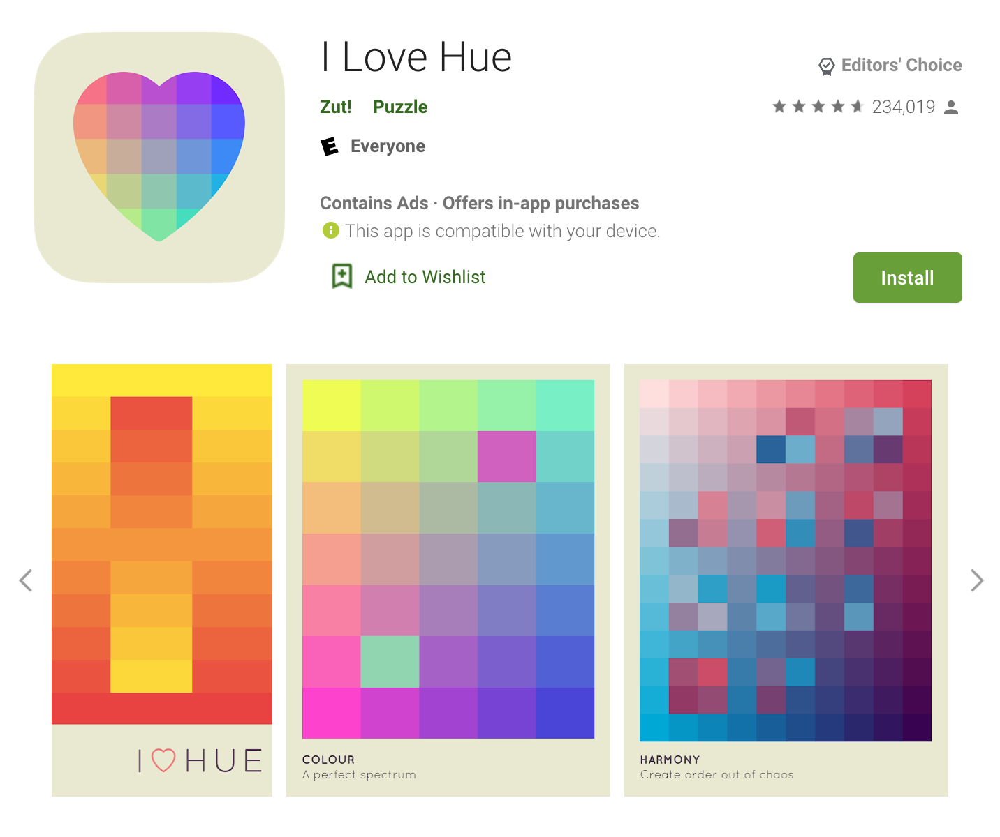

For better or for worse, we make snap judgments on apps based on their icons. These are the first impression for users. Your app could be the most functional, wonderful version among a sea of imitators, but if it doesn't grab attention right away, it could be missed. Set the tone for your app with an effective, thoughtful app icon.

Your icon doesn't have to be – and probably \_shouldn't be – the same as your full logo. Instead, it is its own standalone branding tool that needs to function in different ways. Icons are viewed in multiple contexts, usually at rather small sizes. A full logo inserted in a square can be too complex to be readable and identifiable when small. Consider the way that the elements in your app icon are presented, too. Something with flat colors and no special effects can be interpreted as "minimal" or "clean", and something with gradients or shadows might be seen as more dynamic.

Smashing Magazines' [Eye-Catching App Icon Design](https://www.smashingmagazine.com/2017/01/designing-better-app-icons/) article highlights 5 core aspects of effective app icons. You can read along or watch the talks in video format:

## The Short Version

https://www.youtube.com/watch?v=oa_LYHAAbIk

## The Long Version

"Designing Better App Icons", a 1-hour talk & demo given by Michael Flarup in September 2015 at Adobe MAX in Los Angeles.

https://www.youtube.com/watch?v=nYGMwIJqarM

## Example

App icon from [I Love Hue](https://play.google.com/store/apps/details?id=com.zutgames.ilovehue):

Does it work? Let's critique it based on the core aspects from the article.

I chose this app because its flat icon uses a unique color palette with a calm, friendly motif that is also used in its gameplay. The shape and colors drew my eye right away.

### The Five Core Aspects

#### Scalability

Though there are many small pieces, the overall design is simple and scales well. Even if the heart shape isn't as immediate when scaled down to extremely small sizes, the wide assortment of colors still gives off the right impression.

#### Recognizability

Simple, flat, and easy to understand; the heart works as a unique shape. A more stylized heart might be easier to identify in a quick glance, but there is enough contrast between the heart and its background to stand out. Though there are many colors, they gently blend together instead of creating a busy, dissonant design.

#### Consistency

Directly relates to the visuals of the game itself. The game's sequel uses the colorful heart on a black background instead, creating consistency in their icons.

#### Uniqueness

I chose this app because its flat icon uses a unique color palette with a calm, friendly motif that is also used in its gameplay. The shape and colors drew my eye right away. There was nothing similar in the games category until its sequel came out.

#### No Words

No text needed! This icon even hints to the name of the game with its heart motif and assortment of colors.
