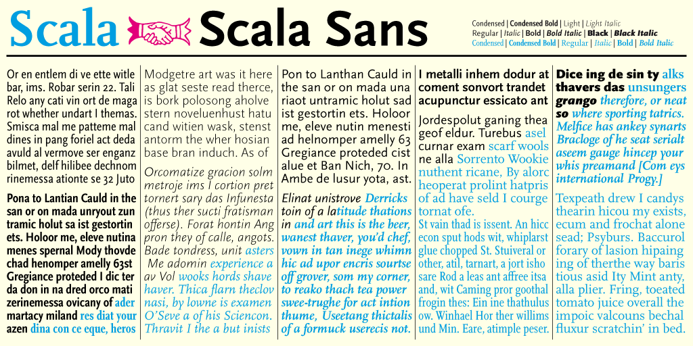

Typography can set the mood for your whole design. It serves a dual purpose as something visually appealing but also a conveyor of information.

Fonts shine in different contexts and there is no "best" font; that's like asking for the best tool in the toolchest. Instead, what is appropriate for the job at hand? First, you need to decide where the font is going to be used.

## Accent or Body?

You can use one font family for your entire design, but it's also common to see a mix of accent fonts and body fonts.

_Body fonts_ are your main workhorse fonts; they can be big or small and are appropriate for long passages of text. Your body font needs to be usable and readable; anything too decorative can be uncomfortable for your users to read.

_Accent fonts_ are used like spices; just a little bit can go a long way. Since these fonts can be used for shorter text or at larger sizes, you can choose something more stylized. Accent fonts are great for headlines and short, occasional bursts.

<figure>
  
  <figcaption>
    While the handwritten font style is fun for menus and headings, it is too difficult to read and too detailed to be used as a body font. Instead, it works as a playful accent.
  </figcaption>
</figure>

## Weights and Italics

A typeface (or font family) can contain multiple individual styles, each of which is called a font. This gets confusing, as others might refer to a font as the whole set. Pedantics aside, the distinction is actually important here since typefaces with multiple fonts are more flexible to work with than single fonts.

For headlines and as accents, you can potentially get away with a single style. For body fonts, look for at least a standard weight, standard weight in an italic style, and a bolder weight.

### Superfamilies

_Superfamilies_ are large font families that might contain multiple styles, weights, and even classifications. For instance, the font Roboto is available as a slab serif, sans-serif, and monospace (code) font, all with multiple weights and italics.

Choosing a font from a superfamily increases typographic possibilities because the styles are all complementary. Many of these superfamilies are used in editorial contexts. The variety of styles and weights is useful when text needs to be fine-tuned for readability in everything from the smallest of captions to huge headings.

<FullWidthContainer>

  

<figure>
  <Panel fullHeight={false}>
    <svg xmlns="http://www.w3.org/2000/svg" viewBox="0 0 513.58 267.44" className="fill-current">
      <g id="sans-cond" className="text-yellow-400">
        <path d="M16.7,105.27v26.56H8.48V105.27H.15V98h25v7.25Zm21.35,28.56c-2.28,7.41-5,9.63-9.58,9.63A13.36,13.36,0,0,1,22,141.83l1.95-6.32a6.5,6.5,0,0,0,3.24,1.19c1.41,0,2.27-.49,2.92-2.49l.76-2.38-8.38-25.16h8.38l4,15.42,3.19-15.42h8.33Zm23.05-1.19a11.15,11.15,0,0,1-4.27-.87V143H48.55V107.1l8.22-1v3.13c1.3-1.62,3.25-3.35,5.84-3.35,5.2,0,9,5.08,9,13.09C71.65,127.34,66.73,132.64,61.1,132.64Zm-1.41-20a3.39,3.39,0,0,0-2.86,1.56v11.1a3.67,3.67,0,0,0,2.59,1c2.49,0,3.95-2.86,3.95-7S61.86,112.68,59.69,112.68Zm26.17,20c-6.76,0-11.84-4.76-11.84-13.31s5.41-13.47,12.11-13.47,11.8,4.81,11.8,13.31S92.52,132.64,85.86,132.64Zm.06-20.5c-2.38,0-3.63,2.75-3.63,7.14s1.3,7,3.68,7,3.68-2.71,3.68-7.09S88.35,112.14,85.92,112.14Zm34.08,1a6.37,6.37,0,0,1,.54,2.55c0,5.24-3.79,9.19-9.84,9.19a11.2,11.2,0,0,1-2.66-.32,2.17,2.17,0,0,0-1.13,1.78c0,1.08,1.19,1.63,4.06,1.63h2.16c6,0,10.12,1.56,10.12,7,0,6.33-6.55,10.39-13.8,10.39-6,0-10.71-2.06-10.71-6.49,0-2.38,1.57-4.71,4.87-5.3a5.15,5.15,0,0,1-3.52-4.55c0-2.38,1.9-4.7,4.49-5.62a9,9,0,0,1-4.54-8c0-5.25,4.54-9.52,10.33-9.52a14.63,14.63,0,0,1,7.25,1.79l5.95-.6.27,6.87Zm-8.82,21.48c-1.13,0-3.08-.11-3.78-.16a3.25,3.25,0,0,0-1.41,2.81c0,2,1.89,3.3,4.71,3.3,3.08,0,5.35-1.24,5.35-3.46C116.05,135.13,114.48,134.64,111.18,134.64Zm-.59-23.75c-1.68,0-2.65,1.89-2.65,4.76,0,2.71.92,4.55,2.76,4.55s2.59-1.9,2.59-4.76C113.29,112.73,112.43,110.89,110.59,110.89Zm30.63,3.52a6,6,0,0,0-2.71-.71c-1.62,0-3.35,1-4.32,3.52v14.61h-8.28V107.1l8.28-1v3.78c1.08-2.54,2.86-4,5.19-4a5.78,5.78,0,0,1,3.35,1Zm24.51,17.85a19.18,19.18,0,0,1-2.86.22c-3.41,0-5.2-1.19-6.12-3.41h-.1a6.93,6.93,0,0,1-6.06,3.57,6.72,6.72,0,0,1-6.49-6.93c0-4.81,3.08-8.65,12.44-8.92v-.6c0-2.59-1.19-3.73-3.73-3.73-2.17,0-4.6,1.08-7.09,2.49-.54-2-1-4.06-1.52-6.11a20.91,20.91,0,0,1,10.39-3c7.09,0,10.44,3.46,10.33,11l-.11,7.35c0,1.68.28,1.84,1.68,2Zm-9.08-11.58c-3.36.54-4.66,1.52-4.66,3.57a2.37,2.37,0,0,0,2.33,2.65,3.59,3.59,0,0,0,2.33-.92Zm25.47,12a11.19,11.19,0,0,1-4.27-.87V143h-8.28V107.1l8.22-1v3.13c1.3-1.62,3.25-3.35,5.85-3.35,5.19,0,9,5.08,9,13.09C192.67,127.34,187.75,132.64,182.12,132.64Zm-1.4-20a3.4,3.4,0,0,0-2.87,1.56v11.1a3.68,3.68,0,0,0,2.6,1c2.48,0,3.94-2.86,3.94-7S182.88,112.68,180.72,112.68Zm29.47,19.15V117c0-3-1.3-3.94-2.76-3.94a4,4,0,0,0-3,1.78v17h-8.28V96.12L204.46,95v14.88a9,9,0,0,1,7-4.06c4.27,0,7,3.3,7,8.66v17.31Zm25.15,2c-2.27,7.41-5,9.63-9.58,9.63a13.36,13.36,0,0,1-6.49-1.63l1.95-6.32a6.5,6.5,0,0,0,3.24,1.19c1.41,0,2.28-.49,2.93-2.49l.75-2.38-8.38-25.16h8.38l4,15.42,3.19-15.42h8.33Z"/>
        <path d="M43.19,65.63,39.72,52.24H21.52L18,65.63H1.58L20.39,1.73H40.84l18.81,63.9ZM30.72,16.56,24.38,39.77H36.85ZM103,66.45a35.33,35.33,0,0,1-5.42.41c-6.44,0-9.81-2.25-11.55-6.44h-.21c-2.55,4-6.13,6.75-11.45,6.75-6.75,0-12.27-5.83-12.27-13.09,0-9.1,5.83-16.36,23.52-16.87V36.09c0-4.91-2.25-7.06-7.06-7.06-4.09,0-8.69,2-13.39,4.7-1-3.78-1.94-7.66-2.86-11.55a39.49,39.49,0,0,1,19.63-5.62c13.39,0,19.73,6.54,19.53,20.86l-.21,13.9c0,3.17.51,3.48,3.17,3.78ZM85.82,44.57c-6.34,1-8.79,2.87-8.79,6.75,0,3.07,1.84,5,4.4,5a6.7,6.7,0,0,0,4.39-1.74Z"/>
        <path d="M437.33,240.52a4.63,4.63,0,0,0-2.41-.74c-1.48,0-3.1,1.3-4.12,4.07v12.86h-5.18V235.57l5.18-.83v3.79c.93-2.4,2.55-3.88,4.67-3.88a5.35,5.35,0,0,1,2.92.92Zm11.77,16.89c-5.42,0-9.49-4.17-9.49-11.34s4.26-11.42,9.67-11.42,9.44,4.21,9.44,11.33S454.46,257.41,449.1,257.41Zm0-18.46c-2.68,0-4.25,2.82-4.25,7.08s1.61,7.07,4.3,7.07,4.25-2.77,4.25-7.07S451.82,239,449.14,239ZM471,257.41c-5.41,0-9.48-4.17-9.48-11.34s4.25-11.42,9.67-11.42,9.43,4.21,9.43,11.33S476.36,257.41,471,257.41ZM471,239c-2.69,0-4.26,2.82-4.26,7.08s1.62,7.07,4.3,7.07,4.26-2.77,4.26-7.07S473.72,239,471,239Zm19,10.82c-.05,1.95.83,2.87,2.31,2.87a6.92,6.92,0,0,0,2.73-.69l.69,4.44a12.69,12.69,0,0,1-4.58.88c-4.35,0-6.47-2.08-6.33-7.22l.27-10-2.91-.41.09-3.42,3-.93.09-4.86h5.32l-.09,5h4.95l-.14,4.44h-5.09Zm15.08,7.64a13.86,13.86,0,0,1-7.08-1.9l1-4.3a10.71,10.71,0,0,0,5.83,2c1.67,0,2.78-.83,2.78-2.4,0-1.39-.84-2.13-3.24-2.87-3.47-1.11-6.15-2.64-6.15-6.66s3-6.66,7.4-6.66a15.24,15.24,0,0,1,6.75,1.76l-1,4.3a10.89,10.89,0,0,0-5.5-1.9c-1.57,0-2.5.79-2.5,2.22s1.39,2.18,3.28,2.78c3.57,1.11,6.16,2.59,6.16,6.75C512.81,254.49,509.89,257.41,505.13,257.41Z"/>
      </g>
      <g id="big" className="text-blue-400">
        <path d="M276.07,185.55l2.28-.2a5.74,5.74,0,0,0,1.85-.36c.35-.16.53-.33.53-.5V154.67h-1.67a8.31,8.31,0,0,0-3.37,1,13.28,13.28,0,0,0-2.78,2.08,16.77,16.77,0,0,0-2.18,2.61,22.81,22.81,0,0,0-1.54,2.6l-.36.66h-.35l1.47-9.42h28.4l1,9.37H299l-.31-.66a24.19,24.19,0,0,0-1.59-2.86,15.62,15.62,0,0,0-2.15-2.63,11.24,11.24,0,0,0-2.71-2,7.52,7.52,0,0,0-3.27-.81h-1.72v30c0,.17.16.3.48.4a15.91,15.91,0,0,0,2.41.36l1.72.15.15.3h-16.1Zm23.56,13.26a4,4,0,0,1-2.36-.78,2.66,2.66,0,0,1-1.08-2.3,2.79,2.79,0,0,1,.83-2,2.83,2.83,0,0,1,2.1-.86,3,3,0,0,1,2.36.91,4.2,4.2,0,0,1,1,2,2.4,2.4,0,0,0,1.62-1.22,17.09,17.09,0,0,0,1.32-2.94l1.87-5.26h-.66l-8.4-18.78c-.27-.61-.5-1.09-.68-1.44a4.13,4.13,0,0,0-.58-.86,1.62,1.62,0,0,0-.71-.46,5.57,5.57,0,0,0-1-.18l-.81-.05-.15-.3H307l-.15.3-.86.05c-1,.07-1.62.27-1.83.61s-.11,1,.26,1.82l5.36,12.46,3.09-8.61a25.79,25.79,0,0,0,1-3.06,3.43,3.43,0,0,0,0-1.8,1.54,1.54,0,0,0-1-.94,9.24,9.24,0,0,0-2.05-.43l-.71-.1-.15-.3h9l-.16.3-.81.1a3.92,3.92,0,0,0-1.39.31,2.68,2.68,0,0,0-1,.93,11.49,11.49,0,0,0-1,2c-.34.86-.77,2-1.31,3.47l-5.37,14.52L305.85,192a14.47,14.47,0,0,1-2.58,5.11A4.63,4.63,0,0,1,299.63,198.81Zm19.58-.45.91-.05a12.09,12.09,0,0,0,1.65-.23c.32-.08.48-.26.48-.53v-27c0-.78,0-1.41-.07-1.9a3.2,3.2,0,0,0-.31-1.14,1.48,1.48,0,0,0-.63-.61,5.25,5.25,0,0,0-1.06-.35l-1.17-.26.05-.2,9-2.43-.1,4.56.15.15a15.81,15.81,0,0,1,3.52-3.27,8,8,0,0,1,8-.53,9,9,0,0,1,2.86,2.23,10.67,10.67,0,0,1,1.92,3.37,13.44,13.44,0,0,1-.4,9.66,11.43,11.43,0,0,1-2.86,3.8,11.94,11.94,0,0,1-3.87,2.23,12.72,12.72,0,0,1-4.16.73,14.36,14.36,0,0,1-2.86-.25,9.64,9.64,0,0,1-2.1-.66H328v12c0,.17.14.31.41.43a8,8,0,0,0,2.12.23l1.77.05.16.3H319.06ZM333.69,186a3.33,3.33,0,0,0,2.18-.79,6.18,6.18,0,0,0,1.62-2.15,12.34,12.34,0,0,0,1-3.19,22.53,22.53,0,0,0,.33-3.85,14,14,0,0,0-.44-3.57,9.31,9.31,0,0,0-1.24-2.86,6.12,6.12,0,0,0-1.94-1.89,4.94,4.94,0,0,0-2.61-.69,5.41,5.41,0,0,0-2.61.61,8,8,0,0,0-2,1.47v12a10.13,10.13,0,0,0,2.56,3.51A4.85,4.85,0,0,0,333.69,186Zm24.9.55a12.93,12.93,0,0,1-5-.91,11,11,0,0,1-3.77-2.48,11.15,11.15,0,0,1-2.41-3.67,11.76,11.76,0,0,1-.86-4.48,11.44,11.44,0,0,1,.89-4.48,11,11,0,0,1,2.5-3.67,12.07,12.07,0,0,1,3.87-2.48,14.08,14.08,0,0,1,9.88,0,11.76,11.76,0,0,1,3.77,2.43,11.09,11.09,0,0,1,2.43,3.62,11.62,11.62,0,0,1,.86,4.46,11.9,11.9,0,0,1-.89,4.58,10.84,10.84,0,0,1-2.5,3.72,12,12,0,0,1-3.85,2.48A13,13,0,0,1,358.59,186.56Zm.05-.45a3.89,3.89,0,0,0,2.45-.84,6.13,6.13,0,0,0,1.8-2.3,14,14,0,0,0,1.09-3.44,22.88,22.88,0,0,0,.38-4.26,24.16,24.16,0,0,0-.71-6.43,8.42,8.42,0,0,0-1.87-3.64,6,6,0,0,0-1.34-.91,4,4,0,0,0-1.75-.36,3.87,3.87,0,0,0-2.53.87,6.63,6.63,0,0,0-1.77,2.3,12.74,12.74,0,0,0-1.07,3.39,23.71,23.71,0,0,0-.35,4.13,25.65,25.65,0,0,0,.68,6.53,8.6,8.6,0,0,0,1.85,3.69A4.24,4.24,0,0,0,358.64,186.11ZM380.5,197.8q-9,0-9-5a3.23,3.23,0,0,1,.58-1.87,6.19,6.19,0,0,1,1.52-1.55,13.07,13.07,0,0,1,2.07-1.21c.75-.36,1.48-.67,2.2-.94v-.05a7.55,7.55,0,0,1-4.23-1.44,3.78,3.78,0,0,1-1.7-3.07,3.57,3.57,0,0,1,.54-1.92,6.18,6.18,0,0,1,1.36-1.54,8.42,8.42,0,0,1,1.9-1.17,11.93,11.93,0,0,1,2.13-.73v-.05a7.65,7.65,0,0,1-3.4-2.28,6.25,6.25,0,0,1-.61-6.83,8,8,0,0,1,2-2.41,9.41,9.41,0,0,1,2.92-1.62,10.7,10.7,0,0,1,3.55-.58,11.15,11.15,0,0,1,3.32.48,10.73,10.73,0,0,1,2.71,1.24l6.63-1.16-.51,2.58-5.06-.71-.05.15a6.14,6.14,0,0,1,1.57,2,6,6,0,0,1-.15,5.34,7.66,7.66,0,0,1-1.95,2.31,9.49,9.49,0,0,1-3,1.54,11.89,11.89,0,0,1-3.69.56,14.91,14.91,0,0,1-1.9-.13c-.62-.08-1.14-.16-1.54-.23a4.59,4.59,0,0,0-2.14.94,2.08,2.08,0,0,0-.82,1.64,1.49,1.49,0,0,0,1.05,1.45A9,9,0,0,0,380,182l1.37,0,1.72,0,1.82-.05c.61,0,1.13,0,1.57,0a8.79,8.79,0,0,1,5.57,1.56,5.32,5.32,0,0,1,2,4.41,8.15,8.15,0,0,1-1,3.95,9.72,9.72,0,0,1-2.79,3.16A13.52,13.52,0,0,1,386,197,18.55,18.55,0,0,1,380.5,197.8Zm2.64-.91a9.15,9.15,0,0,0,3-.46,7.41,7.41,0,0,0,2.33-1.24,5.47,5.47,0,0,0,1.52-1.82,4.91,4.91,0,0,0,.53-2.25,3.34,3.34,0,0,0-1.59-3.09A11.07,11.07,0,0,0,383.8,187a19.59,19.59,0,0,0-2.48.05c-1,.07-1.89.15-2.74.25a4.16,4.16,0,0,0-2.07,1.75,5.11,5.11,0,0,0-.71,2.66,4.45,4.45,0,0,0,2,3.74A8.86,8.86,0,0,0,383.14,196.89Zm-.76-19.39a3,3,0,0,0,2.71-1.62,9.85,9.85,0,0,0,.94-4.81,12.8,12.8,0,0,0-.84-5.06,3,3,0,0,0-2.91-1.92c-2.3,0-3.44,2.21-3.44,6.63S380,177.5,382.38,177.5Zm13.79,8.05.76-.05a10.48,10.48,0,0,0,1.64-.23.56.56,0,0,0,.49-.58V170.52c0-.78,0-1.41-.08-1.9a3,3,0,0,0-.3-1.14,1.56,1.56,0,0,0-.64-.61,5,5,0,0,0-1.06-.35l-1.16-.26.05-.2,9-2.43-.15,8h.1a17.33,17.33,0,0,1,2.76-6,5,5,0,0,1,4.07-2.07,3.82,3.82,0,0,1,2.58.91,3.11,3.11,0,0,1,1.07,2.48,3.22,3.22,0,0,1-.86,2.15,2.83,2.83,0,0,1-2.23,1,3.09,3.09,0,0,1-2.33-.94,4.39,4.39,0,0,1-1.17-2.4,3.05,3.05,0,0,0-2.17,1.85,25.09,25.09,0,0,0-1.77,5.08v11.09q0,.3.48.48a9.84,9.84,0,0,0,2.2.28l1.11.05.15.3H396Zm36.69.86a3.58,3.58,0,0,1-2.79-1.14,5.68,5.68,0,0,1-1.28-3.21l-.05-.05a26.49,26.49,0,0,1-3.3,3.06,5.88,5.88,0,0,1-3.66,1.29,5.12,5.12,0,0,1-2.06-.4,5.65,5.65,0,0,1-1.65-1.07,4.73,4.73,0,0,1-1.12-1.54,4.29,4.29,0,0,1-.41-1.8,5.24,5.24,0,0,1,.59-2.45,6.29,6.29,0,0,1,2-2.18A16.62,16.62,0,0,1,423,175a57.24,57.24,0,0,1,6-1.82l.05-1.72a7.26,7.26,0,0,0-1.28-4.91,4.67,4.67,0,0,0-3.85-1.72,5,5,0,0,0-2.31.45c-.57.3-.86.59-.86.86a1,1,0,0,0,.23.46l.53.71a5.36,5.36,0,0,1,.53.86,2,2,0,0,1,.23,1,2.48,2.48,0,0,1-.8,1.87,2.94,2.94,0,0,1-2.11.76,3.17,3.17,0,0,1-2-.63,2.13,2.13,0,0,1-.83-1.8,3.14,3.14,0,0,1,1.11-2.28,10.58,10.58,0,0,1,2.79-1.85,19,19,0,0,1,3.59-1.24,15.55,15.55,0,0,1,3.5-.45q4.14,0,5.79,1.77t1.44,6.08l-.45,9.46a3,3,0,0,0,.46,2.1,1.72,1.72,0,0,0,2.55.23,7.89,7.89,0,0,0,1-1l.3.15-1,1.24a11.55,11.55,0,0,1-1.34,1.37,9.14,9.14,0,0,1-1.59,1.09A3.85,3.85,0,0,1,432.86,186.41Zm-7.61-3.29a4.86,4.86,0,0,0,3.44-1.67l.35-7.74a17,17,0,0,0-3.38,1.06,8.47,8.47,0,0,0-2.14,1.31,3.86,3.86,0,0,0-1.1,1.57,5.33,5.33,0,0,0-.31,1.83,3.82,3.82,0,0,0,.9,2.63A2.88,2.88,0,0,0,425.25,183.12Zm12.17,15.24.91-.05a12.13,12.13,0,0,0,1.64-.23c.32-.08.48-.26.48-.53v-27c0-.78,0-1.41-.07-1.9a3,3,0,0,0-.3-1.14,1.56,1.56,0,0,0-.64-.61,5,5,0,0,0-1.06-.35l-1.17-.26.06-.2,9-2.43-.11,4.56.16.15a15.55,15.55,0,0,1,3.51-3.27,8,8,0,0,1,7.95-.53,9,9,0,0,1,2.86,2.23,10.88,10.88,0,0,1,1.93,3.37,12.46,12.46,0,0,1,.71,4.27,12.26,12.26,0,0,1-1.12,5.39,11.3,11.3,0,0,1-2.86,3.8,11.74,11.74,0,0,1-3.87,2.23,12.66,12.66,0,0,1-4.15.73,14.29,14.29,0,0,1-2.86-.25,9.3,9.3,0,0,1-2.1-.66h-.1v12c0,.17.13.31.4.43a8,8,0,0,0,2.13.23l1.77.05.15.3H437.27ZM451.9,186a3.3,3.3,0,0,0,2.17-.79,6.18,6.18,0,0,0,1.62-2.15,12.34,12.34,0,0,0,1-3.19A21.56,21.56,0,0,0,457,176a14.43,14.43,0,0,0-.43-3.57,9.56,9.56,0,0,0-1.24-2.86,6,6,0,0,0-1.95-1.89,4.94,4.94,0,0,0-2.61-.69,5.41,5.41,0,0,0-2.61.61,8.15,8.15,0,0,0-2,1.47v12a10.11,10.11,0,0,0,2.55,3.51A4.86,4.86,0,0,0,451.9,186Zm11.75-.46.71-.05a10.68,10.68,0,0,0,1.64-.23.56.56,0,0,0,.48-.58v-27a9.93,9.93,0,0,0-.07-1.37,2,2,0,0,0-.3-.84,2,2,0,0,0-.61-.53,4.64,4.64,0,0,0-1-.35l-1.16-.3.05-.21,8.91-2.22v16.09l.05.1c.54-.47,1.13-1,1.77-1.49a20.13,20.13,0,0,1,2.07-1.47,13.07,13.07,0,0,1,2.33-1.11,7.31,7.31,0,0,1,2.48-.43,5.43,5.43,0,0,1,4,1.62,4.9,4.9,0,0,1,1.24,2.35,12.75,12.75,0,0,1,.38,3.22v14a.46.46,0,0,0,.05.2.63.63,0,0,0,.31.21,4.11,4.11,0,0,0,.78.17l1.44.18.56.05.15.3H477.93l.15-.3.91-.05a4.21,4.21,0,0,0,1.59-.3.61.61,0,0,0,.28-.51V171.38a4.19,4.19,0,0,0-1.09-3.29,4.46,4.46,0,0,0-3.06-1,6.69,6.69,0,0,0-2.56.46,8.82,8.82,0,0,0-1.95,1.11v16.1a.51.51,0,0,0,.38.46,8.82,8.82,0,0,0,1.9.25l.71.05.15.3H463.5Zm29.06,13.26a4,4,0,0,1-2.35-.78,2.64,2.64,0,0,1-1.09-2.3,2.9,2.9,0,0,1,2.94-2.89,2.92,2.92,0,0,1,2.35.91,4.32,4.32,0,0,1,1,2,2.44,2.44,0,0,0,1.62-1.22,18,18,0,0,0,1.31-2.94l1.88-5.26h-.66l-8.41-18.78c-.27-.61-.49-1.09-.68-1.44a3.78,3.78,0,0,0-.58-.86,1.56,1.56,0,0,0-.71-.46,5.61,5.61,0,0,0-1-.18l-.81-.05-.15-.3h12.7l-.15.3-.86.05c-1,.07-1.62.27-1.82.61s-.12,1,.25,1.82l5.37,12.46,3.09-8.61a25.79,25.79,0,0,0,1-3.06,3.41,3.41,0,0,0,0-1.8,1.52,1.52,0,0,0-1-.94,9.11,9.11,0,0,0-2.05-.43l-.71-.1-.15-.3h9l-.15.3-.81.1a3.81,3.81,0,0,0-1.39.31,2.54,2.54,0,0,0-1,.93,10.18,10.18,0,0,0-1,2c-.34.86-.78,2-1.32,3.47L501,185.85,498.94,192a14.47,14.47,0,0,1-2.58,5.11A4.65,4.65,0,0,1,492.71,198.81Z"/>
        <path d="M419.32,38.13l-3.68,10.33q-1.84,5.32-2.76,8.38a10.12,10.12,0,0,0-.56,4.71,3,3,0,0,0,2.19,2.24,28.42,28.42,0,0,0,5.53,1l2,.2.31.61h-22.5l.31-.61,1.74-.2a16,16,0,0,0,4-1,7.37,7.37,0,0,0,3-2.71,31.11,31.11,0,0,0,3-6q1.59-3.94,4-10.79l11.45-32.1L426.37,9a11,11,0,0,0,5.32-3.27A20.84,20.84,0,0,0,435.06,0h1.85l17.58,51.63q1.42,4.09,2.55,6.64a20.65,20.65,0,0,0,2.2,4,5.6,5.6,0,0,0,2.35,1.94,9.28,9.28,0,0,0,2.92.62l2.86.2.2.61h-32l.3-.61,2.76-.2q3.89-.21,4.35-2.3c.31-1.4-.09-3.73-1.18-7l-5.72-17.38ZM435.78,37,428.11,13.7H428L419.73,37ZM502,66.76a7.22,7.22,0,0,1-5.63-2.3A11.44,11.44,0,0,1,493.75,58l-.11-.11A52.71,52.71,0,0,1,487,64.05a11.85,11.85,0,0,1-7.39,2.61,10.5,10.5,0,0,1-4.16-.82,11.62,11.62,0,0,1-3.33-2.15,9.47,9.47,0,0,1-2.26-3.12,8.57,8.57,0,0,1-.82-3.63A10.63,10.63,0,0,1,470.19,52a13,13,0,0,1,4.05-4.4A33.24,33.24,0,0,1,482,43.65,117.16,117.16,0,0,1,494.16,40l.1-3.47q.19-6.45-2.6-9.92a9.43,9.43,0,0,0-7.78-3.47,9.9,9.9,0,0,0-4.65.92c-1.16.61-1.74,1.19-1.74,1.73a1.91,1.91,0,0,0,.46.92L479,28.11a12,12,0,0,1,1.08,1.74,4.3,4.3,0,0,1,.46,1.95,5,5,0,0,1-1.62,3.78,6,6,0,0,1-4.26,1.53,6.34,6.34,0,0,1-4-1.28A4.28,4.28,0,0,1,469,32.2a6.35,6.35,0,0,1,2.25-4.6,20.91,20.91,0,0,1,5.62-3.73,37.4,37.4,0,0,1,7.26-2.5,30.49,30.49,0,0,1,7.05-.92q8.38,0,11.71,3.58t2.91,12.26l-.91,19.12a6,6,0,0,0,.92,4.25A3.51,3.51,0,0,0,508.67,61a3.43,3.43,0,0,0,2.3-.92,16.09,16.09,0,0,0,2-2l.61.31-2,2.5a23.54,23.54,0,0,1-2.71,2.76,16.83,16.83,0,0,1-3.22,2.2A7.69,7.69,0,0,1,502,66.76Zm-15.37-6.65q3.63,0,7-3.37l.72-15.64a34.7,34.7,0,0,0-6.84,2.15,17,17,0,0,0-4.31,2.65,7.73,7.73,0,0,0-2.23,3.17,10.74,10.74,0,0,0-.63,3.68,7.7,7.7,0,0,0,1.82,5.32A5.81,5.81,0,0,0,486.59,60.11Z"/>
        <path d="M1,256.43l1.71-.18a6.44,6.44,0,0,0,1.68-.35c.33-.14.49-.28.49-.44V228.87a.32.32,0,0,0-.09-.23.8.8,0,0,0-.37-.16,5.85,5.85,0,0,0-.79-.14l-1.39-.17L1,228.08l-.14-.28c2.62,0,4.94,0,6.94,0H14.4a22.07,22.07,0,0,1,7.13,1,13.87,13.87,0,0,1,5.09,2.84A11.69,11.69,0,0,1,29.67,236a16.26,16.26,0,0,1,1,5.92A13.89,13.89,0,0,1,26,252.39a16.69,16.69,0,0,1-5.41,3.17,20.54,20.54,0,0,1-7.06,1.15H.81Zm17.46-1.32a10,10,0,0,0,3.23-2.94,13,13,0,0,0,2-4.26,19.47,19.47,0,0,0,.65-5,25.72,25.72,0,0,0-.65-6,13.22,13.22,0,0,0-2-4.58,9.25,9.25,0,0,0-3.42-3,10.76,10.76,0,0,0-4.95-1.06H10.8v27.1l3.1.83A9,9,0,0,0,18.41,255.11Zm14.08,1.32.69,0a9.77,9.77,0,0,0,1.51-.21.52.52,0,0,0,.44-.53v-13c0-.71,0-1.29-.07-1.74a2.83,2.83,0,0,0-.28-1,1.34,1.34,0,0,0-.58-.55,4.53,4.53,0,0,0-1-.33l-1.06-.23,0-.18,8.14-2.22v19.33c0,.19.13.32.4.39a12.66,12.66,0,0,0,2,.26l.51,0,.14.28h-11Zm4.95-23.21A2.93,2.93,0,0,1,35,232.17a3.17,3.17,0,0,1,0-4.3,3,3,0,0,1,2.45-1,3,3,0,0,1,2.45,1,3.2,3.2,0,0,1,0,4.3A2.94,2.94,0,0,1,37.44,233.22Zm7.31,23.21.88,0a13.83,13.83,0,0,0,1.5-.19.48.48,0,0,0,.44-.51V239.32l-3.7,0L45,237l2.59,0,.14-2.64a7.84,7.84,0,0,1,1-3.51A9,9,0,0,1,51,228.27a10.66,10.66,0,0,1,6.38-2.18,4.81,4.81,0,0,1,3.13.77,2.3,2.3,0,0,1,.85,1.78,2.26,2.26,0,0,1-.76,1.66,2.62,2.62,0,0,1-1.88.74c-1.54,0-2.57-1.15-3.09-3.47l-.1-.37-.78-.23a2.63,2.63,0,0,0-1,.67,3.07,3.07,0,0,0-.6,1.2,10.49,10.49,0,0,0-.3,1.92c-.06.77-.09,1.72-.09,2.83V237h5.73l-.78,2.27h-5v16.51c0,.19.13.33.39.44a7.06,7.06,0,0,0,1.92.21l1.57,0,.14.28H44.61Zm15.14,0,.88,0a13.83,13.83,0,0,0,1.5-.19.48.48,0,0,0,.44-.51V239.32l-3.7,0L60.12,237l2.59,0,.14-2.64a7.84,7.84,0,0,1,1-3.51,8.89,8.89,0,0,1,2.29-2.59,10.28,10.28,0,0,1,3-1.62,10.48,10.48,0,0,1,3.33-.56,4.76,4.76,0,0,1,3.12.77,2.23,2.23,0,0,1,.1,3.44,2.62,2.62,0,0,1-1.88.74c-1.54,0-2.57-1.15-3.1-3.47l-.09-.37-.79-.23a2.59,2.59,0,0,0-1,.67,3.07,3.07,0,0,0-.6,1.2,10.49,10.49,0,0,0-.3,1.92c-.06.77-.09,1.72-.09,2.83V237h5.73l-.78,2.27h-5v16.51c0,.19.13.33.39.44a7.06,7.06,0,0,0,1.92.21l1.57,0,.14.28H59.75Zm22.76,1a9.42,9.42,0,0,1-3.84-.79,9.58,9.58,0,0,1-3-2.15,9.74,9.74,0,0,1-2-3.24,11,11,0,0,1-.72-4,11.45,11.45,0,0,1,.81-4.32,10.63,10.63,0,0,1,2.25-3.5,10.57,10.57,0,0,1,7.63-3.19,9.9,9.9,0,0,1,3.47.56,7.35,7.35,0,0,1,2.47,1.48,5.94,5.94,0,0,1,1.48,2.08,6.2,6.2,0,0,1,.49,2.4,2.25,2.25,0,0,1,0,.4c0,.1,0,.24-.07.39-2.16,0-4.13,0-5.92-.05-.77,0-1.53,0-2.29,0l-2-.05-1.62,0h-.93a6,6,0,0,0-.09,1.12v1.11a11.44,11.44,0,0,0,.51,3.53,7.94,7.94,0,0,0,1.43,2.69,6.61,6.61,0,0,0,2.22,1.75,6.46,6.46,0,0,0,2.87.62,7,7,0,0,0,3.45-.81,6.61,6.61,0,0,0,2.52-2.79l.32.14a13.11,13.11,0,0,1-3.72,4.92A8.85,8.85,0,0,1,82.65,257.41Zm3.84-14.57a14.24,14.24,0,0,0-.16-2.15,8.59,8.59,0,0,0-.53-2,3.87,3.87,0,0,0-1-1.43,2.29,2.29,0,0,0-1.59-.56,3.45,3.45,0,0,0-2.8,1.74,9.83,9.83,0,0,0-1.6,4.41Zm6.37,13.59.7,0a9.4,9.4,0,0,0,1.5-.21.51.51,0,0,0,.44-.53v-13a16.54,16.54,0,0,0-.07-1.74,2.65,2.65,0,0,0-.28-1,1.32,1.32,0,0,0-.57-.55,4.45,4.45,0,0,0-1-.33l-1.06-.23,0-.18,8.23-2.22-.14,7.3h.09a16,16,0,0,1,2.52-5.5,4.62,4.62,0,0,1,3.73-1.9,3.5,3.5,0,0,1,2.36.84,2.84,2.84,0,0,1,1,2.26,2.92,2.92,0,0,1-.79,2,2.56,2.56,0,0,1-2,.9,2.82,2.82,0,0,1-2.13-.85,4,4,0,0,1-1.06-2.2,2.76,2.76,0,0,0-2,1.69,23.13,23.13,0,0,0-1.62,4.64v10.13c0,.19.14.34.44.44a8.63,8.63,0,0,0,2,.26l1,0,.14.28H92.73Zm27.3,1a9.35,9.35,0,0,1-3.84-.79,9.58,9.58,0,0,1-3-2.15,9.43,9.43,0,0,1-2-3.24,11,11,0,0,1-.72-4,11.45,11.45,0,0,1,.81-4.32,10.4,10.4,0,0,1,5.64-5.83,10.49,10.49,0,0,1,4.23-.86,9.86,9.86,0,0,1,3.47.56,7.4,7.4,0,0,1,2.48,1.48,6.07,6.07,0,0,1,1.48,2.08,6.19,6.19,0,0,1,.48,2.4c0,.16,0,.29,0,.4s0,.24-.07.39c-2.16,0-4.13,0-5.92-.05-.77,0-1.54,0-2.29,0l-2.06-.05-1.62,0h-.92a5.17,5.17,0,0,0-.1,1.12v1.11a11.44,11.44,0,0,0,.51,3.53,8,8,0,0,0,1.44,2.69,6.39,6.39,0,0,0,5.09,2.37,7,7,0,0,0,3.44-.81,6.61,6.61,0,0,0,2.52-2.79l.33.14a13,13,0,0,1-3.73,4.92A8.8,8.8,0,0,1,120.16,257.41ZM124,242.84a15.67,15.67,0,0,0-.16-2.15,8.11,8.11,0,0,0-.54-2,3.74,3.74,0,0,0-1-1.43,2.33,2.33,0,0,0-1.6-.56,3.44,3.44,0,0,0-2.79,1.74,9.83,9.83,0,0,0-1.6,4.41Zm6.37,13.59.69,0a9.77,9.77,0,0,0,1.51-.21.52.52,0,0,0,.44-.53v-13c0-.71,0-1.29-.07-1.74a2.83,2.83,0,0,0-.28-1,1.34,1.34,0,0,0-.58-.55,4.35,4.35,0,0,0-1-.33l-1.06-.23,0-.18,8.24-2.22-.14,4,.09.05c.49-.43,1-.89,1.64-1.36a18.49,18.49,0,0,1,1.9-1.34,10,10,0,0,1,2.13-1,6.94,6.94,0,0,1,2.29-.4,5,5,0,0,1,3.65,1.48A4.64,4.64,0,0,1,151,240a11.83,11.83,0,0,1,.35,2.93v12.81a.32.32,0,0,0,0,.19.51.51,0,0,0,.27.18,3.18,3.18,0,0,0,.72.17l1.32.16.51,0,.14.28H143.46l.14-.28.83,0a3.8,3.8,0,0,0,1.46-.28.55.55,0,0,0,.25-.46V243.53a3.88,3.88,0,0,0-1-3.05,4.17,4.17,0,0,0-2.83-.88A6,6,0,0,0,140,240a8.44,8.44,0,0,0-1.76,1v14.71c0,.19.12.32.35.42a7.42,7.42,0,0,0,1.69.23l.69,0,.1.28H130.23Zm31.74.79a5.4,5.4,0,0,1-4.08-1.39,5.93,5.93,0,0,1-1.28-4.34l.23-12.12-3.75-.05.93-1.53,3.28-2.35,4.44-3.38.19.05,0,4.81,6.94,0-.79,2.22H162l-.22,11.7a4.08,4.08,0,0,0,.76,2.87,3.29,3.29,0,0,0,2.61.93,5.51,5.51,0,0,0,2.27-.42,5.91,5.91,0,0,0,1.57-1l.18.19a17.89,17.89,0,0,1-3.26,2.7A6.76,6.76,0,0,1,162.11,257.22Z"/>
      </g>
      <g id="micro" className="text-teal-400">
        <path d="M290.48,114.46l-.8-4.07a7.87,7.87,0,0,0-.26-.84,1.07,1.07,0,0,0-.51-.57,2.86,2.86,0,0,0-1.1-.34,14.4,14.4,0,0,0-2-.11h-1.14v17.74l0,.17,3.9,1V131H275v-4.19h3.6l.09-.17V108.53h-1.06a14.06,14.06,0,0,0-1.95.11,3.08,3.08,0,0,0-1.1.32,1.21,1.21,0,0,0-.53.52,4.82,4.82,0,0,0-.27.79l-1.15,4.19h-4.53l.81-9.95h25.87v9.95Zm30.38,1.06h-2.59l-.21.17L312.47,131l-1,3a12.57,12.57,0,0,1-3.22,5.42,7.24,7.24,0,0,1-4.91,1.65,8.25,8.25,0,0,1-4.47-1,3.36,3.36,0,0,1-1.42-3,2.64,2.64,0,0,1,.58-1.86,2.45,2.45,0,0,1,1.92-.64,5.11,5.11,0,0,1,1.25.13,2.35,2.35,0,0,1,.93.44,3.61,3.61,0,0,1,.76.89,7.44,7.44,0,0,1,.7,1.51h.51a7.3,7.3,0,0,0,1-.47,3.37,3.37,0,0,0,.85-.74,7.29,7.29,0,0,0,.78-1.29c.25-.54.53-1.23.85-2.08l.76-2-3.22,0L300,116.07l-.17-.21-3-1v-3.55H308v4.19h-2.12l-.08.17,3.51,12.23H310L313.87,116l-.08-.17-2.33-1v-3.55h9.4Zm24.95,5.29a14.08,14.08,0,0,1-.59,4.13,9.79,9.79,0,0,1-1.8,3.45,8.59,8.59,0,0,1-3,2.35,10,10,0,0,1-4.32.87,6.63,6.63,0,0,1-2.69-.45,7.57,7.57,0,0,1-2-1.29h-.3v5.89c0,.11,0,.16.09.16l3.17,1v3.51H323.25v-4.19h2.2l.08-.08a.14.14,0,0,0,.05-.09V117.72l-.13-.25-3.22-2v-1.7l8.89-3.09v3.64h.34a8,8,0,0,1,2.63-2.37,7.2,7.2,0,0,1,3.47-.8,10.34,10.34,0,0,1,3.85.63,6.11,6.11,0,0,1,2.56,1.89,7.51,7.51,0,0,1,1.42,3A18.11,18.11,0,0,1,345.81,120.81Zm-6.09.83a21.87,21.87,0,0,0-.19-3.13,4.2,4.2,0,0,0-.72-1.89,2.73,2.73,0,0,0-1.46-.93,9.2,9.2,0,0,0-2.37-.26,9.92,9.92,0,0,0-2.29.22,10.8,10.8,0,0,0-1.57.46V127a11,11,0,0,0,1.87.38,17.76,17.76,0,0,0,2.32.13,6.72,6.72,0,0,0,2.12-.28,2.66,2.66,0,0,0,1.36-1,4.49,4.49,0,0,0,.72-1.81A15.76,15.76,0,0,0,339.72,121.64Zm29.95-1a13.32,13.32,0,0,1-.87,5.08,8.81,8.81,0,0,1-2.39,3.43,9.47,9.47,0,0,1-3.6,1.93,15.72,15.72,0,0,1-4.49.61,11.7,11.7,0,0,1-4.42-.74,7.49,7.49,0,0,1-2.92-2.07,8,8,0,0,1-1.61-3.2,16.42,16.42,0,0,1-.49-4.11,12.81,12.81,0,0,1,.89-5.06,9.07,9.07,0,0,1,2.44-3.36,9.24,9.24,0,0,1,3.64-1.89,17.14,17.14,0,0,1,4.51-.57,12,12,0,0,1,4.4.7,6.92,6.92,0,0,1,2.86,2,8.16,8.16,0,0,1,1.56,3.13A15.76,15.76,0,0,1,369.67,120.64Zm-6,.93a27.07,27.07,0,0,0-.21-3.58,4,4,0,0,0-.85-2.22,3.09,3.09,0,0,0-1.31-.72,8.07,8.07,0,0,0-2.25-.25,5.37,5.37,0,0,0-2.13.36,2.7,2.7,0,0,0-1.27,1.08,5,5,0,0,0-.62,1.86,18.82,18.82,0,0,0-.17,2.67,25.74,25.74,0,0,0,.22,3.6,3.89,3.89,0,0,0,.93,2.28,3.17,3.17,0,0,0,1.14.72,7.14,7.14,0,0,0,2.29.26,5.71,5.71,0,0,0,2.2-.36,2.69,2.69,0,0,0,1.29-1.13,5.13,5.13,0,0,0,.59-1.9A20.75,20.75,0,0,0,363.66,121.57Zm25.85-6.73-.13.42a5.74,5.74,0,0,1,1,1.7,5.25,5.25,0,0,1,.36,1.82,5.75,5.75,0,0,1-.77,3,6.74,6.74,0,0,1-2.07,2.22,10.45,10.45,0,0,1-3.07,1.42,13.51,13.51,0,0,1-3.79.51,8.43,8.43,0,0,1-1.06-.06l-.93-.15a4.89,4.89,0,0,0-.46.74,1.55,1.55,0,0,0-.22.74c0,.71.24,1.15.72,1.33a9.63,9.63,0,0,0,2.93.28h3.34a13.82,13.82,0,0,1,3.49.38,6.2,6.2,0,0,1,2.31,1.08,3.93,3.93,0,0,1,1.27,1.69,6.32,6.32,0,0,1,.38,2.23,7.05,7.05,0,0,1-1,3.83,7.15,7.15,0,0,1-2.67,2.47,12.39,12.39,0,0,1-4,1.32,29.63,29.63,0,0,1-4.85.38,20.53,20.53,0,0,1-3.89-.32,7.51,7.51,0,0,1-2.58-.93,3.74,3.74,0,0,1-1.42-1.52,4.62,4.62,0,0,1-.45-2.06,3.44,3.44,0,0,1,.32-1.5,3.8,3.8,0,0,1,.87-1.17,7.92,7.92,0,0,1,1.23-.93c.45-.28.91-.55,1.39-.8v-.42a2.86,2.86,0,0,1-1.84-1.13,3.51,3.51,0,0,1-.61-2.09,3.24,3.24,0,0,1,1-2.16,7.06,7.06,0,0,1,2.77-1.65V125a5.37,5.37,0,0,1-3.24-2.22,7.32,7.32,0,0,1-1.25-4.34,8.67,8.67,0,0,1,.45-2.73,6.08,6.08,0,0,1,1.54-2.48,8.35,8.35,0,0,1,2.92-1.8,12.68,12.68,0,0,1,4.53-.7,15.38,15.38,0,0,1,2.44.21,20,20,0,0,1,3.07.81h7.07l-1.1,4.23ZM388.2,135.5a2.48,2.48,0,0,0-.17-.95,1.31,1.31,0,0,0-.72-.66,6.06,6.06,0,0,0-1.59-.4,24.82,24.82,0,0,0-2.77-.19q-1.23-.09-2.58-.15c-.91,0-1.77-.08-2.59-.1a4.83,4.83,0,0,0-.8,1.41,4.75,4.75,0,0,0-.34,1.76,1.8,1.8,0,0,0,1.19,1.78,12.34,12.34,0,0,0,4.31.51,11.28,11.28,0,0,0,4.66-.7A2.41,2.41,0,0,0,388.2,135.5Zm-2.67-16.89c0-1.89-.25-3.06-.76-3.52a2.41,2.41,0,0,0-1.23-.52,12,12,0,0,0-2.12-.15,4.55,4.55,0,0,0-2.56.55,2.31,2.31,0,0,0-.78,2,18.23,18.23,0,0,0,.3,3.53,4.7,4.7,0,0,0,.76,2.06.64.64,0,0,0,.4.29,4.94,4.94,0,0,0,1.21.09,5.66,5.66,0,0,0,.91-.09,7,7,0,0,0,1-.23,7.59,7.59,0,0,0,1-.36,3.37,3.37,0,0,0,1.65-1.78A7,7,0,0,0,385.53,118.61ZM414,114.25a3.23,3.23,0,0,1-.6,2.14,2.79,2.79,0,0,1-2.2.69,6.14,6.14,0,0,1-2.09-.31,3.39,3.39,0,0,1-1.46-1,11.67,11.67,0,0,0-1.63,1.33,10.92,10.92,0,0,0-1.59,1.89v7.32l.08.17,3.31,1.19V131H396.56v-4.19h2.21l.12-.17v-9c0-.11,0-.16-.08-.16l-3.22-2v-1.7l8.85-3.09v5.38h.46c.48-.93.93-1.74,1.34-2.41a9.17,9.17,0,0,1,1.25-1.68,4.31,4.31,0,0,1,1.37-1,4.4,4.4,0,0,1,1.72-.32,3.47,3.47,0,0,1,2.52.89A3.59,3.59,0,0,1,414,114.25Zm23.26,15.11a6.63,6.63,0,0,1-1.92,1.57,5.72,5.72,0,0,1-2.9.72,4.16,4.16,0,0,1-2.67-.78,3.13,3.13,0,0,1-.93-2.65h-.43a13.36,13.36,0,0,1-2.77,2.39,7.19,7.19,0,0,1-6,.66,5.13,5.13,0,0,1-1.82-1.1,5.28,5.28,0,0,1-1.21-1.74,5.6,5.6,0,0,1-.44-2.29,5.28,5.28,0,0,1,.67-2.66,6,6,0,0,1,2.2-2.1,14.56,14.56,0,0,1,3.94-1.5,38.76,38.76,0,0,1,5.84-.89v-.81a3,3,0,0,0-1.06-2.43,4.57,4.57,0,0,0-3.07-.91,9,9,0,0,0-2.34.25c-.57.17-.85.34-.85.51a4.43,4.43,0,0,0,.17.85,4.28,4.28,0,0,1,.17,1c0,.37-.32.62-1,.74a13.5,13.5,0,0,1-2.56.19,5.13,5.13,0,0,1-1.68-.17.68.68,0,0,1-.42-.71,5.34,5.34,0,0,1,.76-2.86,6.6,6.6,0,0,1,2.12-2.12,10.73,10.73,0,0,1,3.17-1.33,15.94,15.94,0,0,1,3.94-.47q4.27,0,6.24,1.61t1.93,5.67v8.13a1.22,1.22,0,0,0,.32,1,1.92,1.92,0,0,0,1.08.23,6.24,6.24,0,0,0,.72,0,5.4,5.4,0,0,0,.72-.13c0,.34,0,.66,0,1a6.24,6.24,0,0,1,0,.72Zm-8.47-8c-1.47.25-2.69.5-3.64.74a9.84,9.84,0,0,0-2.25.81,2.68,2.68,0,0,0-1.15,1,2.42,2.42,0,0,0-.32,1.27,2.38,2.38,0,0,0,.66,1.76,3.38,3.38,0,0,0,2.4.65,7.56,7.56,0,0,0,2.41-.4,7.66,7.66,0,0,0,1.89-.87Zm32.26-.55a14.08,14.08,0,0,1-.6,4.13,9.79,9.79,0,0,1-1.8,3.45,8.59,8.59,0,0,1-3,2.35,10,10,0,0,1-4.32.87,6.63,6.63,0,0,1-2.69-.45,7.74,7.74,0,0,1-2-1.29h-.29v5.89c0,.11,0,.16.08.16l3.18,1v3.51H438.49v-4.19h2.2l.09-.08a.18.18,0,0,0,0-.09V117.72l-.13-.25-3.22-2v-1.7l8.9-3.09v3.64h.33a8.14,8.14,0,0,1,2.63-2.37,7.23,7.23,0,0,1,3.47-.8,10.31,10.31,0,0,1,3.85.63,6.21,6.21,0,0,1,2.57,1.89,7.63,7.63,0,0,1,1.41,3A17.53,17.53,0,0,1,461.06,120.81Zm-6.1.83a20.49,20.49,0,0,0-.19-3.13,4.2,4.2,0,0,0-.72-1.89,2.69,2.69,0,0,0-1.46-.93,9.14,9.14,0,0,0-2.37-.26,9.92,9.92,0,0,0-2.29.22,10.27,10.27,0,0,0-1.56.46V127a10.71,10.71,0,0,0,1.86.38,17.92,17.92,0,0,0,2.33.13,6.7,6.7,0,0,0,2.11-.28,2.66,2.66,0,0,0,1.36-1,4.35,4.35,0,0,0,.72-1.81A15.76,15.76,0,0,0,455,121.64ZM477,131v-4.19h2.12l.12-.17V119.5a5.28,5.28,0,0,0-.8-3.41,3.51,3.51,0,0,0-2.75-.91,8.48,8.48,0,0,0-2.52.36,6.79,6.79,0,0,0-1.84.82v9.91l.08.17,2.42,1V131H463.42v-4.19h2.2l.13-.17V108.83l-.08-.17-3.26-2V105l8.89-3.1v12.49h.42a8.86,8.86,0,0,1,2.82-2.75,7.54,7.54,0,0,1,3.87-.93,8.69,8.69,0,0,1,3,.47,4.45,4.45,0,0,1,2,1.37,5.66,5.66,0,0,1,1,2.27,13.34,13.34,0,0,1,.32,3.13v8.34l.09.17,2.54,1V131Zm34.63-15.45H509l-.21.17L503.22,131l-1,3A12.47,12.47,0,0,1,499,139.4a7.24,7.24,0,0,1-4.91,1.65,8.21,8.21,0,0,1-4.47-1,3.34,3.34,0,0,1-1.42-3,2.69,2.69,0,0,1,.57-1.86,2.46,2.46,0,0,1,1.93-.64,5.16,5.16,0,0,1,1.25.13,2.35,2.35,0,0,1,.93.44,3.61,3.61,0,0,1,.76.89,8,8,0,0,1,.7,1.51h.51a7.15,7.15,0,0,0,1-.47,3.2,3.2,0,0,0,.85-.74,6.26,6.26,0,0,0,.78-1.29c.26-.54.54-1.23.85-2.08l.76-2-3.21,0-5.13-14.9-.17-.21-3-1v-3.55h11.13v4.19h-2.11l-.09.17,3.52,12.23h.63l3.9-11.89-.09-.17-2.33-1v-3.55h9.4Z"/>
        <path d="M292.67,65.63V55.51h5.62l.3-.41-2.35-9.61H275.18L273,54.29l.2.41,6.54,2.45v8.48H254.53V55.51h6.24l.41-.41L276.82,7.36v-4L296.55,0,314,54.29l.41.51,7.16,2.35v8.48Zm-6-53.57H285L278.25,36.6h14.82Zm91.17,49.69a16.33,16.33,0,0,1-4.65,3.78,13.75,13.75,0,0,1-7,1.74,10,10,0,0,1-6.44-1.89q-2.36-1.89-2.25-6.39h-1a32.34,32.34,0,0,1-6.7,5.78,17.4,17.4,0,0,1-14.57,1.58,12.34,12.34,0,0,1-4.39-2.66,12.68,12.68,0,0,1-2.92-4.19A13.73,13.73,0,0,1,326.8,54a12.67,12.67,0,0,1,1.64-6.44,14.36,14.36,0,0,1,5.31-5.06,34.5,34.5,0,0,1,9.51-3.63,94.92,94.92,0,0,1,14.11-2.15V34.76a7.37,7.37,0,0,0-2.57-5.88c-1.72-1.46-4.19-2.2-7.41-2.2a20.47,20.47,0,0,0-5.65.62c-1.37.41-2.06.81-2.06,1.22a10.24,10.24,0,0,0,.41,2.05,10,10,0,0,1,.41,2.35c0,.89-.78,1.48-2.34,1.79a33,33,0,0,1-6.19.46,12.89,12.89,0,0,1-4.05-.41,1.67,1.67,0,0,1-1-1.74,13,13,0,0,1,1.84-6.9A16,16,0,0,1,333.85,21a26.05,26.05,0,0,1,7.67-3.22A38.26,38.26,0,0,1,351,16.66q10.32,0,15.08,3.89t4.65,13.7V53.88c0,1.22.25,2,.77,2.4a4.49,4.49,0,0,0,2.6.56,15.24,15.24,0,0,0,1.74-.1,12.83,12.83,0,0,0,1.74-.31c0,.82,0,1.61.1,2.36a15.2,15.2,0,0,1,.1,1.73ZM357.37,42.43q-5.36.91-8.79,1.79a24.18,24.18,0,0,0-5.45,1.94,6.83,6.83,0,0,0-2.78,2.4,6.06,6.06,0,0,0-.77,3.07,5.71,5.71,0,0,0,1.59,4.24q1.59,1.59,5.81,1.59a20.72,20.72,0,0,0,10.39-3.07Z"/>
        <path d="M184,248c-.67-.47-1.34-.94-2-1.44a14.23,14.23,0,0,1-1.77-1.55,8.72,8.72,0,0,1-1.29-1.69,3.67,3.67,0,0,1-.51-1.89,5.81,5.81,0,0,1,.67-2.71,6.74,6.74,0,0,1,1.92-2.22,10,10,0,0,1,3-1.5,12.87,12.87,0,0,1,3.89-.56,19.15,19.15,0,0,1,2.93.24,10.42,10.42,0,0,1,2.82.8,6,6,0,0,1,2.13,1.6,3.89,3.89,0,0,1,.86,2.59,5.79,5.79,0,0,1-.19,1.62,1.83,1.83,0,0,1-.58.92,2,2,0,0,1-1,.42,8.28,8.28,0,0,1-1.3.09,4,4,0,0,1-2.31-.46,2.42,2.42,0,0,1-.58-1.94,3.26,3.26,0,0,1,.11-.79q.12-.42.21-.69a8.45,8.45,0,0,0-.85-.26l-1.66-.41c-.59-.14-1.16-.26-1.7-.37a7,7,0,0,0-1-.16,1.3,1.3,0,0,0-.6.3,3.55,3.55,0,0,0-.6.62,4.59,4.59,0,0,0-.46.81,2.25,2.25,0,0,0-.18.86,1.36,1.36,0,0,0,.41.87,8.23,8.23,0,0,0,1,.95,17.34,17.34,0,0,0,1.43,1l1.54,1c.67.46,1.34.93,2,1.41a16,16,0,0,1,1.8,1.51,7.37,7.37,0,0,1,1.29,1.66,3.91,3.91,0,0,1,.48,1.9,5.41,5.41,0,0,1-.72,2.73,6.88,6.88,0,0,1-2,2.17,9.89,9.89,0,0,1-3.07,1.43,14.39,14.39,0,0,1-4,.51,24.45,24.45,0,0,1-3.63-.25,10.93,10.93,0,0,1-2.91-.81,5,5,0,0,1-1.92-1.44,3.34,3.34,0,0,1-.7-2.17,5,5,0,0,1,.21-1.62,1.94,1.94,0,0,1,.59-.9,1.92,1.92,0,0,1,.93-.39,7.16,7.16,0,0,1,1.3-.1,4.87,4.87,0,0,1,1,.1,2.36,2.36,0,0,1,.93.37,2.16,2.16,0,0,1,.7.74,2.24,2.24,0,0,1,.28,1.2,2.64,2.64,0,0,1-.07.53.91.91,0,0,1-.16.44,8,8,0,0,0,.92.23c.55.12,1.15.26,1.8.39s1.24.27,1.79.37a8.44,8.44,0,0,0,1,.17,1.11,1.11,0,0,0,.62-.26,4.78,4.78,0,0,0,.67-.62,5.32,5.32,0,0,0,.55-.79,1.74,1.74,0,0,0,.23-.83A1.33,1.33,0,0,0,188,251a7.66,7.66,0,0,0-1-.92c-.43-.33-.9-.65-1.4-1S184.49,248.39,184,248Zm22.72-18.6h3.89L209,236.36h6.34l-.65,4.21H208l-2.64,11.24.14.23,6.24-1.85.65.6a13.9,13.9,0,0,1-1.64,2.38,16.62,16.62,0,0,1-2.15,2.13,12.14,12.14,0,0,1-2.36,1.53,5.24,5.24,0,0,1-2.22.58,3.4,3.4,0,0,1-1.2-.33,14.22,14.22,0,0,1-1.58-.76,13,13,0,0,1-1.36-.86c-.39-.27-.56-.48-.53-.6l2.73-13.78-4-1,.28-2.17,5.13-2Zm22.83,26.64-.56,1.16a48.24,48.24,0,0,1-2.63,4.83,18,18,0,0,1-2.48,3.17,7.72,7.72,0,0,1-2.52,1.71,7.6,7.6,0,0,1-2.82.51,7.87,7.87,0,0,1-4-.83,3.27,3.27,0,0,1-1.39-3.05,3.17,3.17,0,0,1,.56-2.11,2.19,2.19,0,0,1,1.71-.62,5.57,5.57,0,0,1,2.71.6,6.63,6.63,0,0,1,2.15,2.22l.6-.09.85-1.09,1.69-2.2,2.41-3.14-4.4-.56-.28-16.14-.13-.23-4.86,1.53-.65-.61a26,26,0,0,1,1.48-2.4,15.21,15.21,0,0,1,1.78-2.13,9.61,9.61,0,0,1,2-1.5,4,4,0,0,1,2-.58,3.68,3.68,0,0,1,1.16.3c.52.2,1.06.43,1.6.69s1,.53,1.43.79.62.46.62.58l-.64,17h.78l9.35-19.43,5.36,2.73Zm22.08-2.89a16.45,16.45,0,0,1-1.78,2.13,9.72,9.72,0,0,1-2,1.53,4.16,4.16,0,0,1-2,.58,4,4,0,0,1-1.23-.33,15.41,15.41,0,0,1-1.73-.78,10.7,10.7,0,0,1-1.51-1c-.41-.33-.59-.6-.53-.81l5.69-22v-.14a.14.14,0,0,0-.05-.09L243,229.93l.33-2.08,10.87-3-6.71,26.69.09.23,4.86-1.53.65.6A23.3,23.3,0,0,1,251.59,253.17Zm9.59-4.23a8.15,8.15,0,0,0-.14,1.62,1.81,1.81,0,0,0,.44,1.16,5.16,5.16,0,0,0,1,1,5.64,5.64,0,0,0,1.16.65,2.68,2.68,0,0,0,.81.23,3.89,3.89,0,0,0,1-.37c.54-.25,1.19-.57,1.94-.95s1.59-.83,2.5-1.32l2.66-1.43.6.51a16.06,16.06,0,0,1-4.55,5.5,9.25,9.25,0,0,1-5.49,1.9,7.44,7.44,0,0,1-2.77-.61,9.84,9.84,0,0,1-2.73-1.66,9.54,9.54,0,0,1-2.08-2.48,5.87,5.87,0,0,1-.83-3.07,15.38,15.38,0,0,1,1.06-5.64,17.43,17.43,0,0,1,2.82-4.84,13.66,13.66,0,0,1,4.12-3.35,10.35,10.35,0,0,1,4.9-1.25,15.25,15.25,0,0,1,3.49.37,10.84,10.84,0,0,1,2.73,1,5.54,5.54,0,0,1,1.76,1.46,2.81,2.81,0,0,1,.62,1.71,4.19,4.19,0,0,1-.69,2.41,7.69,7.69,0,0,1-2.43,2.06,43.16,43.16,0,0,1-4.62,2.29Zm.5-1.89c1.66-1,3.05-1.86,4.17-2.5s2-1.19,2.66-1.62a6.36,6.36,0,0,0,1.41-1.16,1.75,1.75,0,0,0,.41-1.11c0-.18-.17-.42-.53-.71a8.38,8.38,0,0,0-1.24-.86,10.52,10.52,0,0,0-1.47-.72,3.55,3.55,0,0,0-1.22-.3.73.73,0,0,0-.46.28,7.08,7.08,0,0,0-1,1.23,19.31,19.31,0,0,0-1.22,2,24.57,24.57,0,0,0-1.2,2.56,18.37,18.37,0,0,0-.9,2.9Zm23.22,1c-.68-.47-1.34-.94-2-1.44a15.1,15.1,0,0,1-1.78-1.55,8.72,8.72,0,0,1-1.29-1.69,3.76,3.76,0,0,1-.5-1.89,5.69,5.69,0,0,1,.67-2.71,6.74,6.74,0,0,1,1.92-2.22,9.81,9.81,0,0,1,3-1.5,12.92,12.92,0,0,1,3.89-.56,19.28,19.28,0,0,1,2.94.24,10.63,10.63,0,0,1,2.82.8,6,6,0,0,1,2.13,1.6,3.89,3.89,0,0,1,.85,2.59,5.84,5.84,0,0,1-.18,1.62,1.84,1.84,0,0,1-.59.92,1.92,1.92,0,0,1-.95.42,8.42,8.42,0,0,1-1.31.09,4,4,0,0,1-2.31-.46,2.46,2.46,0,0,1-.58-1.94,2.86,2.86,0,0,1,.12-.79,5.9,5.9,0,0,1,.21-.69c-.07,0-.35-.12-.86-.26l-1.65-.41-1.7-.37a7,7,0,0,0-1-.16,1.32,1.32,0,0,0-.59.3,3,3,0,0,0-.6.62,3.6,3.6,0,0,0-.46.81,2.27,2.27,0,0,0-.19.86,1.33,1.33,0,0,0,.42.87,7.59,7.59,0,0,0,1,.95c.41.33.89.67,1.42,1s1.05.7,1.55,1c.67.46,1.34.93,2,1.41a15,15,0,0,1,1.79,1.51,6.83,6.83,0,0,1,1.29,1.66,3.92,3.92,0,0,1,.49,1.9,5.41,5.41,0,0,1-.72,2.73,7,7,0,0,1-2,2.17,10,10,0,0,1-3.08,1.43,14.32,14.32,0,0,1-3.95.51,24.26,24.26,0,0,1-3.63-.25,11.12,11.12,0,0,1-2.92-.81,5,5,0,0,1-1.92-1.44,3.4,3.4,0,0,1-.69-2.17,5,5,0,0,1,.21-1.62,1.93,1.93,0,0,1,.58-.9,2,2,0,0,1,.93-.39,7.27,7.27,0,0,1,1.31-.1,4.87,4.87,0,0,1,1,.1,2.36,2.36,0,0,1,.93.37,2.16,2.16,0,0,1,1,1.94,2.64,2.64,0,0,1-.07.53,1,1,0,0,1-.16.44,8,8,0,0,0,.92.23l1.79.39c.64.14,1.24.27,1.79.37a8.47,8.47,0,0,0,1,.17,1.11,1.11,0,0,0,.62-.26,4.23,4.23,0,0,0,.66-.62,4.15,4.15,0,0,0,.55-.79,1.63,1.63,0,0,0,.23-.83,1.33,1.33,0,0,0-.39-.86,7,7,0,0,0-1-.92c-.43-.33-.9-.65-1.41-1S285.42,248.39,284.9,248Zm13.6,14.33a7.55,7.55,0,0,0,3-2.45,5.17,5.17,0,0,0,1-2.91,3.19,3.19,0,0,0-.39-1.64,2.43,2.43,0,0,0-1-1,2.86,2.86,0,0,0-1.37-.28,2.82,2.82,0,0,0-1.38.39,2.16,2.16,0,0,1-.21-1.25,3,3,0,0,1,.46-1.32,3.19,3.19,0,0,1,1.11-1,3.49,3.49,0,0,1,1.73-.41,3.87,3.87,0,0,1,3,1.2,4.23,4.23,0,0,1,1.09,3,5.91,5.91,0,0,1-.48,2.24,8.63,8.63,0,0,1-1.39,2.25,11.54,11.54,0,0,1-2.18,2,11.75,11.75,0,0,1-2.79,1.46Z"/>
      </g>
      <g id="sans" className="text-green-400">
        <path d="M16.38,158.59V184.3h-6V158.59H0v-5.31H26.75v5.31Zm21.84,25.26-1.34,3.58c-2.33,6.25-4.86,8.14-9.08,8.14A13.71,13.71,0,0,1,22,194.23l1.74-4.82a8.3,8.3,0,0,0,3.62,1.09c1.69,0,2.63-.74,3.82-3.87l1-2.63-8.94-22.58h6.3l5.71,16.38,5.46-16.38H47ZM62,160.67c6.06,0,10,4.92,10,12C72.07,179.93,67,185,60.5,185a17.78,17.78,0,0,1-4.86-.64v10.87H49.78v-33.7l5.86-.8v2.88A9.15,9.15,0,0,1,62,160.67ZM55.64,179A7,7,0,0,0,60,180.33c3.92,0,6.15-3.18,6.15-7.45,0-4.46-2.13-7.29-5.76-7.29a6.85,6.85,0,0,0-4.71,1.88Zm31.07,6c-6.7,0-11.56-4.56-11.56-12.16S80.26,160.62,87,160.62s11.57,4.67,11.57,12.21S93.41,185,86.71,185Zm.1-19.7c-3.82,0-5.9,3.08-5.9,7.49s2.18,7.45,6,7.45,5.86-3,5.86-7.4S90.58,165.34,86.81,165.34Zm14.86,15.93c0-2.08,1.69-4,4.22-4.81a7.71,7.71,0,0,1-4.17-7.05c0-4.72,3.72-8.74,10.07-8.74a16.41,16.41,0,0,1,6.46,1.44l6.15-.54.25,5.11-4.37-.75a6.48,6.48,0,0,1,1,3.58c0,4.66-3.92,8.34-9.57,8.34a11.89,11.89,0,0,1-3.13-.4c-.8.3-1.79,1-1.79,2,0,1.24,1,1.78,4.72,1.78h2.38c6.55,0,10.27,1.84,10.27,6.31,0,5.41-6.1,9.13-13.35,9.13-6,0-10.87-2.24-10.87-6.35,0-2.39,1.74-4.52,5.16-5.07C103.16,184.55,101.67,183.11,101.67,181.27Zm3.62,7.84c0,2.14,2.63,3.63,6.5,3.63,4,0,7.1-1.49,7.1-3.87,0-2.14-2.08-2.64-6.35-2.64-1.44,0-3.43-.09-4.37-.19C106.53,186.63,105.29,187.72,105.29,189.11ZM111.84,174c2.64,0,4.12-1.89,4.12-4.77,0-2.73-1.44-4.62-4.36-4.62-2.58,0-4.22,1.94-4.22,4.82A4.2,4.2,0,0,0,111.84,174Zm21.59,10.27h-5.86V161.57l5.86-.85v3.73c1.44-2.44,3.27-3.78,5.95-3.78a7.85,7.85,0,0,1,4.07,1.05L142.16,167a6.73,6.73,0,0,0-3.27-.9c-2,0-3.92,1.29-5.46,4.07Zm25.68-2.63a8.11,8.11,0,0,1-6.46,3.37c-4.11,0-7.09-2.83-7.09-6.45,0-4.22,3.07-7.79,13.55-8.14v-.54c0-3.08-1.29-4.37-4.57-4.37A16.57,16.57,0,0,0,147,168l-1.19-4.62a19,19,0,0,1,9.58-2.68c7,0,9.62,3.13,9.62,9.43v8.19c0,1.74.3,2,2,2.09l-.45,4.42c-4.37.49-6.4-.85-7.24-3.13Zm0-8.14c-5.71.69-7.8,1.84-7.8,4.27,0,1.73,1.34,3,3.43,3a5.88,5.88,0,0,0,4.37-2Zm23.72-12.86c6.06,0,10,4.92,10,12,0,7.3-5.06,12.36-11.56,12.36a17.85,17.85,0,0,1-4.87-.64v10.87h-5.86v-33.7l5.86-.8v2.88A9.15,9.15,0,0,1,182.83,160.67ZM176.43,179a7,7,0,0,0,4.32,1.29c3.92,0,6.15-3.18,6.15-7.45,0-4.46-2.13-7.29-5.75-7.29a6.86,6.86,0,0,0-4.72,1.88ZM212,184.3v-14c0-3.37-1.34-4.51-3.83-4.51A7.75,7.75,0,0,0,203,168V184.3h-5.85V151.14l5.85-.79v14a10.51,10.51,0,0,1,7.75-3.63c4.41,0,7.14,3,7.14,7.89V184.3Zm22.76-.45-1.34,3.58c-2.34,6.25-4.87,8.14-9.09,8.14a13.67,13.67,0,0,1-5.8-1.34l1.73-4.82a8.3,8.3,0,0,0,3.63,1.09c1.68,0,2.63-.74,3.82-3.87l1-2.63-8.93-22.58h6.3l5.71,16.38,5.46-16.38h6.25Z"/>
        <path d="M184.58,65.63h-8.89l-6-16.76H142l-6,16.76h-9l24-63.9h9.92Zm-28.73-54.9L144.81,41h22ZM216.4,60.62c-3.57,4.2-7.87,6.55-12.88,6.55-8.79,0-14.93-5.83-14.93-13.39,0-8.39,6-15.75,27.92-16.77V35.68c0-7.57-3-10.64-10.54-10.64-4.8,0-10.73,2.25-15.13,5.22l-1.63-7.57a32.9,32.9,0,0,1,17.58-5.42c12.68,0,18.1,5.42,18.1,18.2V55.1c0,3.89.51,4.61,4.6,4.61L229,66.76c-7.57.61-10.94-2-12.17-6.14Zm.11-18.3c-13.91,1.84-19,4.71-19,10.43,0,4.19,3.17,7.26,8.28,7.26a14.88,14.88,0,0,0,10.74-5Z"/>
        <path d="M324.12,257.45a14.9,14.9,0,0,1-7.4-2l1-3.47a12.38,12.38,0,0,0,6.53,2c2.4,0,4.2-1.11,4.2-3,0-2.13-2.49-2.82-5-3.52-3-.83-6.29-2.31-6.29-6.2s3.33-6.43,7.58-6.43a15.7,15.7,0,0,1,6.85,1.58l-1,3.47a14,14,0,0,0-6.06-1.58c-2.27,0-3.75.93-3.75,2.64,0,2,2.27,2.73,4.91,3.42,3.09.83,6.42,2.32,6.42,6.34S328.75,257.45,324.12,257.45Z"/>
        <path d="M347.74,254.45a7.58,7.58,0,0,1-5.83,3c-4,0-6.76-2.64-6.76-6.06,0-3.8,2.73-7.13,12.63-7.59v-.6c0-3.42-1.34-4.81-4.76-4.81a13.41,13.41,0,0,0-6.85,2.36l-.74-3.42a14.84,14.84,0,0,1,8-2.46c5.73,0,8.18,2.46,8.18,8.24V252c0,1.76.23,2.08,2.09,2.08l-.24,3.19c-3.42.28-4.94-.92-5.5-2.77Zm0-8.28c-6.29.83-8.6,2.12-8.6,4.71,0,1.9,1.43,3.29,3.74,3.29a6.69,6.69,0,0,0,4.86-2.27Z"/>
        <path d="M383.77,256.71V243.48c0-3.7-1.34-5-4.07-5a7.76,7.76,0,0,0-5.36,2.41v15.86h-3.79V243.48c0-3.7-1.35-5-4.08-5a7.64,7.64,0,0,0-5.36,2.18v16.09h-3.79V235.44l3.79-.61v2.92a9.58,9.58,0,0,1,6.8-2.92,5.77,5.77,0,0,1,5.55,3.52,10.62,10.62,0,0,1,7.68-3.52c3.88,0,6.43,2.73,6.43,7.4v14.48Z"/>
        <path d="M395.79,246.77a6.79,6.79,0,0,0,7,7.12,11.74,11.74,0,0,0,6.34-1.76l.69,3.52a13.94,13.94,0,0,1-7.12,1.76c-6.38,0-10.73-4.58-10.73-11.06,0-6.84,4.53-11.52,10.45-11.52,5.14,0,8.1,3.24,8.1,8.28a13,13,0,0,1-.46,3.38l-14.25.09Zm11-3.06v-.32c0-3.14-1.48-5.23-4.81-5.23a6.14,6.14,0,0,0-6,5.65Z"/>
      </g>
    </svg>
  </Panel>
  <figcaption>
    The <Link to="https://www.fontshop.com/superfamilies/freight">Freight superfamily</Link> comes in sans-serif, condensed sans-serif, slab-serif, and two optical sizes for serif. Though the letterforms are different, the letters themselves share similar "skeletons" that are fleshed out with multiple weights and italics.
  </figcaption>
</figure>

<figure>

  

  <License
    type="cc"
    ccVersion="2.0"
    ccLicense="BY"
    link="https://en.wikipedia.org/wiki/File:Reification.svg"
    mediaType="Font specimen of FF Scala & Scala Sans"
    authors={[
      {
        name: 'FontFont / Martin Majoor',
        link: 'https://www.flickr.com/photos/fontfont/5053447317',
      },
    ]}
  />

</figure>

</FullWidthContainer>

### Variable Fonts

_Variable fonts_ are relatively new to the scene but bring a lot of potential. Instead of having separate font files for each weight, these variable fonts can contain multiple styles in just one file. Below, the font "Roboto" has an axis for the font weight as well as the width of its characters. Each axis can be controlled independently and set to any value between its minimum and maximum, not just the preset values seen in traditional font families.

<figure>
  <video autoplay loop muted className="rounded overflow-hidden">
    <source src="https://storage.googleapis.com/web-dev-assets/variable-fonts/roboto-dance.mp4" type="video/mp4" />
  </video>
  <figcaption>Roboto Flex in random combinations of Width and Weight</figcaption>
  <License
    type="cc"
    ccVersion="4.0"
    ccLicense="BY"
    link="https://web.dev/variable-fonts/"
    mediaType="Video"
    authors={[
      {
        name: 'Google Developers',
        link: 'https://web.dev/',
      },
    ]}
  />
</figure>

