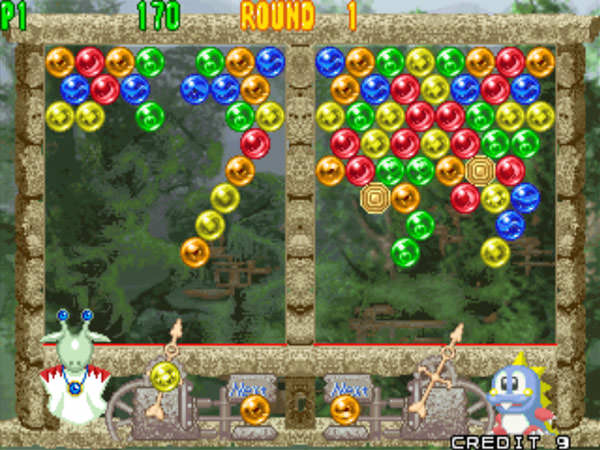

<Blockquote
  link="https://www.colourblindawareness.org/colour-blindness/"
  author="Colour Blind Awareness"
>
  

    Colour (color) blindness (colour vision deficiency, or CVD) affects approximately 1 in 12 men (8%) and 1 in 200 women in the world. In Britain this means that there are approximately 2.7 million colour blind people (about 4.5% of the entire population), most of whom are male.
  

</Blockquote>

<figure>

  
  <figcaption>
    A comparison of the visible color spectrum in common types of color blindness
  </figcaption>

  <License
    type="public"
    link="https://commons.wikimedia.org/wiki/File:Color_blindness.png"
    mediaType="Illustration"
    authors={[
      {
        name: 'Nanobot on Wikipedia',
        link: 'https://commons.wikimedia.org/wiki/File:Color_blindness.png',
      },
    ]}
  />

</figure>

Color blindness and deficiencies come in a variety of types, most commonly red-green. This is a huge deal when you consider that red and green are often used for "success" or "error" feedback in messaging, buttons, and so forth. If color is the sole differentiator between two objects, chances are, there will be some frustrated users.

Compare these banners to the version run through [Colorblindly](https://chrome.google.com/webstore/detail/colorblindly/floniaahmccleoclneebhhmnjgdfijgg):

  

    <h3 className="mt-0 text-lg font-bold mb-2">Standard Colors</h3>
    

      

        

          Product added to cart
        

        

          Problem adding product to cart
        

      

      

        

          Success: Product added to cart
        

        

          Error: Problem adding product to cart
        

      

      

        

          <FontAwesomeIcon icon={['far', 'check']} className="mr-2 text-lg" /> Product added to cart
        

        

          <FontAwesomeIcon icon={['far', 'exclamation-triangle']} className="mr-2 text-lg" /> Problem adding product to cart
        

      

    

  

  

    <h3 className="mt-0 text-lg font-bold mb-2">Deuteranopia-Simulated Colors</h3>
    

      

        

          Product added to cart
        

        

          Problem adding product to cart
        

      

      

        

          Success: Product added to cart
        

        

          Error: Problem adding product to cart
        

      

      

        

          <FontAwesomeIcon icon={['far', 'check']} className="mr-2 text-lg" /> Product added to cart
        

        

          <FontAwesomeIcon icon={['far', 'exclamation-triangle']} className="mr-2 text-lg" /> Problem adding product to cart
        

      

    

  

Helper text is good, but adding icons is even better. When we consider that many users are skimming and not actually reading the text, any visual cues we can add will aid them.

Of course, there are plenty of times when we can't add helper text or cute icons. Enter: video games. Here is a design with bright, colorful orbs; shoot a colored orb from the bottom to clear a matching group of orbs in the top section.

<figure>

  

    

      
      <figcaption>
        Standard vision
      </figcaption>
    

    

      
      <figcaption>
        Deuteranope-simulated vision
      </figcaption>
    

  

  <License
    type="copyright"
    mediaType="Game screenshot"
    authors={[
      {
        name: 'Puzzle Bobble (Bust-A-Move)',
        link: 'https://en.wikipedia.org/wiki/Puzzle_Bobble',
      },
    ]}
  />

</figure>

Good luck doing well in the game if you have difficulty differentiating red and green. Sure, there are slight differences in the orbs, but not enough to be considered colorblind-friendly. There is an [increasing amount of gamers](https://www.reddit.com/r/gaming/comments/4qawl2/were_looking_for_more_colorblind_gamers_to_form/) looking for colorblind-accessible games that work well.

Luckily, there is one game category that has this problem solved: match-3 games.

## Match-3 Games

This type of game is very common. Many of them use the same (or quite similar) mechanics, so it is easy to make a spin-off game once you've figured out the technical side; new graphics can be enough to make it a "new" game.

In this type of game, you swap neighboring pieces to make matches of 3 or more of the same piece. Not only are the pieces different colors, but often unique shapes; unlike the previous image example, these would be **easy to tell apart even in greyscale**. Food and gemstones are common themes, copying off of the fame of two major games: Bejeweled and Candy Crush.

Check out the examples below and note how the designers used these techniques to help users differentiate the pieces:
- Unique shapes
- Colors that vary in lightness, not just hue

Though the pieces are different, they are still unified in their illustration style, color scheme, 3D perspective (if any), and light source.

<FullWidthContainer>

  

    <figure>
      
      <figcaption>&copy; <a href="https://play.google.com/store/apps/details?id=com.king.candycrushsaga">Candy Crush</a></figcaption>
    </figure>
    <figure>
      
      <figcaption>&copy; <a href="https://play.google.com/store/apps/details?id=com.king.farmheroessaga">Farm Heroes Saga</a></figcaption>
    </figure>
    <figure>
      
      <figcaption>&copy; <a href="https://play.google.com/store/apps/details?id=air.com.sgn.cookiejamblast.gp">Cookie Jam Blast</a></figcaption>
    </figure>
    <figure>
      
      <figcaption>&copy; <a href="https://play.google.com/store/apps/details?id=casual.match3.pets.blast.matching.game">Pet Fever</a></figcaption>
    </figure>
    <figure>
      
      <figcaption>&copy; <a href="https://play.google.com/store/apps/details?id=com.rovio.abmatch3">Angry Birds Match</a></figcaption>
    </figure>
    <figure>
      
      <figcaption>&copy; <a href="https://play.google.com/store/apps/details?id=com.cookapps.ff.aladdinblast">Magic Lamp</a></figcaption>
    </figure>
    <figure>
      
      <figcaption>&copy; <a href="https://play.google.com/store/apps/details?id=air.com.sgn.cookiejamblast.gp">Harry Potter: Puzzles & Spells</a></figcaption>
    </figure>
    <figure>
      
      <figcaption>&copy; <a href="https://play.google.com/store/apps/details?id=com.ea.gp.bejeweledskies">Bejeweled Stars</a></figcaption>
    </figure>
  

</FullWidthContainer>

## Creating a Match-3 Game in Figma

https://www.youtube.com/watch?v=xRVZ7IP4bzM

## Just for Fun

Want to see how well you can differentiate colors? There's a test for that.

<Button to="http://www.xrite.com/online-color-test-challenge">Take the X-Rite Color Challenge</Button>

## Recommended Icon Sites

- [The Noun Project](https://thenounproject.com/)
- [FlatIcon](https://www.flaticon.com/)
