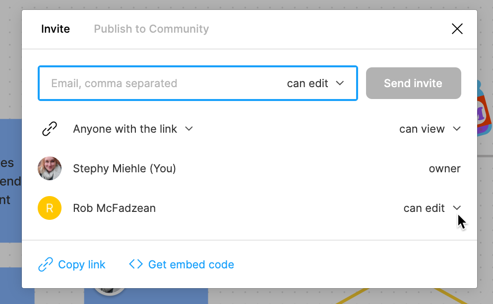

## What is FigJam?

FigJam is a tool from the creators of [Figma](/figma). Instead of being full-fledged design software, FigJam is meant for quick diagrams and collaborative feedback.

You can create a new FigJam document inside of your Figma account.

<figure>

<iframe
  style="border: 1px solid rgba(0, 0, 0, 0.1);"
  width="100%"
  height="450"
  src="https://www.figma.com/embed?embed_host=share&url=https%3A%2F%2Fwww.figma.com%2Ffile%2FcZzdSWSFhhu6VdAIZNxR16%2FClient-Onboarding%3Fnode-id%3D0%253A1"
  allowfullscreen
></iframe>

<License
  type="cc"
  ccVersion="4.0"
  ccLicense="BY-NC-SA"
  mediaType="Sample FigJam diagram"
  authors={[
    {
      name: 'Stephy Miehle on behalf of McHenry County College',
    },
  ]}
/>

<figcaption>
  This sample diagram showcases a flowchart, stickers, and multiple colors and
  shapes to help differentiate actions.
</figcaption>

</figure>

<Button to="https://www.figma.com/file/cZzdSWSFhhu6VdAIZNxR16/Client-Onboarding?node-id=0%3A1">
  Open sample document
</Button>

### Other Uses

FigJam's simplicty is a benefit: it's flexible for a number of uses.

  <figure>
    

      
    

    <figcaption>
      <a href="https://www.figma.com/community/file/964643362660977506">
        Moodboard template
      </a>
    </figcaption>
  </figure>
  <figure>
    

      
    

    <figcaption>
      <a href="https://www.figma.com/community/file/964643468321702755">
        Icebreaker game template
      </a>
    </figcaption>
  </figure>
  <figure>
    

      
    

    <figcaption>
      <a href="https://www.figma.com/community/file/964644828001526628">
        Diagram template
      </a>
    </figcaption>
  </figure>
  <figure>
    

      
    

    <figcaption>
      <a href="https://www.figma.com/community/file/964626434721506143">
        Brainstorming template
      </a>
    </figcaption>
  </figure>

## FigJam Interface

<figure>
  

    
  

  <figcaption>
    FigJam emulates a dot-grid piece of paper and comes with familiar
    whiteboarding shapes (and fun extras, like these stickers).
  </figcaption>
</figure>

### Creating Shapes

Shapes are the fundamental tools of FigJam and can be linked, recolored, resized, and moved with ease.

<figure>
  
  <figcaption>
    When a shape is selected, the blue "plus sign" icon lets you quickly create
    a new connected shape. Alternatively, you can click and drag on this "plus
    sign" to connect to existing shapes.
  </figcaption>
</figure>

### Style Toolbar

By using different colors and shapes for certain types of actions, your document can be easier to quickly review.

<figure>
  
  <figcaption>
    On the style toolbar, you can change the fill color, change the shape,
    switch to outline mode, and more.
  </figcaption>
</figure>

### Rearranging Shapes & Stickers

Shapes and stickers might sneak behind other elements that were created later, but there are a few other formatting options (like editing the stacking context) hidden behind the right-click menu.

<figure>
  
  <figcaption>Reordering a sticker to appear above a shape</figcaption>
</figure>

### Interactive Stickers

Some stickers have editable regions where you can enter and edit your own text. Most are meant for short messages, but some stickers will adapt and add extra lines if you write something long.

<figure>
  
  <figcaption>The recipe card is a fun sticker for short lists</figcaption>
</figure>

### Collaborating

Viewers can leave "cursor comments" that only show up while they are interacting with the document. These move around with the viewer's cursor and are not "pinned" to the document.

<figure>
  
  <figcaption>Cursor comments are handy for quick feedback</figcaption>
</figure>

By default, viewers cannot leave comments or edit the document; they can look but can't touch or change it. Just like Figma, you can share your document with collaborators if you'd like them to have more control.

<figure>
  
  <figcaption>Granting edit permissions in FigJam</figcaption>
</figure>
