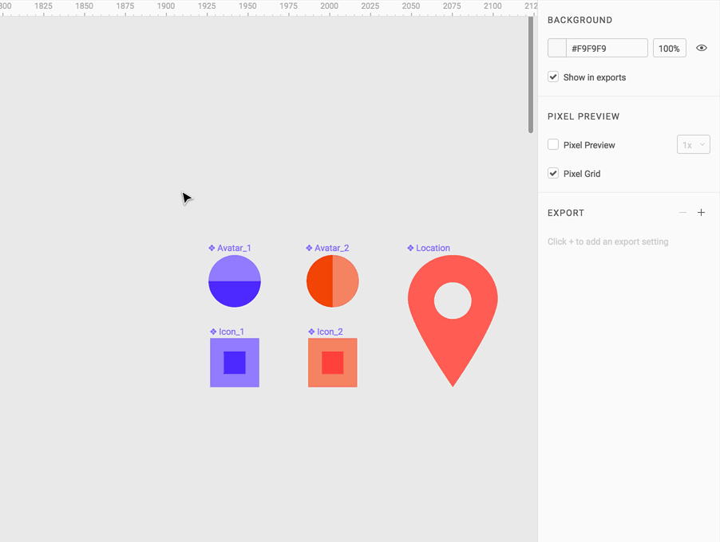

These instructions will be for the **web version** of Figma, but if you're working on your own Windows or Mac machine, you can install the [desktop app](https://www.figma.com/downloads).

## Why shouldn't I just use Illustrator or something I already know?

For one, Figma is free for students with all features! There is also a basic free tier available to all. Viewers do not need to sign up for an account.

It also allows you to **prototype your designs**. While we are **not coding these applications**, we can set up basic interactivity and have a way of navigating between frames, such as tapping on a menu or button. These prototypes can be viewed online or even on your mobile devices. Instead of having to shuffle through multiple print-outs and documents, clients can easily navigate your design.

Some of the tools here are also better suited for UI design and allow you to create **multiple styles of reusable components**, just like you might see on the web. Drawing icons and combining shapes is also [shockingly more convenient](https://medium.com/@rajipurcell/figma-a-solid-ui-design-app-thats-finally-improved-the-pen-tool-6103fa7a64b3) than some of the bigger-name tools.

Non-designers can also **comment right on your documents** instead of making you refer back to a giant list of changes. You can use comments to make annotations for your teammates [while you collaborate](https://blog.figma.com/multiplayer-editing-in-figma-8f8076c6c3a6), since this is a service that **multiple people can work on at once**.

Figma also comes with **version control**, so you can rewind your changes. No more keeping 12 files in a folder as "save states" with a cryptic naming system!

<figure>
  
  <figcaption>
    This does not have to be your life! Better organization (from the start)
    will make your life a lot easier.
  </figcaption>
</figure>

## Basic Concepts

### Frames

Frames are similar to "artboards" in Adobe products; they are boxes of content inside a large workspace.

You can create a frame of an arbitrary size or use a **device preset**, such as "iPhone 7 Plus".

The way that you arrange these frames is up to you: do you separate them into pages? Arrange them in a flow? With mobile UI, it's not uncommon to see multiple frames in a sequence, such as [this example](https://dribbble.com/shots/3877666-The-Flow-of-Joy/attachments/880536) from Dribble:

<figure>

<FullWidthContainer>

</FullWidthContainer>

<License
  type="copyright"
  title="The Flow of Joy"
  link="https://dribbble.com/shots/3877666-The-Flow-of-Joy/attachments/880536"
  mediaType="Interface design"
  authors={[
    {
      name: 'Josh Hemsley',
      link: 'https://dribbble.com/joshhemsley',
    },
  ]}
/>

<figcaption>
  The frames here are tiny, but you can see that they are arranged primarily in
  groups/sections and then side-by-side in sequence. The designer also drew red
  lines on their workspace to signal how the frames relate.
</figcaption>

</figure>

**So why not just draw on the workspace (grey background)?** Anything in a frame can be prototyped; if it is on the workspace, it won't be included.

### Design Tools

You can view the [Figma editor articles](https://help.figma.com/editor#1322329-toolbar) for an in-depth look at each tool (scroll down to the Toolbar heading). Here are a few neat aspects of some of the tools.

#### Text Tool

The text tool already has Google Fonts included!

https://www.youtube.com/watch?v=5i-ebNTjad8

If you use the three-dot menu with the Text Tool selected, you can access OpenType features and settings such as ALL CAPS, Sᴍᴀʟʟ Cᴀᴘs, and more.

One other cool font feature? FontAwesome is included by default, giving you access to common icons right inside of your project. To use a FontAwesome icon, copy the icon from the [FontAwesome cheatsheet](http://fontawesome.io/cheatsheet/) (to the left of the icon name) and paste it into your document. Your icon may appear to be blank or a strange rectangle until you select the icon and apply the font FontAwesome to it.

#### Place Image

You can add your images made in other programs, too. One cool feature is that you can perform basic photo filters inside Figma. This is *very* handy for darkening images (through Exposure) so that text on top of them can have adequate contrast. Or, mess around with the tint to get a pseudo-vintage look.

#### Pen Tool

This is not your normal pen tool. Points and bezier curves are still used, but you can continue to draw multiple lines from the same point. The video below shows how this works, but Figma's team wrote a [tutorial article](https://blog.figma.com/introducing-vector-networks-3b877d2b864f) that explains a bit more.

https://youtube.com/watch?v=b-xDRjf5B-8

### Effects

Instead of having to create blurs and special effects in Photoshop (or other software) and upload yet another file, you can apply some [special effects](https://help.figma.com/properties-panel/effects-512074) straight inside of Figma.

https://www.youtube.com/watch?v=e1BRH09iwes

#### Drop Shadow

A versatile effect that can be used to make a shape pop off the background by casting a shadow below. The shadow can be offset, the blur size controls the softness, and the color and blend tint and combine the shadow.

- Drop shadows can also be efficiently applied to a group and layer under the group as a whole instead of each individual shape.
- Set a blur size of 0 to create a hard shadow of the shape.
- Create an outer glow with an offset of 0 and set blend to Screen.

#### Inner Shadow

A versatile effect that can be used to add inner depth to a shape. These have similar controls to the drop shadow but appear atop the fill but below the stroke on a shape.

- Like drop shadows, inner shadows can be applied to groups.
- Create an inner glow with an offset of 0 and set blend to Screen.

#### Layer Blur

This blurs any given layer's geometry.

- Blurs of large numbers of pixels can contribute to performance issues.

#### Background Blur

This blurs the geometry of all geometry underneath the bounds of the layer with the blur.

- Blurs of large numbers of pixels can contribute to performance issues.
- To see the background blur, make sure to set the fill paint opacity much less than 100%. Opacity can be set as low as 1% to see all background blur.

### Components

Here's the fun part. Using the basic design tools, you can create reusable, resizeable [components](https://blog.figma.com/components-in-figma-e7e80fcf6fd2).

> Not only does this make it easier to reuse existing parts quickly but components also help with consistency. And since reused components are not copies, but instances of the same component, any changes applied later are immediately reflected across your design.

This means that if you suddenly decide all buttons should be in e.g. a different font, you can make the change in one place and it will propagate to the rest. But, you can also create object-level overrides for different colors or styles of the base component.

Here, each icon is an instance of the left icon; the middle and right icons have some overrides applied. But, when the circle inside the icon is resized, all three instances are updated:

<figure>

<figcaption>Animated illustration &copy; Figma</figcaption>
</figure>

Here is how that might work for more complex groupings:

<figure>

<figcaption>Animated illustration &copy; Figma</figcaption>
</figure>

There are a **lot** of other details about components not covered in this video! View the full article by Figma for more tips. But, the best way to learn is to experiment; you can come up with [your own flexible component systems](https://medium.com/@nspace/building-flexible-components-in-figma-41113aa69493).

[Read the Figma Post](https://blog.figma.com/components-in-figma-e7e80fcf6fd2)

### Constraints

[Constraints](https://help.figma.com/properties-panel/constraints) allow you to decide what should happen when a component is resized. You can set different elements to stay in a relative position (say, the left edge), stay in the middle, stretch, and so forth. This one is a bit harder to describe in words, but check out how it works with a video:

https://www.youtube.com/watch?v=rRQAQ1d9q9w

### Layout Grid

If you select any frame, you can add a grid or rows/columns to your design to help you align your content. Figma is smart and will help you snap your objects to your [layout grid](https://help.figma.com/properties-panel/layout-grids). In conjunction with Constraints, you can create some very modular objects, which makes your job as the designer a whole lot easier. Pixel-perfect is much more attainable using these tools.

Frames with grids can also be nested inside other frames with grids, allowing you to create [complex layouts](https://blog.figma.com/grid-systems-for-screen-design-46d86ea9fd48).

### Library

Any components you create can be added to a [Team Library](https://blog.figma.com/team-libraries-in-figma-409fa5e20f7) so that everyone you work with can sync changes and updates together.

> You can even nest components and publish them to the team library. That way you can construct modules from individual source elements, then later reuse those modules across more complex views and flows in other files. Deeply-nested components make maintaining a single source of truth incredibly easy and predictable.

> Only people with Edit permissions to the source file can modify your source components, but anyone with View access can use the published components from that file. So, now your Production Designers are the only ones who can edit the file with the final icon assets and your Brand Designers are the only group who can control your color documentation. Everyone else can use their work, but they can’t set the rules.

### Prototyping & Presenting

In [Prototype Mode](https://help.figma.com/prototyping/prototyping-presenting), you can construct a prototype by linking frames to frames or by creating hotspots between objects and other frames.

https://www.youtube.com/watch?v=-sAAa-CCOcg

First, select the **prototype** tab at the top of the Properties Panel. Select the first frame you would like to be used in your prototype. Any top level frame, or object within the frame, can be selected to reveal a circular transition bubble.

Click and drag the node to create connections. These connections turn your frames into a prototype.

[View the article](https://help.figma.com/prototyping/prototyping-presenting) to learn about all of your presentation options.

### Transitions

If you’d like to make your prototype transitions a little more interesting than “instant”, here’s the way to add fades, slide between frames, and so forth:

https://youtu.be/MLXoDrX9snM

<iframe
  style="border: 1px solid rgba(0, 0, 0, 0.1);"
  width="100%"
  height="450"
  src="https://www.figma.com/embed?embed_host=share&url=https%3A%2F%2Fwww.figma.com%2Fproto%2FJLu7nD5bIAj7GHy9VmJzjHpr%2FUntitled%3Fnode-id%3D1%253A2%26scaling%3Dscale-down%26page-id%3D0%253A1%26starting-point-node-id%3D1%253A2"
  allowfullscreen
></iframe>

## Get Inspired

Figma is somewhat new to the game, but it's already becoming a popular choice for rapid prototyping. You can see examples of what others have done on [Dribbble](https://dribbble.com/search?q=figma) and learn about some of the handy features with the [#FigmaTip](https://twitter.com/hashtag/figmatip?src=hash) hashtag.

You can also import some freebies from [figmaresources.com](https://www.figmaresources.com/), [FigmaFinder](http://figmafinder.com/), or even [from Figma itself](https://www.figma.com/resources).
