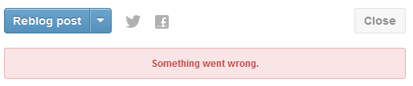
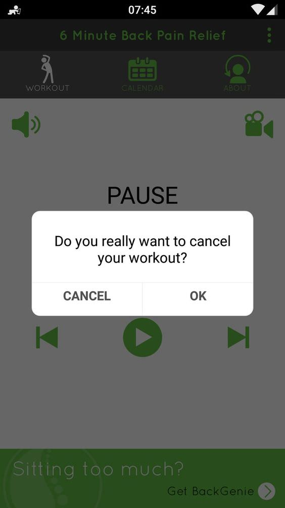
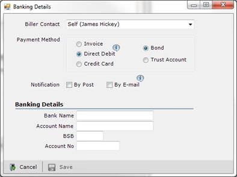
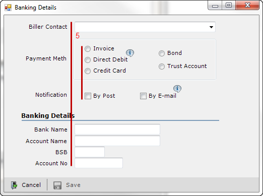

Forms are one of those components that you see _everywhere_: user registration to billing, feedback, and more. They are also one of the easiest things to frustrate users if the functionality doesn't work well.

https://twitter.com/odannyboy/status/1128006884915441667

## Form Anatomy

First, let's talk about some of the things that compose a basic form: inputs and labels. We're used to many input types from the web already, but common ones include:

- Text (a single line)
- Textbox (a multi-line version of a regular text input)
- Email (like text, but optimized for email addresses)
- Phone (like text, but optimized for phone numbers)
- Time and/or date
- Number
- Dropdowns/Select menus

A label is typically used to, well, label the type of data for a specific input. Using gestalt principles, we can make sure that it's clear which label goes with which input. Spacing is your friend here! You can use white space between one label/input pair and another, or larger sections of white space for different form sections.

### Use the Right Input

<Blockquote
  link="https://www.nngroup.com/articles/checkboxes-vs-radio-buttons/#:~:text=Radio%20buttons%20are%20used%20when,must%20select%20exactly%20one%20choice.&text=Checkboxes%20are%20used%20when%20there,zero%2C%20one%2C%20or%20several."
  author="Nielsen Norman Group"
>
  

    <strong>Radio buttons</strong> are used when there is a list of two or more
    options that are <strong> mutually exclusive </strong> and the user must
    select exactly one choice. In other words, clicking a non-selected radio
    button will deselect whatever other button was previously selected in the
    list.
  

  

    <strong>Checkboxes</strong> are used when there are lists of options and the
    user may <strong> select any number </strong> of choices, including zero,
    one, or several. In other words, each checkbox is independent of all other
    checkboxes in the list, so checking one box doesn't uncheck the others.
  

  

    <strong>A stand-alone checkbox </strong> is used for a single option that
    the user can turn on or off.
  

</Blockquote>

There are a few other reasons why you might consider using radio buttons. [Nielsen Norman Group](https://www.nngroup.com/articles/checkboxes-vs-radio-buttons) recommends that "if possible, use radio buttons rather than drop-down menus. Radio buttons have lower cognitive load because they make all options permanently visible so that users can easily compare them."

Of course, there are times when radio buttons aren't recommended! Sliders are more appropriate for interfaces like a volume control panel and drop-down menus are more appropriate for long lists, such as a list of state abbreviations. Long drop-downs can be overwhelming to look at _and_ difficult to use if information is not well-organized.

## Tips for Friendlier Forms

### Break down your data

First try to reduce the number of inputs. Each one is another point of friction; the more friction you have, the more likely your users will get overwhelmed and not want to complete your form. Users are especially fickle with mobile applications, and you do not want to alienate your users so much that they immediately uninstall your app.

One optimization to consider? Social logins. If appropriate, users can sign up for a service with just a tap rather than filling out a username/email address and a password.

Once you've reduced as much as you can, consider the remaining inputs: does it make sense to group any of them together across multiple screens? Instead of one long, scrolling form, you could use multiple steps across different screens. Again, you do not want to be excessive here, but you can make some forms look less daunting if they are split into sections. These are also called stepped forms or wizards, such as a checkout process.

Smaller sections of related data also make sense to treat as separate "blocks" of information, such as addresses with cities, states, and zip codes. When combined with subheadings, your form will be much easier to scan (and thus, less daunting).

### Let users know how long your form will take to complete

If your form spans multiple pages or screens, it's a good idea to add a progress meter or other signal of how many steps are left.

### Keep them accessible

Minimalists may be tempted to remove the labels from their inputs and rely on placeholder text. This design choice looks cleaner, but at the expense of usability. If users want to double-check that they entered the correct data in the right spot, they can't confirm it without clearing out the data inside an input to reveal the placeholder again. Plus, placeholders are typically a light grey on a white background; not great for contrast.

There are times when omitting a label may be appropriate (if there is a single input and any highly-visible supporting text is clear about what should be entered). In a denser form, though, you may run into trouble.

### Use native styles

Some input types, such as time and date, have specific styles on each operating system. There is no need to reinvent the wheel! Users are already familiar with how these inputs work, and they are designed specifically for mobile.

For example, in [Losing My Loyalty Because of a Terrible Date of Birth Experience](https://web.archive.org/web/20170707222208/http://badforms.com/canadian-tire-date-of-birth/), a user had such a bad time filling out a date input that he got frustrated and his feelings towards the company were negatively impacted.

https://www.youtube.com/watch?v=dKu0IUl52Z0

### Provide help and feedback

In a well-developed UI, you design not only the inputs, but feedback styling as well. Error styles are most common, but you may also run across checkmarks in an input for good data, etc. If there is something wrong with a user's input, help them fix it; angry red styling may not be informative enough.

<figure>
  
  <figcaption>
    Screenshot of an error on <a href="https://www.tumblr.com">Tumblr</a>. What
    should a user do in this situation? Clear feedback would let them know
    whether to try again or if their action was complete.
  </figcaption>
</figure>

<figure className="mt-12 mb-6 mx-auto grid gap-12 md:grid-cols-2 items-center">

{' '}

  <figcaption>
    

      Make sure that if you are using some sort of alert, the text displayed is unambiguous. In this example, a savvy user can guess that tapping "OK" would cancel the workout and tapping "CANCEL" would let it continue, but without that familiarity, the choices are confusing.
    

    

      You can supply "helper text", or supporting information, to clarify what type of data is needed or why you're asking for it in the first place (because you have a good reason for that form input, right?).
    

    

      Screenshot of an ambiguous dialog in the <a href="https://play.google.com/store/apps/details?id=com.tcmardoc.minutebackpainrelief&hl=en_US&gl=US">6 Minute Back Pain Relief</a> app.
    

  </figcaption>
</figure>

### Use an appropriate voice and word choice

Your word choice has a huge impact on the friendliness of your form. Everything from the labels to the placeholders and button text can have an impact.

One of the easiest upgrades is to change your button text from a generic "Submit" to something more suited for the form, such as "Sign Up" or "Place Order"; the action that will be completed is clearly displayed.

<Blockquote
  link="http://uxmovement.com/buttons/why-the-ok-button-is-no-longer-okay/"
  author="UX Movement"
>
  

    When users click the "Ok" button, they’re not saying "okay", they’re doing a
    specific action.
  

  

    An action specific button would enable users to do their task much more
    quickly and accurately. Not all users will read the question or message in a
    dialog box. Most will make decisions without reading it carefully or
    completely.
  

  

    <strong>
      If an action button is labeled "Ok", this could lead users who ignore
      dialog box text to click the wrong button. But if you label your "Ok"
      button with a specific action, users will be able to see what action
      they’re about to do without reading the dialog box.
    </strong>
  

</Blockquote>

Form labels should be clear and very short unless they are worked into the "mad lib style" mentioned in the [UXPin article](https://www.uxpin.com/studio/blog/web-form-design-best-practices-5-useful-ui-patterns-2/).

### Ask for things in the right order

Organize your form inputs into logical groups, and then ask for that data in the right order. Compare your form's flow (progression through sections) to other forms; users may not be aware of it, but they have common expectations for the types of things asked for in forms, and they often ask for some things before they ask for others.

If you must ask for more sensitive data, it's best to do so later in the process; with most of the form already complete, users are more likely to finish registering or filling out your form than if you asked them for the more daunting information right away. Users abandon or "drop off" of complex forms all the time; make yours as friendly as possible to cut down on those numbers.

### Avoid dark patterns

<Blockquote link="https://darkpatterns.org" author="Dark Patterns">
  

    Dark Patterns are tricks used in websites and apps that make you buy or sign
    up for things that you didn't mean to. When you use the web, you don’t read
    every word on every page - you skim read and make assumptions. If a company
    wants to trick you into doing something, they can take advantage of this by
    making a page look like it is saying one thing when it is in fact saying
    another.
  

</Blockquote>

Use your design powers for good! Dark patterns go beyond the web and are just as common in mobile design.

You can read about types of [dark patterns](https://darkpatterns.org/types-of-dark-pattern) or scroll through the [Hall of Shame](https://darkpatterns.org/hall-of-shame) for examples.

### Use optical alignment

When dealing with complex forms, align similar types of content optically. In the example below, the original design has radio boxes and checkboxes staggered with different indentations; even though the checkboxes are left-aligned with the bounding box around the radio buttons, the design feels off-balance.

<figure>
  

  

<figcaption>
  

    The version with the red lines shows the radio and checkboxes lined up with
    each other, as well as the top and bottom text inputs lining up. The design
    here is tidier.
  

</figcaption>

<License
  type="mit"
  link="https://www.ssw.com.au/rules/rules-to-better-interfaces-general-usability-practices"
  mediaType="App screenshots"
  authors={[{ name: 'SSW', link: 'https://www.ssw.com.au/' }]}
  className="mt-4"
/>

</figure>

### Be smart about "required" fields

It's important to be clear about which fields are required and which are optional, and how you handle that differentiation really depends on what you are working on. [Patternry](http://patternry.com/p=required-form-fields/) recommends the following:

<Blockquote
  link="http://patternry.com/p=required-form-fields/"
  author="Patternry"
>
  
First of all, keep the form simple. Avoid optional input fields in forms, don’t ask users to provide useless information.

  
Show the required/optional indicators next to labels instead of input fields to make it easier to scan the form through and see what information needs to be given.

  <strong>If most of the form fields are optional:</strong>

<ul>
  <li>
    Use text or asterisk (*) next to each field to indicate required fields.
  </li>
  <li>
    If you choose asterisk, provide a legend which tells the meaning of it.
  </li>
  <li>Consider bolding the required field label.</li>
</ul>

  
<strong>If most of the form fields are required:</strong>

  <ul>
    <li>Use text “(Optional)” after optional field labels to indicate optional fields.</li>
  </ul>
</Blockquote>

## Wrapping It Up

https://www.youtube.com/watch?v=hPS7LUW7SlA

Watch Judy Grundy's ["The UX of Form Design: Designing an Effective Form" presentation](https://www.youtube.com/watch?v=hPS7LUW7SlA) to learn how Expedia's bad form mistakes cost about $12 million (and how you can avoid similiar mistakes by considering your users).
