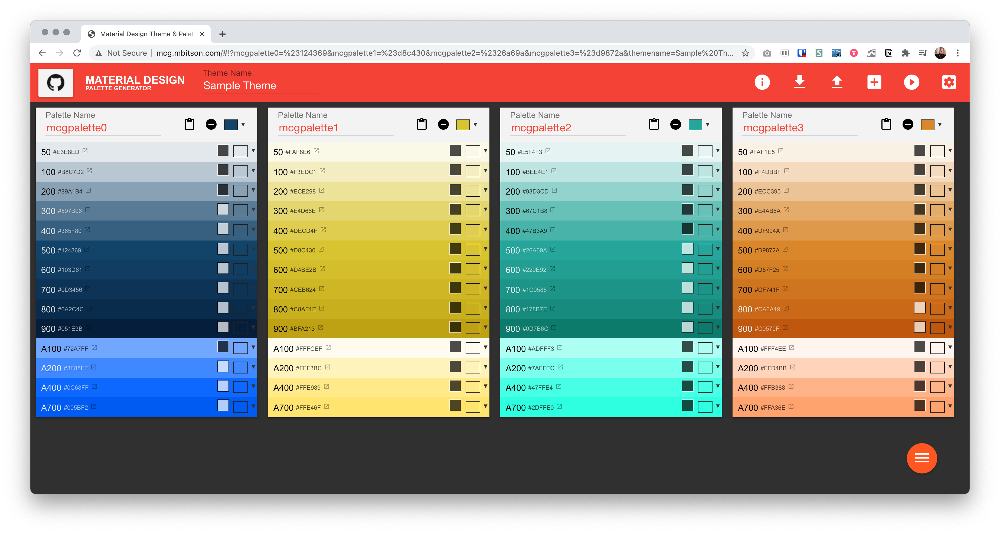
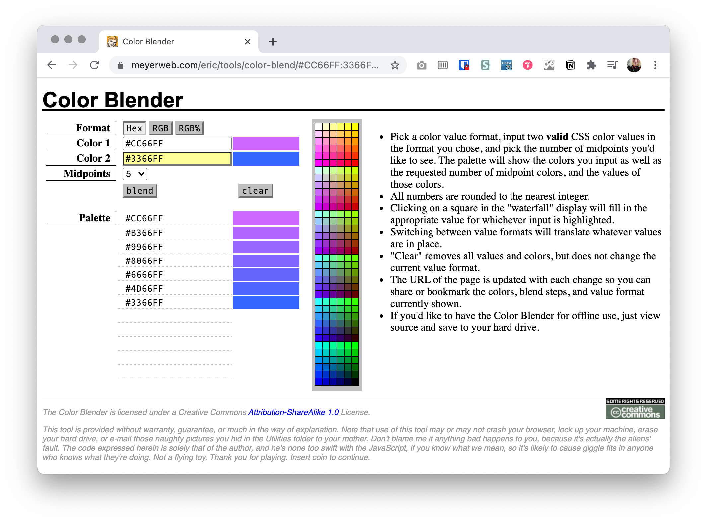

Whether using your own software or web resources, there are many tools to generate and expand your color schemes.

## DIY: Blending Modes for In-Between Colors

This tutorial was recorded using Adobe Illustrator, but the same technique can work in other design software that supports blending modes. In short, we can use software to digitally mix together colors using different algorithms.

### The Shorter Version

https://www.youtube.com/watch?v=410347d2wg8

### The Longer Version

https://youtu.be/TI5ozMY7jIk

## Automated tools

You don't have to pick just one method! I often use the Material Design Palette Generator but fine-tune the results myself, especially for the lightest and darkest values. Then, I use Eric Meyer's blender tool to find the right match between my custom replacement color and the Material-generated colors.

### Material Design Palette Generator

This builder is especially handy for web or mobile developers! After you set the base color(s), all lights, darks, and even vivid accents are generated automatically. For the best and most consistent results, try to choose a color that is neither too dark nor too light; you'll get a better range with a mid-brightness color.

<figure>
  
  <figcaption>
    This multi-hued palette on <Link to="http://mcg.mbitson.com/#!?mcgpalette0=%23124369&mcgpalette1=%23d8c430&mcgpalette2=%2326a69a&mcgpalette3=%23d9872a&themename=Sample%20Theme">Material Design Palette Generator</Link> turned each of its 4 colors into a 14-color palette.
  </figcaption>
</figure>

[Try It](http://mcg.mbitson.com/#!?mcgpalette0=%23124369&mcgpalette1=%23d8c430&mcgpalette2=%2326a69a&mcgpalette3=%23d9872a&themename=Sample%20Theme)

### Eric Meyer's Color Blender

Many other color blenders and generators use a mix of well-tuned algorithms to create their palettes. This one is a little more straightforward: a smooth blend from one color to another. Though not as advanced as some of the newer methods, this old-school tool comes in handy when you're looking for a true average between colors.

<figure>
  
  <figcaption>
    Eric Meyer's <Link to="https://meyerweb.com/eric/tools/color-blend/#CC66FF:3366FF:5:hex">Color Blender</Link> finds the desired amount of midpoints between any 2 colors. You can enter colors as RGB or hexadecimal.
  </figcaption>
</figure>

[Try It](https://meyerweb.com/eric/tools/color-blend/#CC66FF:3366FF:5:hex)
