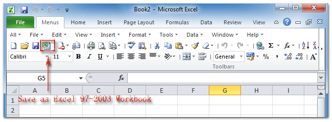
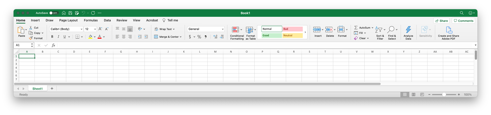

## The Myth: Icons Enhance Usability

Icons can _sometimes_ enhance usability, but only when used properly! Relying on only icons for navigation can frustrate and confuse users.

Without labels, icons can be ambiguous. Microsoft discovered the pitfalls when redesigning their menu system in the early 2000s:

<Blockquote
  author="Jensen Harris via Microsoft"
  link="https://docs.microsoft.com/en-us/archive/blogs/jensenh/the-importance-of-labels"
  title="The Importance of Labels"
>
  

    One of the problems noticed again and again among non-expert users was that people didn't use the toolbar at all! With the exception of the "Delete" icon (which was perhaps familiar from the Windows 95 shell), people used the menus to reply, forward, and to create new messages.
  

  

    Different fixes were tried: new icons, rearrangement of the icons, positioning icons under the menus from which the commands came from. <strong>In the end, one change caused a total turnaround: labeling the important toolbar buttons. Almost immediately, the toolbars were a big hit and everyone at all skill levels starting using them.</strong>
  

</Blockquote>

<figure>

  

  <figcaption>
    Excel 2010 relied mostly on icons in its toolbar, but some of the operations were too complex to represent in an easily-recognized design.
  </figcaption>

  <License
    type="copyright"
    link="https://www.addintools.com/documents/excel/where-is-save-as.html"
    mediaType="Screenshot"
    authors={[
      { name: 'Addintools', link: 'https://www.addintools.com' },
    ]}
    className="mt-4"
  />

</figure>

<figure>

  <FullWidthContainer>

  

  </FullWidthContainer>

  <figcaption>
    Modern Excel still uses icons, but many additional labels have been added and common tasks are highlighted with larger buttons. Notably, this screenshot was taken on a large desktop, which had plenty of room for horizontal content. Older apps didn't have as much room to work with, but neither do mobile apps!
  </figcaption>

</figure>

## What Does an Icon Mean?

We've gotten used to some common shapes (see "Consider What's Universal" later on this page), but many icons are more interpretive. There are 2 factors here:

- The designer has to represent a sometimes-abstract concept with a simple graphic, usually at a small size
- The user has to identify the shapes in the icon, then decode the _meaning_ of the icon based on their own experiences and associations

This can be extra-confusing when different icons can mean the same thing:

<Blockquote
  author="Mary Formanek"
  link="https://uxdesign.cc/label-your-icons-e2bd57366d37"
  title="Label Your Icons"
>
  

    [S]aying that the users will know what it is because they have seen it
    everywhere is like saying that anyone can identify any kind of tree because
    they have seen a tree before. Just because I have seen a tree doesn't mean I
    can identify a maple tree. And for icons, this can be compared to seeing a
    hamburger icon and a house icon and they both mean “menu”.
  

  

    This “they will know what it means” logic does not work. Not only does it
    not make sense, but following that logic is literally making an assumption
    for the user. <strong>We are not the users.</strong> What we assume they
    have seen is probably not what they have actually seen. We should never
    assume the users will understand things because we think its basic
    knowledge.
  

</Blockquote>

For example, the icons in each set represent the same concept or idea. Their art styles and even the fundamental shapes represented can vary, but somehow the user has to decode the design and its intent. Try guessing what they represent before reading the caption! All icons were sourced with permission from [FlatIcon](https://www.flaticon.com/).

<figure>
  <Panel>
    <svg xmlns="http://www.w3.org/2000/svg" viewBox="0 0 500 220" className="w-full fill-current h-64">
      <path d="M299.062,64.865l16.563-8.708,16.563,8.708-3.163-18.444,13.4-13.061-18.518-2.691-8.282-16.781-8.282,16.781L288.825,33.36l13.4,13.061Zm2.354-27.414,9.818-1.427,4.391-8.9,4.391,8.9,9.818,1.427-7.105,6.925,1.678,9.778-8.782-4.617-8.781,4.617,1.677-9.778Z"/><path d="M365.625,11.719H353.711V0H277.539V11.719H265.625v5.859h11.914V99.994l38.086-23.317,38.086,23.317V17.578h11.914ZM347.852,89.537l-32.227-19.73L283.4,89.537V5.859h64.454Z"/><path d="M226.473,27.761,209.806,11.1a2.079,2.079,0,0,0-1.473-.611H143.75a8.342,8.342,0,0,0-8.333,8.334v75a8.343,8.343,0,0,0,8.333,8.333h75a8.342,8.342,0,0,0,8.333-8.333V29.234A2.085,2.085,0,0,0,226.473,27.761ZM156.25,14.651h45.833v25a4.17,4.17,0,0,1-4.166,4.166h-37.5a4.17,4.17,0,0,1-4.167-4.166Zm54.167,83.333H152.083v-37.5h58.334Zm12.5-4.166a4.171,4.171,0,0,1-4.167,4.166h-4.167V58.4a2.082,2.082,0,0,0-2.083-2.084H150a2.082,2.082,0,0,0-2.083,2.084V97.984H143.75a4.171,4.171,0,0,1-4.167-4.166v-75a4.171,4.171,0,0,1,4.167-4.167h8.333v25a8.343,8.343,0,0,0,8.334,8.333h37.5a8.342,8.342,0,0,0,8.333-8.333v-25h1.221L222.917,30.1Z"/><path d="M187.5,39.651h8.333a2.083,2.083,0,0,0,2.084-2.084V20.9a2.083,2.083,0,0,0-2.084-2.084H187.5a2.082,2.082,0,0,0-2.083,2.084V37.567A2.082,2.082,0,0,0,187.5,39.651Zm2.083-16.667h4.167v12.5h-4.167Z"/><path d="M432.775,31.534h-18.5V60.228h18.5a2.053,2.053,0,0,0,2.051-2.051V33.585A2.053,2.053,0,0,0,432.775,31.534Zm-5.343,16.323a2.93,2.93,0,0,1-5.86,0V43.9a2.93,2.93,0,0,1,5.86,0Z"/><path d="M414.275,17.2v8.473h18.5a7.919,7.919,0,0,1,7.911,7.91V58.177a7.92,7.92,0,0,1-7.911,7.91h-18.5V74.56h71.45V17.2Zm42.3,44.457h-1.427a2.93,2.93,0,1,1,0-5.859h1.427a2.93,2.93,0,1,1,0,5.859Zm0-12.849h-1.427a2.93,2.93,0,1,1,0-5.86h1.427a2.93,2.93,0,1,1,0,5.86Zm0-12.848h-1.427a2.93,2.93,0,1,1,0-5.859h1.427a2.93,2.93,0,1,1,0,5.859Zm14.643,25.7h-1.428a2.93,2.93,0,1,1,0-5.859h1.428a2.93,2.93,0,1,1,0,5.859Zm0-12.849h-1.428a2.93,2.93,0,0,1,0-5.86h1.428a2.93,2.93,0,0,1,0,5.86Zm0-12.848h-1.428a2.93,2.93,0,1,1,0-5.859h1.428a2.93,2.93,0,1,1,0,5.859Z"/><path d="M400,8.786v74.19a5.859,5.859,0,0,0,5.859,5.859h7.028v7.256a.976.976,0,0,0,.976.976h12.858a.976.976,0,0,0,.976-.976V88.835H472.3v7.256a.976.976,0,0,0,.976.976h12.858a.976.976,0,0,0,.976-.976V88.835h7.028A5.859,5.859,0,0,0,500,82.976V8.786a5.859,5.859,0,0,0-5.859-5.859H405.859A5.859,5.859,0,0,0,400,8.786Zm91.584,66.75a4.889,4.889,0,0,1-4.883,4.883H413.3a4.889,4.889,0,0,1-4.883-4.883V16.226a4.889,4.889,0,0,1,4.883-4.883h73.4a4.889,4.889,0,0,1,4.883,4.883Z"/><path d="M46.875,78.117a6.228,6.228,0,0,1-4.419-1.828L24.778,58.612a6.25,6.25,0,0,1,8.839-8.839l7.008,7.008V9.37a6.25,6.25,0,0,1,12.5,0V56.781l7.008-7.008a6.25,6.25,0,0,1,8.839,8.839L51.3,76.289a6.232,6.232,0,0,1-4.42,1.828Zm-2.21-4.037a3.13,3.13,0,0,0,4.42,0L66.762,56.4A3.125,3.125,0,1,0,62.431,51.9c-.03.029-.059.058-.087.088l-9.676,9.675A1.562,1.562,0,0,1,50,60.553V9.37a3.125,3.125,0,0,0-6.25,0V60.553a1.562,1.562,0,0,1-2.667,1.105l-9.677-9.675A3.125,3.125,0,1,0,26.9,56.314c.029.03.058.059.088.087L44.665,74.079Z"/><path d="M84.375,96.87h-75A9.386,9.386,0,0,1,0,87.5V50a6.25,6.25,0,0,1,12.5,0V84.37H81.25V50a6.25,6.25,0,0,1,12.5,0V87.5A9.386,9.386,0,0,1,84.375,96.87ZM6.25,46.87A3.129,3.129,0,0,0,3.125,50V87.5a6.257,6.257,0,0,0,6.25,6.25h75a6.257,6.257,0,0,0,6.25-6.25V50a3.125,3.125,0,0,0-6.25,0V85.933A1.563,1.563,0,0,1,82.812,87.5H10.937a1.563,1.563,0,0,1-1.562-1.562V50A3.129,3.129,0,0,0,6.25,46.87Z"/><path d="M218.708,137.083v6.1h-67.66a7.083,7.083,0,0,0-7.084,7.083v50.772h-7.3a3.328,3.328,0,0,1-3.328-3.328V125.741a3.328,3.328,0,0,1,3.328-3.328h33.131a2.981,2.981,0,0,1,2.7,1.715L177,133.755H215.38A3.328,3.328,0,0,1,218.708,137.083Z"/><path d="M230.005,149.046H153.019a3.2,3.2,0,0,0-3.195,3.2v62.018a3.328,3.328,0,0,0,3.328,3.328h76.853a3.328,3.328,0,0,0,3.328-3.328V152.374a3.328,3.328,0,0,0-3.328-3.328Zm-54.461,28.269a2.93,2.93,0,0,1,4.143,0l8.963,8.963v-24.91a2.93,2.93,0,1,1,5.859,0v24.91l8.963-8.963a2.93,2.93,0,0,1,4.143,4.143s-13.53,13.484-13.983,13.98a2.908,2.908,0,0,1-4.125-.015l-13.963-13.965A2.93,2.93,0,0,1,175.544,177.315Zm39.891,27.95a2.929,2.929,0,0,1-2.93,2.929H170.652a2.931,2.931,0,0,1-2.93-2.929v-6.618a2.93,2.93,0,0,1,5.859,0v3.688h36v-3.688a2.93,2.93,0,0,1,5.859,0Z"/><path d="M100,141.832H54.913l-8.257-16.07H0v82.617H27.848l-1.618,5.859H73.77l-1.618-5.859H100Zm-35.352,5.859h12.11V167.28l-6.055-2.5-6.055,2.5Zm-21.569-16.07,5.247,10.211h-8.4l-5.246-10.211Zm-9.153,76.758,4.633-16.8H61.441l4.633,16.8Zm60.215-5.859h-23.6l-4.635-16.8H34.1l-4.635,16.8H5.859v-70.9H28.094l8.258,16.07H58.789V176.04L70.7,171.119l11.914,4.921V147.691H94.141Z"/><path d="M347.917,219.219h-62.5a9.384,9.384,0,0,1-9.375-9.375V161.406a9.384,9.384,0,0,1,9.375-9.375h15.625a8.529,8.529,0,0,1,6.368,2.86l7.647,8.6a7.746,7.746,0,0,0,5.791,2.6h27.069a9.385,9.385,0,0,1,9.375,9.375v34.375A9.385,9.385,0,0,1,347.917,219.219Zm-62.5-64.063a6.25,6.25,0,0,0-6.25,6.25v48.438a6.25,6.25,0,0,0,6.25,6.25h62.5a6.25,6.25,0,0,0,6.25-6.25V175.469a6.25,6.25,0,0,0-6.25-6.25H320.848a10.882,10.882,0,0,1-8.125-3.65l-7.647-8.6a5.4,5.4,0,0,0-4.034-1.81Z"/><path d="M346.354,162.969a1.562,1.562,0,0,1-1.562-1.563,6.25,6.25,0,0,0-6.25-6.25H311.979a1.563,1.563,0,0,1,0-3.125h26.563a9.385,9.385,0,0,1,9.375,9.375A1.563,1.563,0,0,1,346.354,162.969Z"/><path d="M293.229,134.844a14.063,14.063,0,0,0-14.062-14.063,3.125,3.125,0,0,0,0,6.25,7.813,7.813,0,0,1,7.812,7.813h-4.687l7.812,10.937,7.813-10.937Z"/><path d="M340.1,134.844a14.063,14.063,0,0,1,14.063-14.063,3.125,3.125,0,0,1,0,6.25,7.813,7.813,0,0,0-7.813,7.813h4.688l-7.813,10.937-7.812-10.937Z"/><path d="M338.542,183.281h-43.75a1.563,1.563,0,1,1,0-3.125h43.75a1.563,1.563,0,0,1,0,3.125Z"/><path d="M338.542,194.219h-43.75a1.563,1.563,0,1,1,0-3.125h43.75a1.563,1.563,0,0,1,0,3.125Z"/><path d="M338.542,205.156h-43.75a1.563,1.563,0,1,1,0-3.125h43.75a1.563,1.563,0,0,1,0,3.125Z"/><path d="M477,120H460v20H430V120H400V220H500V143Zm13,90H410V130h10v20h50V130h3l17,17Z"/><path d="M445,183l-8-8-7,7,15,15,25-25-7-7Z"/><path d="M435,120h10v15H435Z"/>
    </svg>
  </Panel>

  <figcaption>
    These icons all represent the concept "save". The floppy disk is still a common subject, even though they are archaic at this point. Other icons in this group seem to signal "download" or "bookmark", which are related concepts but imply a different action.
  </figcaption>
</figure>

<figure>
  <Panel>
    <svg xmlns="http://www.w3.org/2000/svg" viewBox="0 0 500.107 220" className="w-full fill-current h-64">
      <path d="M486.925,143.172A45,45,0,1,0,500.107,175,44.711,44.711,0,0,0,486.925,143.172Zm-40.358-6.981a57.374,57.374,0,0,0-4.774,5.255,54.7,54.7,0,0,0-7.012,11.3H422.2A39.837,39.837,0,0,1,446.567,136.191ZM419.185,158.02h13.5a52.945,52.945,0,0,0-2.665,14.338H415.461A39.441,39.441,0,0,1,419.185,158.02Zm-3.724,19.612h14.564a52.937,52.937,0,0,0,2.665,14.338h-13.5A39.436,39.436,0,0,1,415.461,177.632Zm6.74,19.612h12.58a54.712,54.712,0,0,0,7.012,11.3,57.506,57.506,0,0,0,4.774,5.255A39.839,39.839,0,0,1,422.2,197.244Zm30.264,14.811a51.927,51.927,0,0,1-6.557-6.808,50.29,50.29,0,0,1-5.266-8h11.823Zm0-20.085h-14.2a47.2,47.2,0,0,1-2.957-14.338h17.159Zm0-19.612H435.306a47.214,47.214,0,0,1,2.959-14.338h14.2Zm0-19.612H440.642a50.24,50.24,0,0,1,5.141-7.845,51.784,51.784,0,0,1,6.682-6.958Zm42.278,19.612H480.178a52.905,52.905,0,0,0-2.664-14.338h13.5A39.441,39.441,0,0,1,494.743,172.358ZM488,152.746h-12.58a54.748,54.748,0,0,0-7.012-11.3,57.519,57.519,0,0,0-4.774-5.255A39.837,39.837,0,0,1,488,152.746Zm-30.264-14.81a51.8,51.8,0,0,1,6.556,6.808,50.175,50.175,0,0,1,5.267,8H457.739Zm0,20.084h14.2a47.177,47.177,0,0,1,2.958,14.338H457.739Zm0,19.612H474.9a47.209,47.209,0,0,1-2.96,14.338h-14.2Zm0,34.415v-14.8h11.823a50.193,50.193,0,0,1-5.141,7.845A51.784,51.784,0,0,1,457.739,212.047Zm5.9,1.753a57.652,57.652,0,0,0,4.774-5.255,54.712,54.712,0,0,0,7.012-11.3H488A39.839,39.839,0,0,1,463.637,213.8Zm27.382-21.83h-13.5a52.9,52.9,0,0,0,2.664-14.338h14.565A39.436,39.436,0,0,1,491.019,191.97Z"/><path d="M338.088,169.349c-1.369,0-2.738.492-2.738,1.65v11.937l-5.688-10.848c-1.334-2.563-2.071-2.739-4.037-2.739-1.37,0-2.739.527-2.739,1.685v22.294c0,1.124,1.369,1.685,2.739,1.685s2.738-.561,2.738-1.685V181.391l6.671,12.148a3.062,3.062,0,0,0,3.054,1.474c1.369,0,2.738-.561,2.738-1.685V171C340.826,169.841,339.457,169.349,338.088,169.349Z"/><path d="M318.849,174.124c1.054,0,1.651-1.124,1.651-2.423,0-1.123-.492-2.352-1.651-2.352h-12.5c-1.194,0-2.388.562-2.388,1.685v22.294c0,1.124,1.194,1.685,2.388,1.685h12.5c1.159,0,1.651-1.228,1.651-2.352,0-1.3-.6-2.422-1.651-2.422H309.44V184.27h5.267c1.158,0,1.65-1.123,1.65-2.071,0-1.124-.6-2.142-1.65-2.142H309.44v-5.933Z"/><path d="M361.447,182.224,374.091,155.6a3.515,3.515,0,0,0-3.176-5.025H287.938a3.516,3.516,0,0,0-3.516,3.516v56.256a3.516,3.516,0,0,0,3.516,3.516h82.977a3.516,3.516,0,0,0,3.176-5.025Zm-69.993,24.612V157.612h73.9l-10.975,23.1a3.521,3.521,0,0,0,0,3.018l10.975,23.1Z"/><path d="M82.626,157.286H57.9c.078-.867.121-1.745.121-2.633a29.018,29.018,0,0,0-43.507-25.135,1.758,1.758,0,1,0,1.76,3.044A25.5,25.5,0,1,1,29.01,180.148a25.211,25.211,0,0,1-15.986-5.637,1.761,1.761,0,0,0-1.62-.311l-4.667,1.22L8.565,171.4a1.757,1.757,0,0,0-.178-1.763,25.507,25.507,0,0,1-1.449-27.754A1.758,1.758,0,1,0,3.9,140.122a29.03,29.03,0,0,0,1.053,30.739l-2.943,6.467a1.758,1.758,0,0,0,2.044,2.429l7.477-1.954a29,29,0,0,0,21.523,5.578v15.394a7.392,7.392,0,0,0,7.383,7.384H65.3l11.118,9.095a1.758,1.758,0,0,0,2.871-1.361v-7.734h3.34a7.392,7.392,0,0,0,7.384-7.384V164.67A7.392,7.392,0,0,0,82.626,157.286Zm3.868,41.489a3.873,3.873,0,0,1-3.868,3.868h-5.1A1.758,1.758,0,0,0,75.77,204.4v5.783l-8.683-7.1c-.479-.436-.9-.436-1.839-.436H40.433a3.873,3.873,0,0,1-3.867-3.868V182.663a29.108,29.108,0,0,0,20.8-21.861H82.626a3.872,3.872,0,0,1,3.868,3.868ZM70.278,186.927a1.757,1.757,0,0,0-.748-3.347h-.72l-5.67-12.921a1.758,1.758,0,0,0-3.22,0L54.251,183.58h-.72a1.757,1.757,0,0,0-.748,3.347l-2.112,4.813a1.758,1.758,0,1,0,3.219,1.412l2.658-6.056h9.965l2.657,6.056a1.758,1.758,0,1,0,3.22-1.412ZM58.09,183.58l3.44-7.84,3.44,7.84ZM9.74,137.139a1.758,1.758,0,1,0-1.243-.515A1.774,1.774,0,0,0,9.74,137.139Zm8.777,28.213a1.758,1.758,0,1,0,1.69,3.083,20.128,20.128,0,0,0,8.7-9.438,20.133,20.133,0,0,0,8.7,9.438,1.758,1.758,0,0,0,1.691-3.083,16.626,16.626,0,0,1-8.446-12.1H38.66a1.758,1.758,0,0,0,0-3.516H30.666v-7.326a1.758,1.758,0,1,0-3.516,0v7.326H20.8a1.758,1.758,0,0,0,0,3.516h6.163A16.626,16.626,0,0,1,18.517,165.352Z"/><path d="M208.078,127.357a10.56,10.56,0,0,0-10.548,10.548v5.274a10.548,10.548,0,0,0,21.1,0v-5.274A10.559,10.559,0,0,0,208.078,127.357Zm5.273,15.822a5.274,5.274,0,0,1-10.547,0v-5.274a5.274,5.274,0,1,1,10.547,0Zm26.725-13.5-4.735-2.323-5.175,10.552h-.993V127.357H223.9v26.369h5.274V143.179h.968l5.161,10.9,4.766-2.258-5.331-11.254Zm-34.635,45.5H192.256V156.715a7.919,7.919,0,0,0-7.91-7.911h-7.911v26.369H150.066v42.19h50.1a7.929,7.929,0,0,0,7.757-6.353l5.274-26.369a7.921,7.921,0,0,0-7.757-9.468Zm-39.554,36.916H155.34V180.447h10.547Zm42.139-28.483-5.273,26.369a2.642,2.642,0,0,1-2.586,2.114H171.161V180.447h10.548V154.078h2.637a2.64,2.64,0,0,1,2.637,2.637v23.732h18.458A2.64,2.64,0,0,1,208.026,183.606Z"/><path d="M410.1,32.259c0,14.241,4.762,21.119,8.239,26.14,2.055,2.968,3.539,5.112,3.539,7.878v21.1a2.637,2.637,0,0,0,2.637,2.637h32.7a2.637,2.637,0,0,0,2.637-2.637V82.1h12.13a2.637,2.637,0,0,0,2.637-2.637V71.551a2.639,2.639,0,0,0-1.167-2.189c-.979-.671-2.349-2.122-2.349-3.085,0-1.052,1.555-2.552,2.349-3.085A2.637,2.637,0,0,0,474.616,61V55.729h4.4a2.638,2.638,0,0,0,2.443-3.63L474.616,35.26v-3a32.26,32.26,0,0,0-64.519,0Zm5.274,0a26.986,26.986,0,0,1,53.971,0v3.517a2.636,2.636,0,0,0,.194.992l5.558,13.687h-3.115a2.637,2.637,0,0,0-2.637,2.637v6.633c-1.4,1.228-3.516,3.575-3.516,6.552s2.115,5.324,3.516,6.552v4h-12.13a2.637,2.637,0,0,0-2.637,2.637v5.273H427.149V66.277c0-4.414-2.175-7.555-4.477-10.88C419.419,50.7,415.371,44.853,415.371,32.259Zm79.334,22.466a2.638,2.638,0,0,1,3.431,1.463,27.334,27.334,0,0,1,0,20.383,2.637,2.637,0,0,1-4.894-1.967,22.053,22.053,0,0,0,0-16.449A2.637,2.637,0,0,1,494.705,54.725Zm-9.786,3.934a2.637,2.637,0,0,1,3.43,1.463,16.785,16.785,0,0,1,0,12.515,2.637,2.637,0,0,1-4.894-1.967,11.5,11.5,0,0,0,0-8.581A2.637,2.637,0,0,1,484.919,58.659Z"/><path d="M312.991,82.8a1.055,1.055,0,0,0,0,2.109h.642a1.055,1.055,0,1,0,0-2.109Z"/><path d="M317.038,84.911h12.631a1.055,1.055,0,0,0,0-2.109H317.038a1.055,1.055,0,0,0,0,2.109Z"/><path d="M327.659,8.74V6.329h2.5a.967.967,0,0,0,1.017-.913c0-.024,0-.048,0-.072V2.285a1.023,1.023,0,0,0-.992-1.054h-5.867a37.767,37.767,0,0,0-.7,75.527v2.7h-9.649a6.633,6.633,0,0,0-6.7,6.6v1.666a1.071,1.071,0,0,0,1.074,1.055h36.393a1.037,1.037,0,0,0,1.033-1.041v-1.68a6.6,6.6,0,0,0-6.6-6.6h-9.926V76.825h.916a1.075,1.075,0,0,0,1.018-1.113V72.653a1.066,1.066,0,0,0-1.018-1.1h-2.5V69.257a30.277,30.277,0,0,0,0-60.517ZM346.7,19.352a27.743,27.743,0,0,1-5.322,4.313,28.832,28.832,0,0,0-9.445-12.314A28.135,28.135,0,0,1,346.7,19.352ZM327.659,37.973V30a30.284,30.284,0,0,0,12.64-3.264,38.442,38.442,0,0,1,1.847,11.241Zm14.487,2.109A38.277,38.277,0,0,1,340.3,51.294,30.317,30.317,0,0,0,327.659,48V40.082ZM339.6,24.722a28.032,28.032,0,0,1-11.938,3.163V11.115A26.549,26.549,0,0,1,339.6,24.722Zm-.49,56.849a4.486,4.486,0,0,1,4.549,4.423c0,.021,0,.042,0,.064v.611H309.376v-.611a4.521,4.521,0,0,1,4.59-4.487Zm-13.382-2.109V76.825h1.406v2.637ZM324.316,4.219a34.721,34.721,0,0,0,0,69.441h4.749v1.055h-4.749a35.688,35.688,0,0,1,0-71.375h4.749v.879ZM310.908,25.746a40.5,40.5,0,0,0-2.09,12.227H298.389a27.878,27.878,0,0,1,6.5-16.952A29.713,29.713,0,0,0,310.908,25.746ZM306.3,19.427a28.149,28.149,0,0,1,14.841-8.076,28.85,28.85,0,0,0-9.47,12.376A27.623,27.623,0,0,1,306.3,19.427Zm2.521,20.655a40.374,40.374,0,0,0,2.09,12.2,29.741,29.741,0,0,0-6.023,4.725,28.233,28.233,0,0,1-6.5-16.93Zm2.85,14.189a28.862,28.862,0,0,0,9.47,12.376,28.149,28.149,0,0,1-14.84-8.076A27.55,27.55,0,0,1,311.668,54.271Zm1.924-1.044a28.454,28.454,0,0,1,11.957-3.115v16.77a25.87,25.87,0,0,1-11.957-13.655Zm-.767-1.981a38.174,38.174,0,0,1-1.9-11.164h14.622V48A30.338,30.338,0,0,0,312.825,51.246Zm-1.9-13.273a38.372,38.372,0,0,1,1.9-11.193A30.322,30.322,0,0,0,325.549,30v7.976Zm2.665-13.2a25.877,25.877,0,0,1,11.957-13.655V27.886a28.447,28.447,0,0,1-11.956-3.116ZM296.324,39a30.217,30.217,0,0,0,29.225,30.259v2.294h-1.233a32.611,32.611,0,0,1,0-65.222h1.233V8.74A30.218,30.218,0,0,0,296.325,39Zm31.335,11.114A28.046,28.046,0,0,1,339.6,53.275a26.545,26.545,0,0,1-11.937,13.607Zm4.276,16.535a28.838,28.838,0,0,0,9.445-12.314,27.712,27.712,0,0,1,5.322,4.313A28.142,28.142,0,0,1,331.935,66.647ZM348.12,57.1a29.843,29.843,0,0,0-5.977-4.759,40.392,40.392,0,0,0,2.111-12.259h10.429A27.921,27.921,0,0,1,348.12,57.1Zm6.564-19.127h-10.43a40.6,40.6,0,0,0-2.111-12.287,29.832,29.832,0,0,0,5.977-4.745A27.963,27.963,0,0,1,354.684,37.973Z"/><path d="M232.022,56.324a1.318,1.318,0,0,0,1.318-1.318V30.9a3.339,3.339,0,0,0-3.335-3.335h-3.953V23.375a2.52,2.52,0,0,0-2.517-2.517h-17V11.5a3.523,3.523,0,0,0-3.519-3.518h-7.152a1.319,1.319,0,1,0,0,2.637h7.152a.883.883,0,0,1,.882.881V31.223a.883.883,0,0,1-.882.881h-1.12a2.153,2.153,0,0,0-1.86,1.074l-1.472,2.549-1.471-2.549a2.152,2.152,0,0,0-1.86-1.074H161.266a.883.883,0,0,1-.882-.881V11.5a.883.883,0,0,1,.882-.881h29.323a1.319,1.319,0,1,0,0-2.637H161.266a3.523,3.523,0,0,0-3.519,3.518v9.361h-4.61a2.52,2.52,0,0,0-2.517,2.517V27.56h-3.954a3.339,3.339,0,0,0-3.335,3.335V70.122a8.275,8.275,0,0,0,8.266,8.266h29.128a.657.657,0,0,1,.633.471c.036.121.057.148.378.9a3.277,3.277,0,0,0,3.133,2.269H191.8a3.278,3.278,0,0,0,3.133-2.269c.33-.775.342-.783.378-.9a.657.657,0,0,1,.633-.471h29.128a8.275,8.275,0,0,0,8.266-8.266V60.277a1.319,1.319,0,0,0-2.637,0v9.845a5.635,5.635,0,0,1-5.629,5.629H195.946a3.277,3.277,0,0,0-3.133,2.269l-.327.763c-.049.115-.155.611-.684.611h-6.933a.657.657,0,0,1-.633-.471c-.035-.12-.046-.124-.378-.9a3.276,3.276,0,0,0-3.133-2.269H151.6a5.635,5.635,0,0,1-5.629-5.629V30.9a.7.7,0,0,1,.7-.7h3.954V68.24a2.52,2.52,0,0,0,2.517,2.517h6.855a1.319,1.319,0,1,0,0-2.637h-6.735V23.5h4.49v7.728a3.523,3.523,0,0,0,3.519,3.518h25.751V64.916a3.207,3.207,0,0,1-3.2,3.2H165.264a1.319,1.319,0,1,0,0,2.637h18.55a5.834,5.834,0,0,0,4.522-2.149,5.832,5.832,0,0,0,4.522,2.149h30.677a2.52,2.52,0,0,0,2.517-2.517V30.2h3.953a.7.7,0,0,1,.7.7V55.006a1.317,1.317,0,0,0,1.318,1.318Zm-8.607,11.8H192.858a3.207,3.207,0,0,1-3.2-3.2V34.741h5.293l1.755,3.038a2.147,2.147,0,0,0,3.719,0l1.754-3.039h.838a3.5,3.5,0,0,0,2.577-1.131h11.089a1.319,1.319,0,0,0,0-2.637H206.531V23.5h16.883V68.12Z"/><path d="M216.679,39.984h-20.29a1.319,1.319,0,0,0,0,2.637h20.29a1.319,1.319,0,1,0,0-2.637Z"/><path d="M216.679,48.994h-20.29a1.319,1.319,0,0,0,0,2.637h20.29a1.319,1.319,0,1,0,0-2.637Z"/><path d="M216.679,58.005h-20.29a1.319,1.319,0,0,0,0,2.637h20.29a1.319,1.319,0,1,0,0-2.637Z"/><path d="M159.992,42.621h20.29a1.319,1.319,0,0,0,0-2.637h-20.29a1.319,1.319,0,0,0,0,2.637Z"/><path d="M159.992,51.631h20.29a1.319,1.319,0,0,0,0-2.637h-20.29a1.319,1.319,0,0,0,0,2.637Z"/><path d="M159.992,60.642h20.29a1.319,1.319,0,0,0,0-2.637h-20.29a1.319,1.319,0,0,0,0,2.637Z"/><path d="M187.017,74.382v.792a1.319,1.319,0,1,0,2.637,0v-.792a1.319,1.319,0,1,0-2.637,0Z"/><path d="M170.921,16.289a1.529,1.529,0,0,0-1.419-.95h0a1.531,1.531,0,0,0-1.419.954l-.011.03-3.585,9.411a1.318,1.318,0,1,0,2.464.939l.57-1.495h3.939l.563,1.491a1.318,1.318,0,0,0,2.467-.931l-3.552-9.412-.015-.037Zm-2.4,6.252.975-2.558.965,2.558Z"/><path d="M181.78,15.2h-2.773a1.319,1.319,0,0,0-1.319,1.318v9.547a1.32,1.32,0,0,0,1.319,1.318h.006s2.548-.011,3.251-.011a3.886,3.886,0,0,0,2.522-6.844A3.508,3.508,0,0,0,181.78,15.2Zm0,2.637a.878.878,0,1,1,0,1.756l-1.455,0V17.835Zm.484,6.9c-.359,0-1.2,0-1.939.006V22.232c.775,0,.807,0,1.939,0a1.251,1.251,0,1,1,0,2.5Z"/><path d="M195.554,17.835a3.432,3.432,0,0,1,1.931.589,1.318,1.318,0,1,0,1.476-2.185,6.092,6.092,0,1,0-3.407,11.142,5.162,5.162,0,0,0,3.5-1.282,5.088,5.088,0,0,0,.521-.537,1.319,1.319,0,1,0-2.021-1.694,2.626,2.626,0,0,1-.254.262,2.536,2.536,0,0,1-1.743.614,3.455,3.455,0,0,1,0-6.909Z"/><path d="M37.2,57.1H13.292v5.274H42.474A5.28,5.28,0,0,0,37.2,57.1Z"/><path d="M37.2,46.549H13.292v5.274H37.2a10.482,10.482,0,0,1,5.274,1.419V51.823A5.28,5.28,0,0,0,37.2,46.549Z"/><path d="M53.022,46.549a5.281,5.281,0,0,0-5.274,5.274v1.419a10.488,10.488,0,0,1,5.274-1.419H76.931V46.549Z"/><path d="M53.022,57.1a5.281,5.281,0,0,0-5.274,5.274H76.931V57.1Z"/><path d="M82.205,12.268V67.645H8.018V12.268H.107V90.01L14.56,75.556H90.116V12.268Z"/><path d="M47.748,42.694a10.488,10.488,0,0,1,5.274-1.419H76.931V0H53.022a5.28,5.28,0,0,0-5.274,5.274Z"/><path d="M13.292,41.275H37.2a10.482,10.482,0,0,1,5.274,1.419V5.274A5.279,5.279,0,0,0,37.2,0H13.292Z"/>
    </svg>
  </Panel>

  <figcaption>
    These icons all represent the concept "language" (as in "Choose your language"). The bottom-right globe is a common choice, but is also co-opted to represent choosing a region, destination, or location. Some of these are just too complicated to figure out at a quick glance, like the top left; as this example was prepared, a viewer wondered why there were heavy gold bars in a chat bubble.
  </figcaption>
</figure>

<figure>
  <Panel>
    <svg xmlns="http://www.w3.org/2000/svg" viewBox="0 0 500 220" className="w-full fill-current h-64">
      <path d="M207.561,89.756H141.74a2.993,2.993,0,0,1-2.991-2.992V72.8A18.971,18.971,0,0,1,157.7,53.853h33.908A18.971,18.971,0,0,1,210.553,72.8V86.764A2.993,2.993,0,0,1,207.561,89.756Zm-32.91-43.881a19.946,19.946,0,1,0-19.946-19.946A19.946,19.946,0,0,0,174.651,45.875Zm44.922-19.148a3,3,0,0,0-5.031,2.194V37.9H198.586a3.989,3.989,0,0,0,0,7.978h15.956v8.976a3,3,0,0,0,5.031,2.194L233.534,44.08a3,3,0,0,0,0-4.388ZM70.63,20.9c-.037-.039-.076-.077-.114-.114a4.675,4.675,0,1,0-6.485,6.735L79.753,43.2H34.967a4.675,4.675,0,1,0,0,9.349H79.753L64.031,68.216a4.674,4.674,0,1,0,6.6,6.621L94.367,51.181l.012-.012a4.675,4.675,0,0,0-.012-6.611ZM4.675,95.739H51.609a4.675,4.675,0,1,0,0-9.349H9.349V9.35h42.26a4.675,4.675,0,0,0,0-9.35H4.675A4.675,4.675,0,0,0,0,4.675V91.064A4.675,4.675,0,0,0,4.675,95.739ZM325.262,40.7a1.492,1.492,0,0,1,1.492-1.493H337.2V6.362h-52L321.255,18.38a1.493,1.493,0,0,1,1.021,1.416V75.027H337.2V42.187h-10.45A1.492,1.492,0,0,1,325.262,40.7Zm-5.971-19.822L277.5,6.941v68.5l41.8,13.934Zm44.343,18.765L346.748,22.751a1.493,1.493,0,0,0-2.112,2.112L358.976,39.2H337.2v2.985h21.772l-14.34,14.339a1.494,1.494,0,0,0,2.112,2.113l16.886-16.888a1.492,1.492,0,0,0,.323-1.626A1.465,1.465,0,0,0,363.634,39.638Zm50.923,54.819h14.96V79.5h-7.48v-7.48H407.078v14.96A7.478,7.478,0,0,0,414.557,94.457Zm45-14.959H437.306V94.457h22.252ZM422.037,30.674H407.078V65.068h14.959Zm0-14.433h7.48V1.282h-14.96a7.479,7.479,0,0,0-7.479,7.48V23.721h14.959Zm30.248,39.108h7.351V40.39h-7.351Zm-6.668,0V40.39h-7.351V55.349ZM482.305,1.282H467.346V16.241h14.959Zm-22.747,0H437.306V16.241h22.252Zm9.023,60.773a2.119,2.119,0,0,0,2.5,3.247L498.706,49.82a2.118,2.118,0,0,0,0-3.9L471.082,30.438a2.118,2.118,0,0,0-2.5,3.246l5.188,6.706H466.3V55.349h7.466Zm-1.235,32.4h14.959V79.5H467.346Zm-63.085,59.722h5.983V130.244h83.772v83.772H410.244V190.081h-5.983V220H500V124.261H404.261Zm11.967,5.984v5.984h5.984v-5.984Zm32.911,39.026,34.792-27.059-34.792-27.058v15.091H428.2v5.984h26.926V157.3l19.061,14.827-19.061,14.828v-8.844H404.261V184.1h44.878Zm-38.895-39.026h-5.983v5.984h5.983Zm-314.5-25.587v75.108A10.327,10.327,0,0,1,85.424,220H10.316A10.328,10.328,0,0,1,0,209.684V134.576a10.327,10.327,0,0,1,10.316-10.315H85.424A10.326,10.326,0,0,1,95.739,134.576Zm-5.609,0a4.712,4.712,0,0,0-4.706-4.706H10.315a4.712,4.712,0,0,0-4.7,4.706v75.108a4.711,4.711,0,0,0,4.7,4.706H85.424a4.712,4.712,0,0,0,4.706-4.706Zm-9.412,4.507v66.1a2.805,2.805,0,0,1-2.8,2.805H27.533a2.8,2.8,0,0,1-2.8-2.805v-9.953H15.107a6.1,6.1,0,0,1-6.094-6.094v-3.289a6.1,6.1,0,0,1,6.094-6.094h9.622V139.083a2.805,2.805,0,0,1,2.805-2.805H77.913A2.805,2.805,0,0,1,80.718,139.083ZM30.339,175.714,40.5,165.553H30.822c-.162,0-.323-.008-.483-.02Zm9.494,26.659c-.012-.161-.02-.323-.02-.486v-11.2l-1.282-1.282L33.537,194.4a2.8,2.8,0,0,1-1.983.821H30.339v7.149Zm11.61-22.779v-3.1l-1.967,1.967,2.166,2.166A2.809,2.809,0,0,1,51.443,179.594Zm.822-11.852a2.8,2.8,0,0,1,4.788,1.984v7.063H70.694a.5.5,0,0,0,.484-.484v-3.289a.5.5,0,0,0-.484-.485H64.116a2.8,2.8,0,0,1-2.8-2.805v-8.7l-5.335-5.335H30.824a.5.5,0,0,0-.485.485v3.289a.492.492,0,0,0,.483.484H47.269a2.8,2.8,0,0,1,1.984,4.788l-19.8,19.8a2.8,2.8,0,0,1-1.983.821H15.107a.5.5,0,0,0-.484.484v3.289a.5.5,0,0,0,.484.484H30.392l6.156-6.156a2.806,2.806,0,0,1,1.984-.821h0a2.8,2.8,0,0,1,1.983.821l4.086,4.087a2.8,2.8,0,0,1,.822,1.983v12.359a.5.5,0,0,0,.484.485H49.2a.5.5,0,0,0,.483-.484V186.6l-6.156-6.155a2.8,2.8,0,0,1,0-3.967ZM75.108,180.5a6.077,6.077,0,0,1-4.414,1.9H54.248a2.8,2.8,0,0,1-1.037-.2l1.258,1.258a2.807,2.807,0,0,1,.822,1.984v16.447c0,.163-.008.324-.021.484H75.108Zm0-24.9A10.205,10.205,0,0,1,61.4,141.888H30.339V150.1c.16-.013.322-.021.485-.021H57.138a2.805,2.805,0,0,1,1.983.821l6.979,6.979a2.8,2.8,0,0,1,.821,1.983v7.063h3.773a6.075,6.075,0,0,1,4.414,1.9Zm0-9.118a4.592,4.592,0,1,0,0,.008ZM318.92,130.244a2.992,2.992,0,0,0,0,5.984,32.91,32.91,0,0,1,32.91,32.91v5.984a32.91,32.91,0,0,1-32.91,32.911,2.992,2.992,0,1,0,0,5.983,38.893,38.893,0,0,0,38.894-38.894v-5.984A38.894,38.894,0,0,0,318.92,130.244Zm-30.038,44.878h28.542a2.992,2.992,0,1,0,0-5.984H288.882l10.052-9.813a3,3,0,0,0-4.188-4.308l-15.318,14.959a2.992,2.992,0,0,0-.078,4.231c.025.026.051.052.078.077l15.318,14.96a3,3,0,0,0,4.188-4.309Zm40.509,0a2.992,2.992,0,0,0,0-5.984H326.4a2.992,2.992,0,1,0,0,5.984ZM172.149,187.328v8.782a9.032,9.032,0,0,1-8.993,8.981,8.845,8.845,0,0,1-3.313-.647,8.984,8.984,0,0,1-17.657-2.352V142.169a8.985,8.985,0,0,1,17.66-2.35,8.848,8.848,0,0,1,3.31-.646,9.04,9.04,0,0,1,8.993,8.989v8.773c0,4-6,4-6,0v-8.773a2.991,2.991,0,1,0-5.982,0V196.11a2.991,2.991,0,0,0,5.982,0v-8.782C166.153,183.331,172.149,183.331,172.149,187.328Zm-17.974-45.159a3,3,0,0,0-5.993,0v59.923a3,3,0,1,0,5.993,0Zm75.277,23.6a9.032,9.032,0,0,1,0,12.709l-17.985,17.994a9.279,9.279,0,0,1-6.857,2.833,9.246,9.246,0,0,1-8.694-8.694,9.263,9.263,0,0,1,2.845-6.845l2.642-2.645H175.145a9,9,0,0,1-6.733-2.874,9.38,9.38,0,0,1,0-12.232,8.995,8.995,0,0,1,6.733-2.877H201.38l-2.619-2.622a9.119,9.119,0,0,1-2.025-9.821,9,9,0,0,1,8.316-5.595,9.123,9.123,0,0,1,6.415,2.7Zm-4.237,4.249-17.983-17.985a3.089,3.089,0,0,0-2.18-.94,2.738,2.738,0,0,0-2.753,1.847,2.89,2.89,0,0,0,.7,3.33l7.743,7.743a3,3,0,0,1-2.113,5.118h-33.48a2.656,2.656,0,0,0-2.268.875,3.415,3.415,0,0,0,0,4.246,2.656,2.656,0,0,0,2.268.875h33.492a3,3,0,0,1,2.113,5.121L203,188a2.945,2.945,0,0,0-1.083,2.368,3.251,3.251,0,0,0,2.953,2.952,2.957,2.957,0,0,0,2.367-1.094l17.983-17.982A2.942,2.942,0,0,0,225.215,170.019Z"/>
    </svg>
  </Panel>

  <figcaption>
    These icons all represent the concept "logout". The arrow tends to face to the right, but sometimes to the left or facing down. The top-left example is very close to the Apple "share" icon rotated sideways, and the thin arrow coming out of 2 panels could also imply sharing a file from a folder. "Logout" and "shut down" aren't common together on a website, but they're both used on operating systems and some of these icons could appear to perform either task.
  </figcaption>

  <License
    type="copyright"
    link="https://www.flaticon.com/"
    mediaType="Icons"
    authors={[
      {
        name: 'FlatIcon'
      },
    ]}
  />
</figure>

## Tips for Successful Icon Navigation

### Keep It Simple, Sunshine

Straightforward concepts are easier to understand than abstract ones. This is especially important when selecting icons for an application. If you choose to use icons, the fastest-interpreted option will perform better than one that is too detailed.

### Consider What's Universal

Despite Mary Formanek's plea, there _are_ a few shapes and symbols considered universal for modern tech. These are a safe bet for the right audience.

<Blockquote
  author="Jensen Harris via Microsoft"
  link="https://docs.microsoft.com/en-us/archive/blogs/jensenh/the-importance-of-labels"
  title="The Importance of Labels"
>
  

    It's not that icons can't work by themselves, but that most people have a fairly limited vocabulary. Floppy disk = save. Printer = print. Play, Pause, Stop, Forward, Back all got defined by tape players from the 1980s. And, yes, if an icon is ideographic enough, it can be infused with meaning and remembered – take the "Apple" menu in Mac OS, for example. But the richness is just not there relative to human language.
  

</Blockquote>

Social media has also introduced its share of familiar icons, such as Facebook's Like thumbs-up or Twitter's Retweet arrow icon.

### Add Labels

[Label your icons](https://uxdesign.cc/label-your-icons-e2bd57366d37) to make the interpretation and association even easier. Sometimes, a concept is just too complicated for a tiny icon to convey. Pairing the icon with a text label will reinforce your desired interpretation.
