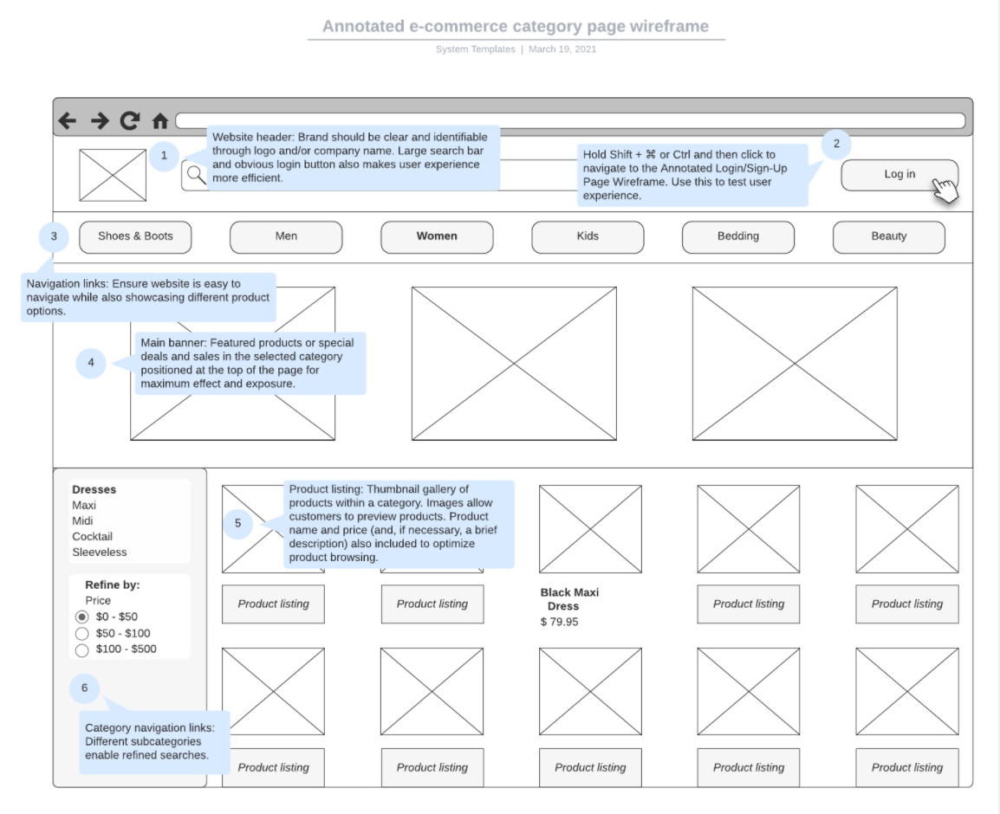
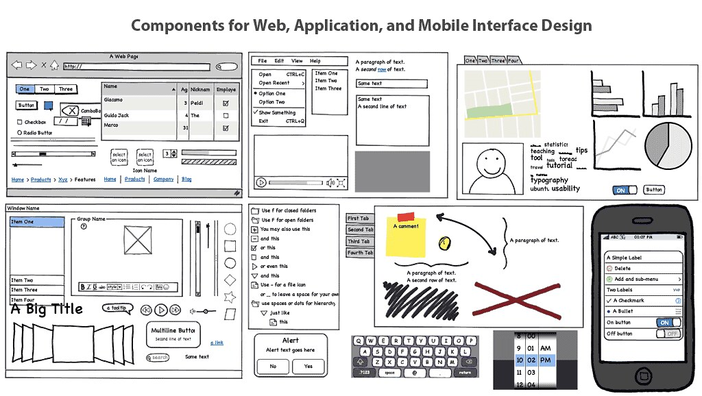
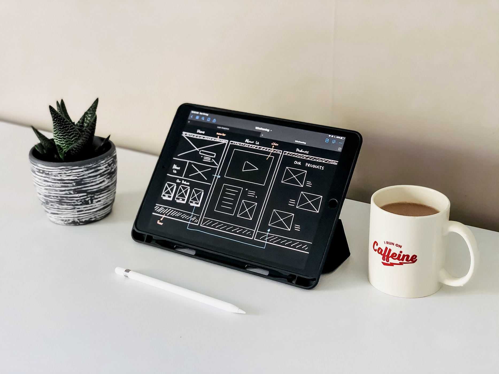

## What are wireframes? What is visual fidelity?

An early step in any good UX project is to build wireframes. They are low-effort, high-return structures that show the client/development team where information is going to be and how it will be organized. Wireframes may have lots of scribbles and notations that plan out interactivity and often have arrows connecting the different screens.

Wireframes can vary based on **fidelity**, or level of detail. With wireframes, we are only concerned with visual fidelity (the detail that we can see). When we prototype, we will also address functional fidelity (how realistically the app works).

wireframe-fidelity.jpg

Above is a sample interface in low-, medium-, and high-fidelity. In early planning, we are aiming for low- to mid-fidelity wireframes featuring very basic boxes and icons.

<figure>

  

  <figcaption>
    This template from LucidChart is an example of a basic, clean digital wireframe.
  </figcaption>

  <License
    type="copyright"
    link="https://www.lucidchart.com/pages/templates/ui-mockup/lucidchart-annotated-e-commerce-category-page-wireframe"
    mediaType="Interface template"
    authors={[
      { name: 'LucidChart', link: 'https://www.lucidchart.com' },
    ]}
    className="mt-4"
  />

</figure>

Here, we have a general idea of what is happening, but the content doesn't go into great depth. Note that the colors used are not design elements and are signifying menu items and navigation.

## How are wireframes different than prototypes?

Wireframes are essentially prototypes without the interactivity. Once a user or tester can actually navigate between screens or interact with them (such as by tapping, swiping, or hovering) ,they are using a prototype. This step is crucial as well, since missing or confusing interactivity can become a huge hurdle for user success.

Prototypes have levels of fidelity too. At the low end, they are tappable. At the high end, they can have interactive actions, animations, and effects, almost like using a real app.

## Why are early-stage wireframes so basic?

Low-fidelity wireframes may look like quick scribbles – because they often are. Testing wireframes usually occurs at multiple levels of visual fidelity. By testing early with a lower-fidelity wireframe, initial bugs can be squashed without needing to invest the time in something more complex.

By keeping the style plain and non-distracting, emphasis is entirely on the content and organization. No matter how much a UX designer may say "ignore the font; that is only for testing", clients and users can get caught up on the appearance and derail an important planning session.

One wireframing tool, Balsamiq, purposely makes their wireframes look hand-drawn:

<figure>

  

  <figcaption>
    Balsamiq has many components, but they are all uneven, wobbly, and imperfect.
  </figcaption>

  <License
    type="cc"
    ccVersion="2.0"
    ccLicense="BY"
    link="https://www.flickr.com/photos/vuhung/11130555105"
    mediaType="Balsamiq demo image"
    authors={[
      { name: 'Nguyen Hung Vu', link: 'https://www.flickr.com/photos/vuhung/' },
    ]}
    className="mt-4"
  />

</figure>

No confusing that for the real design! Note that even in this sketch-looking style, it's possible for testers to have their attention drawn to the default placeholder colors. Keep it simple; for early stages, greyscale is the way to go.

## Common shapes in wireframes

<figure>

  

  <figcaption>
    Basic wireframe showing image regions, headlines, and smaller text
  </figcaption>

  <License
    type="unsplash"
    link="https://unsplash.com/photos/pl9DrjAMV6I"
    mediaType="Photo"
    authors={[
      { name: 'Visual Design', link: 'https://unsplash.com/@visualdesign_inspiration' },
    ]}
    className="mt-4"
  />

</figure>

You do not have to be a great artist to create wireframes, but some common shapes will help you as a shortcut:

- A shape with an "X" through it generally means "image"
- An image box with a triangle prominently drawn in the middle generally means "video"
- Thicker-scribbled lines can represent headlines if real text isn't used
- Thinner lines can represent smaller text
  - Lines can be straight or wavy depending on your style
  - Use irregular line lengths to suggest the text alignment (even at the left edge is left-aligned, etc.)
